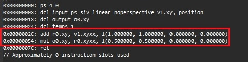
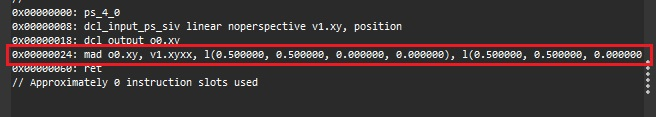
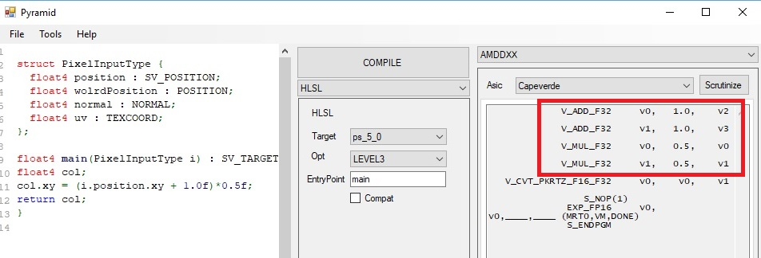
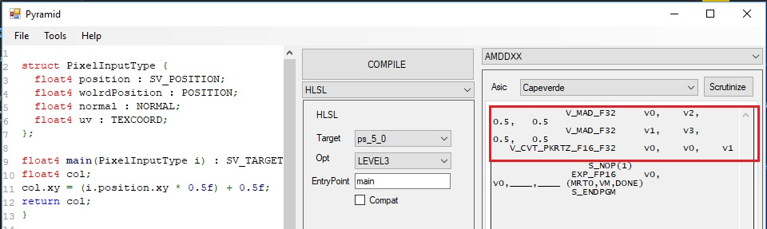
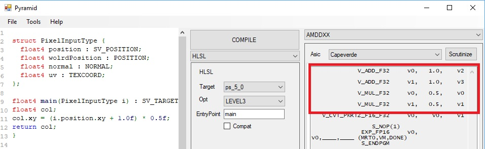
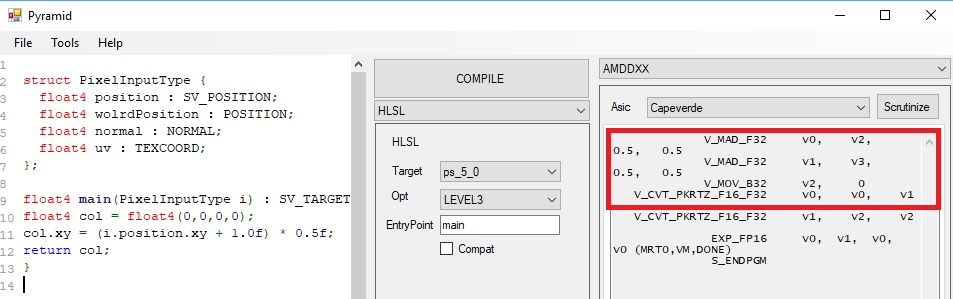

<details> 
  <summary>SPOILER: What is a MAD/FMA? (click to show text)</summary>
   
   <p style="background:gray;padding: 1em;">
   TL;DR: FMA (Fused multiply add) and MAD/MADD (multiply-add) are a specific instuction in a processor
   which allows to performa a multiplication followed by an add in a single instruction.
   Having that instruction baked in hardware allows to achieve two results, higher performance
   due to performaing the operation in a single instruction and less instruction/fetch and decoding
   down the cpu pipeline.
   </p>
   
   <p style="background:gray;padding: 1em;">
   Proper explanation:
   <a href="https://en.wikipedia.org/wiki/Multiply%E2%80%93accumulate_operation" target="_blank">FMA on wikipedia</a>
   <p>
   
   
</details>

The other day I was working on optimizing an HLSL shader and came across a source code line like this:

```hlsl
result.xy = (myValue.xy + 1.0f) * 0.5f;
```

After having watched the great GDC videos <a href="https://www.gdcvault.com/play/1020352/Low-Level-Shader-Optimization-for" target="_blank">[1]</a> <a href="https://www.gdcvault.com/play/1017786/Low-Level-Thinking-in-High" target="_blank">[2]</a> from <a href="https://twitter.com/_Humus_" target="_blank">Emil Persson</a> the first thing that came to mind was, ***will this MAD/FMA***? 

The first step was, of course, to go and check the intermediate representation, I could have done it directly
from Unity, but I decided to do it from the really cool new <a href="https://developer.nvidia.com/nsight-graphics" target="_blank">NSight Graphics</a> tool that I use on a daily
basis for optimization/debugging, and this was the result:



As we can see from the intermediate representation, the compiler generated an add and mul.
Personally I am not a big fan of intermediate representation, and this is because both AMD and Nvidia
do different optimizations at different point of the compilation stages.
Nowadays, a lot of optimization happens
between the translation from [IR](https://en.wikipedia.org/wiki/Intermediate_representation) 
to machine code, so the fact that it doesn't generate a MAD/FMA doesn't
necessarely means it won't generate it in the abovementioned code, later we are actually gonna look at some machine code.

The question now is, can we do it better? (even in IR?).
The answer is yes, this is a fairly trivial case, but should give an idea of the general pattern.
We can transform the above source code as:
```hlsl
//intermediate step 
//result.xy = (myValue.xy *0.5 ) +  1.0f * 0.5f;
result.xy = (myValue.xy *0.5 ) +  0.5f;
```

We expanded the multiplication and the multiplication 1.0f * 0.5f can be constant folded, and we get
the above line, where now, we do have a proper multiply and add line of code, that should be easier
for the compiler to map to a madd/fma instruction.
Let's compile the code and let's check the result:



As we can see now, we did get a MAD instruction. This small optimization just saved us one instruction.
This is only on paper, we will need to check some disassembly to be 100% sure. I cannot comment on the Nvidia 
disassembly since is closed under NDA, but we can use some publicky available tools from AMD to see what
machine code it will generate.

At that point in time I did not have an AMD gpu in my system, so I needed to find a way to generate 
that code without an AMD driver and or GPU in my system.
After trying several tools from GPUOpen.com I was not able to achieve my goal, so I turned to twitter, 
I got pointed out to this great tool:

https://github.com/jbarczak/Pyramid
<a href="https://github.com/jbarczak/Pyramid target="_blank">Pyramid</a>
This tool worked out of the box and actually allowed me to see several different disassemblies for AMD cards
being generated. Let see what we got:

***ORIGINAL***



***OPTIMIZED***



As we can see we got the same exact behaviour of the IR. Once we re-organized the source code line,
we got MAD/FMA being generated.

That is it, end of story..... or ***IS IT?***

I have not been completely honest in the results I got, on my first test I have gotten AMD to generate MADs
for both cases, thinking to myself: clang is awesome. Then I started working on this
blog posting and generating the screenshots, and something odd happened, I started getting MAD/FMA for 
both cases even in HLSL IR.

I was puzzled, I was sure I was getting ADD/MUL instruction for the original case, how come now I am getting
MAD/FMA?
Took me a little to figure out what was going on there, I actualy stumbled on it by chance.
Have a look at those two pieces of code and corresponding disassamblies:

***CODE A***



***CODE B***



We are still using the "un-optimized" version of the code, for both examples A and B. The only 
difference is that we initalized the col variable. To be fair, we don't need to completely initalize
the float4, we could just initialize the zw value and will start generating MAD/FMA.
If we inspect the intermediate representation we see that the actual declaration of the output
changes based on how many channels of the float4 are initialized:

```hlsl
dcl_output o0.xyzw
```

Although that does not explain why we are still able to generate MAD with the "optimized" version of 
the code. I find this interesting and would love to know more about it. I am gonna try to poke twitter
about it and/or maybe the AMD forum. That is it for now.
Since I got curious I started to have a look if this also happens on CPU (for scalar values not vector values),
more on that on the next post.

