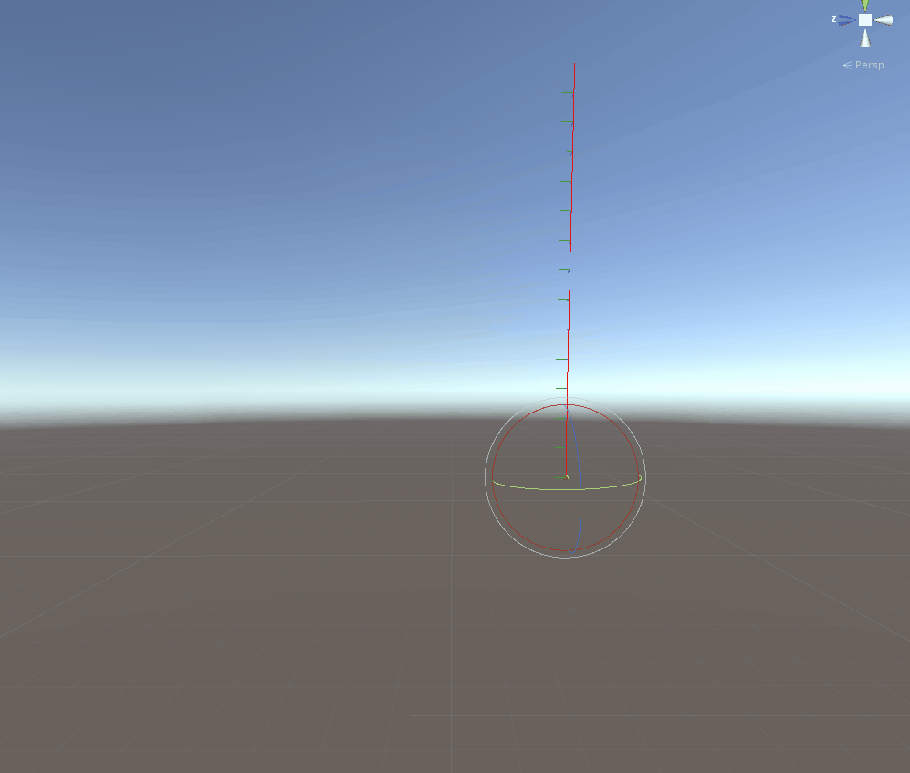
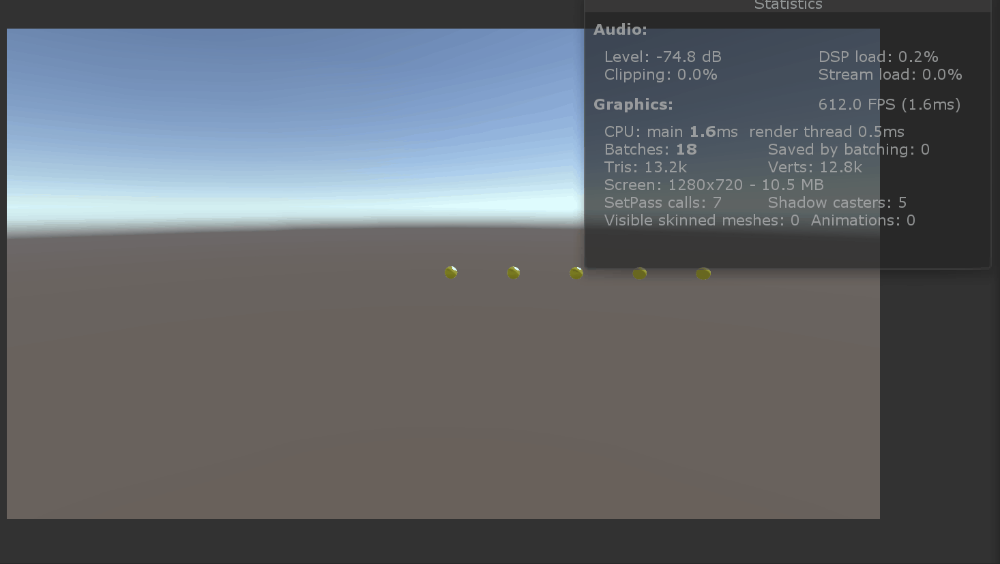
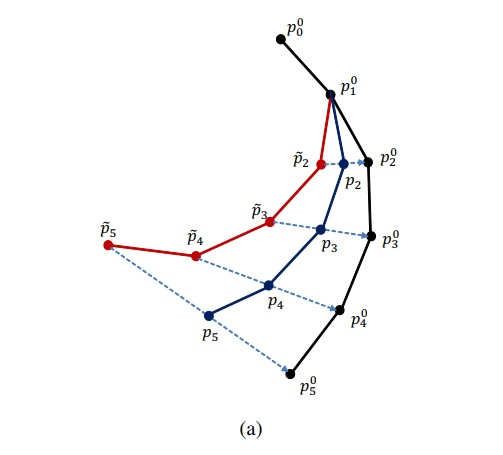
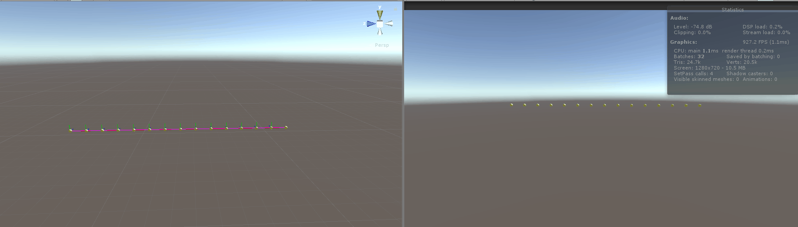
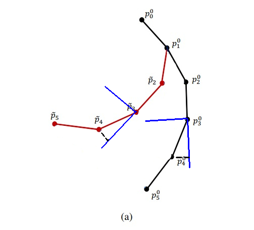
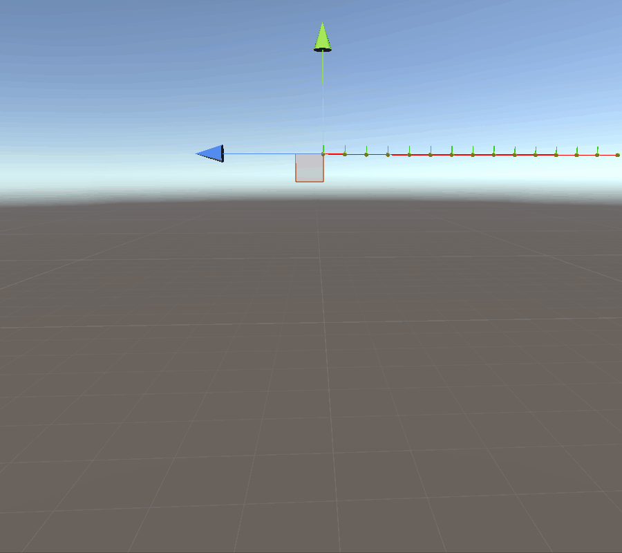

# Introduction

In today's blog post I would like to talk about hair simulation,
it has been something that always piqued my interest. I attempted to do
a proper simulation in the past based on the
,
more specifically the one focusing on
.

The issue with both papers was that they did not worry about keeping the
initial hair shape, basically the groom an artist would have spent
days crafting.
All the demos were with perfectly straight hair (or curly) but that
did not keep the overall shape. I ended up being stuck in trying
to create a stiffness constraint to fix this very problem.

Recently I picked it up the challenge again, this time following the
.
Special thanks to Dongsoo Han that allowed me to upload the paper.
After going through the paper I was surprised on how close to an
actual working stiffness constraint I got, but more on that later.

In case you are curious about the final result, here below a simulation of a
single hair with quite high stiffness.

As you might have understood from the above gif we are going to write this
implementation in Unity, the first pass is going to be in C# on the cpu,
simulating a single hair, in future steps we are going to make a
GPU implementation and having fun optimizing it.
In this first part of the tutorial we are going to mostly talk about
the theory and in the next part we are going to see the actual implementation.

The way I approached it was to use a simple Monobehaviour that exposes
pretty much everything needed by the simulation, from positions and masses to
constraints parameters.
The  Evaluation happens in the Update method, although not ideal, the correct
time delta is used, VSync is also turned on which led to smooth 60fps.

The computation is composed of five main steps:

- Integration
- Global constraints
- Local constraints
- Edge/Length constraints
- Collision resolution (not handled yet)

Let's get started and explore each one of the stages, building up to our
final simulation.

# Verlet Integration

The integration step is the step in which we compute the forces acting
on each particle and compute the next step in the simulation, basically
answering the question, based on all the information I have know
(forces, positions etc) what will be the state of my system in X time?

The good thing about Verlet integration is that, the velocity is not explicitly
handled like in other integration method like


instead the velocity is kept implicit by keeping track of current and previous previous
positions, which allows us to extract the velocity by subtracting the position
at the current frame from the one at previous frame. The nice side effect of
this, is that everything we do that manipulate the positions (constraints),
will implicitly work on the velocity as-well.
All this gives to a much more stable simulation compared to explicit Euler,
only downside is that if you need to handle collision it gets slightly tricky
because to change the velocity you need to manipulate the positions of the
previous frame.

Lets have a quick look on how Verlet integration is implemented,
here the formula:

$$\begin{align}
P\_{i+1} &= P\_i + V + accel \cdot t^2   \\\\\\
V &= P\_i - P\_{i-1}
\end{align}$$

Where $P_{i+1}$ is the next frame we want to compute, $P_i$ is the positions of the current frame,
$V$ is the velocity extracted from the positions,$t$ is the delta time and $accel$ the resulting
acceleration due to applied forces.

If you are interested in the actual derivation you can have a look at the great video from
.
The main idea is to start Semi-Implicit Euler integration method, manipulate it, do few
substitution to get a formula based on two sets of positions and not velocities.

If you were to run the code now, you would be seeing the particles falling straight
down with no interaction between each other, if that is the case, congratulations
your integration step is working, but we want to simulate hair, we need to have
the particles to be linked with each other, and respect an initial hair length.

Although does not respect the order outlined above, adding edge constraints will allow
us to have an initial simulation, after all the above list is the actual final order
of the algorithm.

# Edge constraints

The edge constraints algorithm used is the same exact one outlined in the Position based
paper. The idea is simple, if the vector between two consecutive particles is longer/shorter
than an initial value, the length will be fixed accordingly.

You can read the constraint explanation directly from the paper, but if you
are like me, I always found that paper hard to digest, the way I understood it was
thanks to the amazing Youtube video from a college class. The edge constraint
starts around minute 52.



The formulation boils down to:

$$\begin{align}
\vec{ n } &= (p\_1 - p\_2) / |(p\_1 - p\_2)|          \\\\\\
\Delta d &= |(p\_1 - p\_2)| - d               \\\\\\
\vec{ \Delta P\_1 } &=  - \frac{w\_1}{(w\_1 + w\_2)} \cdot \Delta d \cdot n        \\\\\\
\vec{ \Delta P\_2 } &=   \frac{w\_2}{(w\_1 + w\_2)} \cdot \Delta d \cdot n         \\\\\\
\end{align}
$$

It does seems like a lot of math, but lets try to unpack equations from $(3)$ to $(7)$ and you will
see that even at an intuitive level will make sense.

Lets start by defining the two points $P\_1$ and $P\_2$, those points are two consecutive
points in the hair, defining a segment.
Next at equation $(3)$ we are just extracting a normalized vector from $P\_1$ to $P\_2$, It
represents the direction we will use to pull/push the particles.

Equation $(4)$ is quite straight forward, we are computing the length of the vector $\vec{P\_1 P\_2}$
and we are subtracting to it $d$ which is the length that the edge should have, also called its
rest length.

Next, in equation $(5)$ and $(6)$ we compute the  vectors that we will push both  $P\_1$ and $P\_2$ to
satisfy the constraint.
The first part of the expression involves $w\_1$ and $w\_2$ which are the inverse masses of
the two point respectively. The argument $\frac{w\_1}{(w\_1 + w\_2)}$ is computing a ratio of
the inverse masses with respect to $P\_1$, equation $(6)$ does the same with respect with
$P\_2$. Once we understood that, the two equations boils down to pushing along
the normal vector based on how much we need to push  ($\Delta d$) to satisfy the constraint
relative to the inverse mass of the particle, meaning the smaller $w$ is the less the particle will move, the lighter it is, the more will be pushed around.

The ratio of the masses sums to one, to an intuitive level you split the amount we need to push
in two fractions based on the mass, in reality for the hairs we use particles with all the same mass
and it simplifies to $\frac{1}{2}$.

After this bit of math, we actually start to have a pretty simulation going, here below an example:

One thing that we need to note is that, since we process the edges one at the time, in a sequential
manner, a point will be pushed around more then once, let's start for example evaluating the first
edge with $P\_0$ and $P\_1$, we apply the constraint, it is satisfied we move to the second constraint,
involving points $P\_1$ and $P\_2$, we satisfy the constraint again, but $P\_1$ moved again, that might
violate the first edge constraint again.

That issue brings us to the concepts of iterating constraints. The system is solved in an iterative way where (hopefully) each iteration converges to the final solution,
rather than a system where all the constraints are satisfied at once.
Simply put, we are going to call our constraint function many times, how many will be user defined

# Global constraints

Now we start adventuring in the land of shape matching, or better, trying to attract our simulation
to converge to a given initial shape, which can be an initial groom defined by an artist to match
a specific style and or artistic direction.

The first and simplest of those is the global constraints, a constraints that happens completely in
world space, the main idea is to try to push the hair where it would be if it was transformed rigidly,
for example if we are talking hair on a head, to transform the hair as it was rigid when the head move.
Here an image extracted from the AMD paper:

The red hair, is the simulated shape, the black one would be the rigidly transformed one, and the
blue one is the result of the constraint. The constraint has a value that goes from 0 to 1, which
represent the strength, if set to 1 the constraint matches  perfectly the rigid shape.
The mathematical formulation is really simple, is a linear interpolation of the two points.
**Make sure that you multiply the original curve by the new head transformation!**

$$ P\_i = S\_G( H \cdot P^0\_i - P\_i) $$

Where $S\_G$ is the strength of the constraint, H is the matrix of the head (or whatever global transformation of the whole sim you might have), $P^0\_i$ is the position of the hair vertex in
rest pose, in local space of the head.
Let me elaborate a tiny bit more on the last sentence about $P^0\_i$, if you express your original
hair in the space of the head, meaning the origin of the coordinate system is the head, you can
later multiply  the vertex rest pose by the current head transformation ($H$), and get the hair
in world space, ready to perform the global constraint.

Here is the result of the global constraint:

It is a bit hard to see, but in purple, you can see the original hair being deformed rigidly,
those are the points we will use for the linear interpolation. This constraint will be applied
only once. In my case I found both the global and local constraint quite strong, meaning that to keep
a soft hair I had to have really really low strength. Not sure if is a result of my implementation or
simply on how I setup the simulation.

# Local constraints

Next we are going to talk about the most complex constraint yet, the local constraint, the goal
of this constraints is to apply a correction to the segments based on local deformation and not overall
transformation, if you take a look again at the global constraint picture:

The hair bent quite uniformly from the original hair, meaning each segment roughly bent the same amount,
but if you look on how much each particle has been corrected you will see that the more down the curve
we go, the higher level of correction is applied, this is because, the rotation on the segments is sort of
"cumulative", the local constraint, on the other end, tries to figure out how much the segment rotated
not overall all, but only relative to the original hair segment.

The main idea is for each segment you generate a local frame, aligned with the previous segment,
this can be done with the **Parallel transport** method you can find in my previous , only difference being, instead of using $P\_i$ and
$P\_{i+1}$, to generate the frame, $P\_i$ and $P\_{i-1}$ will be used instead.

Once the local fram have been generated, we are going to perform the constraint in this local space
which will take into account only how much the segment bent compared to the previous one.
There are two way to apply this constraint, the first one is to convert you world position particle $P\_4$
into the local frame, involving an inverse matrix or, you can have the original hair, which has been converted in local space, being converted in back in world space using the new computed local frame transformation.
The latter method is the one I used because less expensive.

Given the fact that here we are only worried about rotations and not translation or scale, the fastest way
to do it would be with quaternions, that is how TressFX has implemented it, in my first iteration I went with matrices so that I did not have to implement the quaternion math myself. With this new knowledge, if we grab the local delta of $P\_4$ from the original hair (black hair) and multiply it by the local frame of the red hair we get something like this (where the black dot is the original deformation moved back
in world space):

As you can see the amount the point $P\_4$ will need to be corrected is much smaller compared to
the global constraint. This is the same implementation I came up with in the past, and worked quite well for short segment of hair, I was experimenting with 5 particles, as soon as you have more it starts to
add a lot of oscillation, creating a wave ripple down the hair.

The way the researchers corrected this artifact was by applying the correction not only at the end of the segment but the start of it as well, basically achieve a rotation from the center of the segment instead applying the rotation at the base of the segment. The final result with only local constraint and edge constraint is the following:

The effect is quite different from the global constraint, the local one fights to keep
the shape (in this case perfectly straight) without fighting the overall simulation, the proposed simulation has a really strong constraint to make the effect quite obvious.
The artist will end up playing with how many iterations and how strong the shape constraints are to achieve the desired effect. To note that the same issue we had with edge constraints appears here,
we are modifying two particles at the same time, which will forces us applying the constraint multiple times.

Let me propose you again the final result where everything comes together:

In the next tutorial we are going to dive in the actual Unity implementation with full code available.
I would really go back now and try to substitute the Verlet integration with the
 paper to see what is the result.
