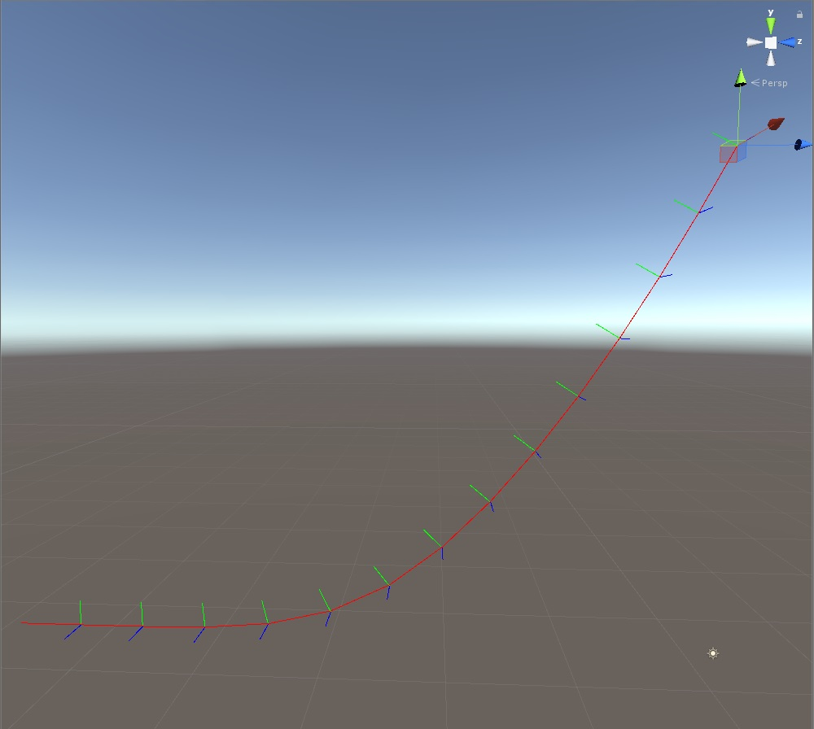
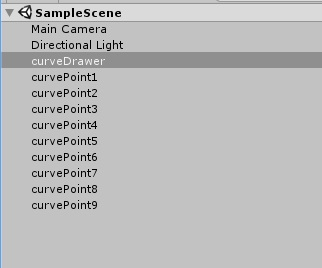
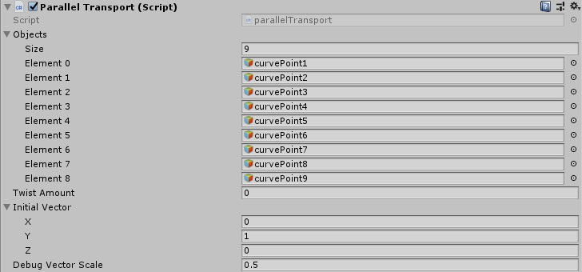
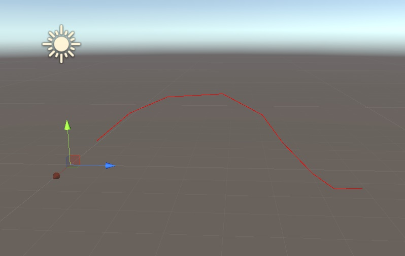
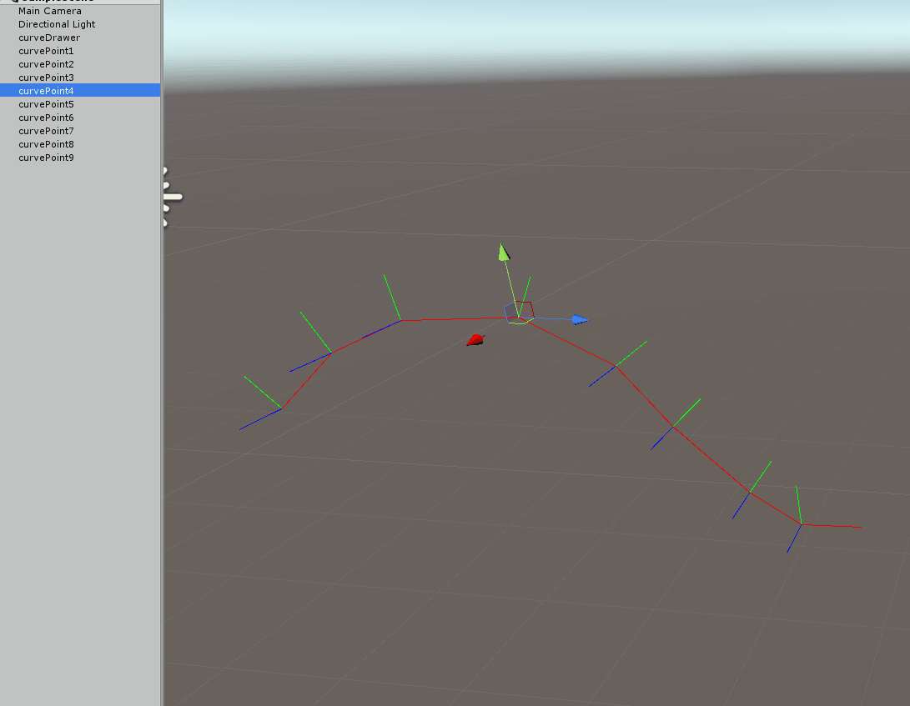
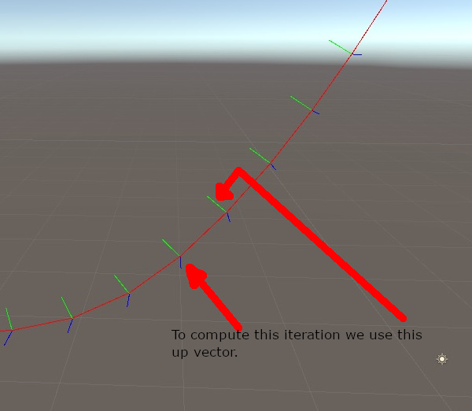
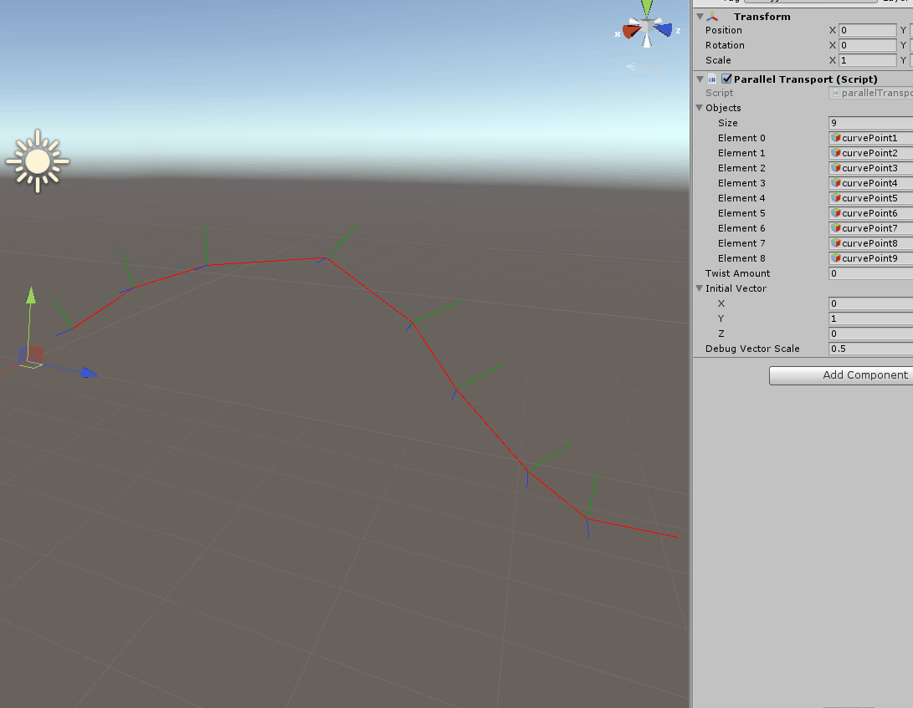

**TL;DR**: How to generate a stable orientation along a curve, math
and Unity implementation.
 the repository with all the code and Unity project.

# Introduction
Parallel transport is a technique that allows computing a moving frame
(a 4x4 matrix defining a coordinate system) down the curve. Here is an example:


The computation starts on the top right of the image, where the gizmo is,
then move sequentially down the curve. The frame is aligned
nicely along the curve. One property (wanted or not) of parallel transport
is the natural twist the frame has following down the curve.
You can imagine it as the frame starts to bend inward if a curve has a spiral form.

The main idea is simple, you start from a given up vector,
you take two samples on a curve, the first sample is the point you want to
compute the frame at, the second sample is a point down the curve,
ideally, offset by a small delta.
Once you compute the new frame, you have generated 3 axes, one of those 3
axes will correspond to the up vector of the frame,
we are going to use that new up vector for the next frame of the computation,
basically for the $i$ iteration we use the resulting up vector from $i-1$ iteration.
As you can see doing this the up vector will gradually adapt such
that the delta won't be too big causing the cross product to fail.

Written in mathematical terms will be something like this:
$$ \begin{align}
   \vec{x\_i} &= P\_{i+1} - P\_{i} \\\\\\
   \vec{z\_i} &= \vec{x\_i} \times \vec{y\_{i-1}} \\\\\\
   \vec{y\_i} &= \vec{z\_i} \times \vec{x\_{i}}
   \end{align} $$

All the vectors are normalized, either at each steps or at the end, to keep notation less cluttered
the normalization was omitted and $\times$ operator is the cross product.


<details>
  <summary>SPOILER: Arrow above the variable? (click to show text)</summary>
   <p style="background:gray;padding: 1em;">
   In case you were wondering what the arrow above the variables means, it is a standard notation to
   represent a vector variable/quantity. Other notations I have seen around are with a bold or underlined
   variables.
   </p>
</details>


That was an overview, let's dive into the actual code! I used unity to demonstrate the concept, if you are not interested in Unity details skip the next section.

# Unity plumbing

The way I decided to approach this tutorial was to have a simple component
referencing many game objects, each of those game object will be a point along
a discrete curve, meaning a curve defined by a series of points and segments
instead of a mathematical function.
Let's start by creating all the needed game objects,
one named `curveDrawer` and many others called `curvePoint#`.



Next, let's add a new script called ParallelTransport to the `curveDrawer`
object, we are going to add several parameters, the most important of all
the GameObjects array.



Here the members of the component:

```C#
using System.Collections;
using System.Collections.Generic;
using Unity.Mathematics;
using UnityEngine;

[ExecuteInEditMode]
public class parallelTransport : MonoBehaviour
{

    public GameObject[] objects;
    public float twistAmount;
    public float3 initialVector;
    public float debugVectorScale;

```

To note that we added the attribute **[ExecuteInEditMode]**, this allows the
script to be executed even when not in play mode, making our life much easier.

I am using the new great
  library
, which is a new C# library, very efficient and really close to shader datatypes,
**make sure to add the package Entities in the package manager and
set your project to use C# .NET 4.x in the player settings** .

# Implementation

Let's get started with the `Update()` method of the component,
the first step in the update is to extract the positions from our game objects:

```C#
 // Update is called once per frame
    void Update ()
    {
        int objLen = objects.Length;
        float3[] positions = new float3[objLen];
        float4x4[] frames = new float4x4[objLen];

        //extracting the data from game objects
        for (int i = 0; i < objLen; ++i)
        {
            positions[i] = objects[i].transform.position;
        }
```

Next let's start to visualize the curve, so we can also position
the points as we like them:

```C#
//draw the frames
var root = transform.localToWorldMatrix;
for (int i = 0; i < objLen-1; ++i)
{
    Debug.DrawLine(positions[i], positions[i + 1]  , Color.red);
}
```

This is the result:



Everything is all set to start computing the frames along the curve,
this is the code that does it:

```C#
float3 up = initialVector;
//calculate the frames
float twistStep = twistAmount / (float)(objLen - 1);
for (int i = 0; i < objLen-1; ++i)
{
    //computing the orthonormal frame
    frames[i] = computeFrame(positions[i], positions[i + 1], up, positions[i]);
    //critical part of parallel transport, the up vector gets updated at every step
    up = frames[i].c1.xyz;
}
```

For each segment of the curve, (index i to index i+1),
we call the `computeFrame` function,
next we extract the Y axis from the matrix, which I decided to be
the up vector of the frame.
In my implementation I decided to have the X axis to be pointing down the curve,
Y to be the up vector and finally Z to be the cross vector, in the end
is totally up to you how you want to build up your frame, you can swizzle
them as you please, but if you use those frames for actual computation
to not introduce unwanted negate scales.

```C#
up = frames[i].c1.xyz;
```
The above line of code is doing nothing more to access the second
column **c1** , being a `float4` we extract the first 3 components
with the property `.xyz` (I hope you now can see the similarities
with shader languages).

This is all good and fancy but we did not look at the `computeFrame`
function yet! This is the core of the whole process, lets dive in:

```C#
    public static float4x4 computeFrame(float3 start, float3 end, float3 up, float3 pos)
    {
        //compute an orthonormal frame from two points and an up vector
        float3 aim = math.normalize(end - start);
        float3 cross = math.normalize(math.cross(aim, up));
        up = math.normalize(math.cross(cross, aim));

        //generating the matrix
        return new float4x4(
            new float4(aim, 0.0f),
            new float4(up, 0.0f),
            new float4(cross, 0.0f),
            new float4(pos, 1.0f));
    }
```

The first thing we do is to extract the vector between our two points,
where end is the point $i+1$ and start is the point at index $i$,
after that we normalize it.
What we need to do next is to create a vector that is perpendicular to both
our up vector and our aim vector, the operation to do so is the
<a href="https://en.wikipedia.org/wiki/Cross_product" target="_blank">cross product</a>.

After performing the cross product we finally have 3 axes, we are ready
to build our matrix/frame, or so we would think, there is still a small
issue to take care of, we have no guarantee that the provided up vector
is perpendicular to the aim vector, we are going to use another cross
product to re-compute the up vector, now we have created an orthogonal
matrix, given the fact we also normalized all three axes we
just created an orthonormal matrix, meaning all axis perpendicular to
each other and all axis have length one.

The last step of the function is to pass in the columns of the matrix to
the constructor.  If we go back to Unity now we will see this is the result:



Two things to note on the above gif, first the up vector adapts when the
point if it is moved up and down, but also when moving left and right you
can see the natural twisting down the curve we get.

To iterate one more time we use the previous up vector to compute the current
frame, let me visualize this with the following image:



Once you have this frame moving along the curve there are several things you can do, for example you can apply a twist down the path:



I am not going to cover in detail how the spin works, but simply put,
I grabbed the formula to generate a

and used to multiply our frames with an increasing angle.

Below the full code:

```C#
using System.Collections;
using System.Collections.Generic;
using Unity.Mathematics;
using UnityEngine;

[ExecuteInEditMode]
public class parallelTransport : MonoBehaviour
{

    public GameObject[] objects;
    public float twistAmount;
    public float3 initialVector;
    public float debugVectorScale;

    public static float4x4 computeFrame(float3 start, float3 end, float3 up, float3 pos)
    {
        //compute an orthonormal frame from two points and an up vector
        float3 aim = math.normalize(start - end);
        float3 cross = math.normalize(math.cross(aim, up));
        up = math.normalize(math.cross(cross, aim));

        //generating the matrix
        return new float4x4(
            new float4(aim, 0.0f),
            new float4(up, 0.0f),
            new float4(cross, 0.0f),
            new float4(pos, 1.0f));
    }

    //creating a rotation matrix from a given axis and angle
    //https://en.wikipedia.org/wiki/Rotation_matrix#Rotation_matrix_from_axis_and_angle
    float4x4 getRotationMatrix(float3 axis, float angle)
    {
        float rad = math.radians(angle);
        float cosA = math.cos(rad);
        float sinA = math.sin(rad);
        return math.transpose( new float4x4
        (
            cosA + axis.x * axis.x * (1.0f - cosA), axis.x * axis.y * (1.0f - cosA) - axis.z * sinA,
            axis.x * axis.z * (1.0f - cosA) + axis.y * sinA, 0,
            axis.y * axis.x * (1.0f - cosA) + axis.z * sinA, cosA + axis.y * axis.y * (1.0f - cosA),
            axis.y * axis.z * (1.0f - cosA) - axis.x * sinA, 0,
            axis.z * axis.x * (1.0f - cosA) - axis.y * sinA, axis.z * axis.y * (1.0f - cosA) + axis.z * sinA,
            cosA + axis.z * axis.z * (1.0f - cosA), 0,
            0, 0, 0, 1
        ));

    }

    // Update is called once per frame
    void Update ()
    {
        int objLen = objects.Length;
        float3[] positions = new float3[objLen];
        float4x4[] frames = new float4x4[objLen];

        //extracting the data from game objects
        for (int i = 0; i < objLen; ++i)
        {
            positions[i] = objects[i].transform.position;
        }

        float3 up = initialVector;
        //calculate the frames
        float twistStep = twistAmount / (float)(objLen - 1);
        for (int i = 0; i < objLen-1; ++i)
        {
            //computing the orthonormal frame
            frames[i] = computeFrame(positions[i], positions[i + 1], up, positions[i]);
            //applying twist
            frames[i] = math.mul( getRotationMatrix(frames[i].c0.xyz, twistStep*(float)i) , frames[i]);
            //critical part of parallel transport, the up vector gets updated at every step
            up = frames[i].c1.xyz;
        }

        //draw the frames
        var root = transform.localToWorldMatrix;
        for (int i = 0; i < objLen-1; ++i)
        {
            float3 currP = positions[i ];
            Debug.DrawLine(currP, currP + (frames[i].c1.xyz)*debugVectorScale , Color.green);
            Debug.DrawLine(currP, currP + (frames[i].c2.xyz)*debugVectorScale , Color.blue);
            Debug.DrawLine(currP, positions[i + 1]  , Color.red);
        }
    }
}
```

The system has several limitations that can make it fail,
if any up vector is parallel to the next aim (aka 90 degrees bent) the cross
product will generate a zero vector and normalization will fail,
or if you have a bend that is bigger than 90 degrees
you will get a flip in your up vector and all the following ones.
Those are limitations that have to be taken into account,
and probably add error checking to make sure the code does not break at
runtime.
In reality that is not too much of a concern, most of the time the curves
that are used (either discrete or mathematically defined) are smooth and well
behaved.

At this point you might wonder what all the fuss is about, what can you use it
for? Mostly you can use it to attach object on a curve and let them move
with a consistent orientation, but that is not all, once you have a stable frame
you can decided to apply a twist as we did on the above example, and interpolate
the twist between segments, a user might even specify a custom twist value
per point on the curve giving quite granular control.

The real reason for which I made this post is to have it as a reference I
can point the user to for future tutorials, more specifically I used parallel
transport to generate a stable frame along hairs for real-time simulation
keep an eye out for that!!

Here the  to the Unity project.

If you find it useful don't forget to share on social media!