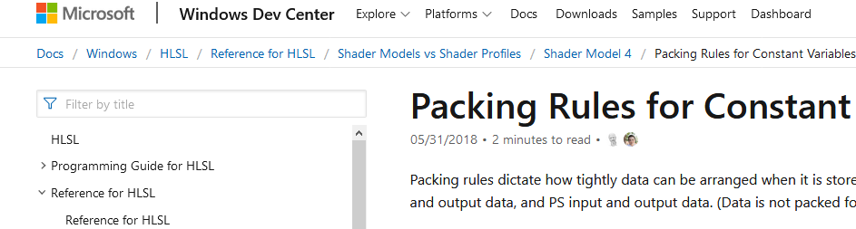
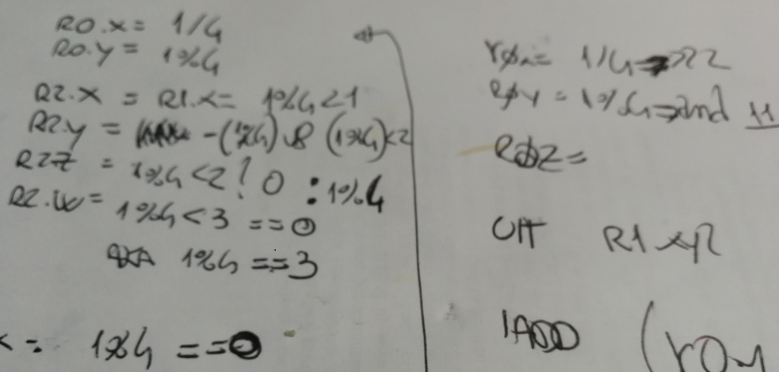

---
date: 2019-11-01
linktitle: Constant Buffer 
title: "Constant buffer reads in HLSL"
tags : ["shader","hlsl"]
tocname: "Table of contents:"
toc : true
draft : true 
---

<p style="background:gray;padding: 1em;">
When you are just chilling on Twitter and a whole thread about indexing constant buffer 
arrays in HLSL explodes leading to a lot of interesting stuff to learn.
</p>

<br><br>

<br><br>

# How it started

It was a normal day and was checking out Twitter, then I came across a tweet from 

 (If you are even
remotely interested in GPU optimizations you must follow him), and he started talking about
emulating float arrays in constant buffers and how bad code-gen was for it! For me was a lot
to un-pack and I learned quite a bit in doing so and just wanted to unroll the thread here and
explain what I learned. Inevitable I ended up scribbling on the back of a graphics paper stained 
with coffee trying to reverse eingeneer what assembly instructions did...



<br><br>

# The dot product selector trick

The   mentioned an old-school
dot product selector trick to select the wanted item in the array, here below the 
 we will be using:

```cpp
cbuffer CBufferArray : register(b0)
{
    float4 floats[16]; // equivalent to 64 floats.
};

uint PSMain(uint i : POS) : SV_Target
{
    return floats[i/4][i%4];
}
```

Here below instaead we have the code FXC is generating.

```asm
ps_5_0
dcl_globalFlags refactoringAllowed
dcl_immediateConstantBuffer { { 1.000000, 0, 0, 0},
                              { 0, 1.000000, 0, 0},
                              { 0, 0, 1.000000, 0},
                              { 0, 0, 0, 1.000000} }
dcl_constantbuffer CB0[16], dynamicIndexed
dcl_input_ps constant v0.x
dcl_output o0.x
dcl_temps 1
and r0.x, v0.x, l(3)
ushr r0.y, v0.x, l(2)
dp4 r0.x, cb0[r0.y + 0].xyzw, icb[r0.x + 0].xyzw
ftou o0.x, r0.x
ret 
```

I was quite puzzled by it, also because I never heard of such trick, so the only thing that was 
left for me was to try to figure out what was going on there.
The first think we can notice is that we have two constant buffer, ```CB0``` is our float constant buffer
and there is also an ```icb``` is the "immediate" constant buffer that the GPU created for us  with some constants
in it, effectively what it looks like an identity matrix.

The first two instructions we see is an "AND" operation and an unsigned shift right using as source
the v0.x register and two immediate constants. The vertex register v0 is the input register for our ```POS```
input, we can see it from this input instruction: ```dcl_input_ps constant v0.x ```.

## The and instruction

Here we are dealing with a bit of bit manipulation (no pun intended). The value 3 in binary is ```11```
using it in a bitwise operation means extracting the two least significat bits. which in the case
of an integer is equivalent to do a mod by four. This is due to the binary representation and 
the fact we are doing a mod by a power of two. The last two bits store values between 0 and 3 which 
are the only possibly value thare are returned by mod by 4.


## The ushr instruction
Here is another trick for bit manipulation, when you want to divide an unsigned integer by a power 
of two, it boils down to simple shifting on the right by the power of two, in this case 4 = 2^2 which means 
we shift right by two, (if we wanted to multiply by four we will shift left by two).

## Putting it all toghether

The two operations effectively boil down to:

```cpp
r0.x = i%4
r0.y = i/4
```
Finally we have this dot product operation where we effectively do:

```cpp
dot( cb0[i/4], icb[i%4])
```

Let us assume that our ```i``` variable is 13, we would get 

```cpp
i/4 = 3
i%4 = 1
```

Which expands to:

```cpp
dot( cb0[3], icb[1])
dot (cb0[3], float4(0.0,1.0,0.0,0.0) 
```

Let us now expand the dot product computation:

```cpp
c = cb0[3];
result = c.x * 0.0 + c.y *1.0 + c.z*0.0 + c.w*0.0
result = c.y * 1.0
result = c.y
```

We can see that the dot product in combination with the immediate constant buffer expands to
being a selector of the float4 which is indexed by ```i/4```.
We are basically using math operation to mask out the floats we do not want, I found it extremely 
clever, but why is Sebastian upset about it?


# Why is it bad?

To have a better understanding of why Sebastian is not particularly pleased about this code-gen
directly down to GCN ISA:

```asm
  s_mov_b32     m0, s12                                 // 000000000000: BEFC000C
  s_nop         0x0000                                  // 000000000004: BF800000
  v_interp_mov_f32  v0, p0, attr0.x                     // 000000000008: D4020002
  v_and_b32     v1, 3, v0                               // 00000000000C: 26020083
  v_lshrrev_b32  v0, 2, v0                              // 000000000010: 20000082
  tbuffer_load_format_xyzw  v[2:5], v0, s[4:7], 0 idxen format:[BUF_DATA_FORMAT_32_32_32_32,BUF_NUM_FORMAT_FLOAT] // 000000000014: EBF1A000 80010200
  tbuffer_load_format_xyzw  v[6:9], v1, s[8:11], 0 idxen format:[BUF_DATA_FORMAT_32_32_32_32,BUF_NUM_FORMAT_FLOAT] // 00000000001C: EBF1A000 80020601
  s_waitcnt     vmcnt(0)                                // 000000000024: BF8C0F70
  v_mul_f32     v0, v2, v6                              // 000000000028: 0A000D02
  v_mac_f32     v0, v3, v7                              // 00000000002C: 2C000F03
  v_mac_f32     v0, v4, v8                              // 000000000030: 2C001104
  v_mac_f32     v0, v5, v9                              // 000000000034: 2C001305
  v_cvt_u32_f32  v0, v0                                 // 000000000038: 7E000F00
  v_cvt_pkrtz_f16_f32  v0, v0, v0
```

The code above boils down to two buffer loads (```tbuffer_load_format_xyzw ``` ), one for the value
indexed by i/4 and one for the selector, plus a dot product, which boils down to 4 multiplications
(mul and mult by constant).

Ideally we would just want to see a single memory fetch.

```asm
%out_var_SV_Target = OpVariable %_ptr_Output_uint Output
     %PSMain = OpFunction %void None %18
         %20 = OpLabel
         %21 = OpLoad %uint %in_var_POS
         %22 = OpUDiv %uint %21 %uint_4
         %23 = OpUMod %uint %21 %uint_4
         %24 = OpAccessChain %_ptr_Uniform_float %CBufferArray %int_0 %22 %23
         %25 = OpLoad %float %24
         %26 = OpConvertFToU %uint %25
               OpStore %out_var_SV_Target %26
               OpReturn
               OpFunctionEnd
```

<br><br>
