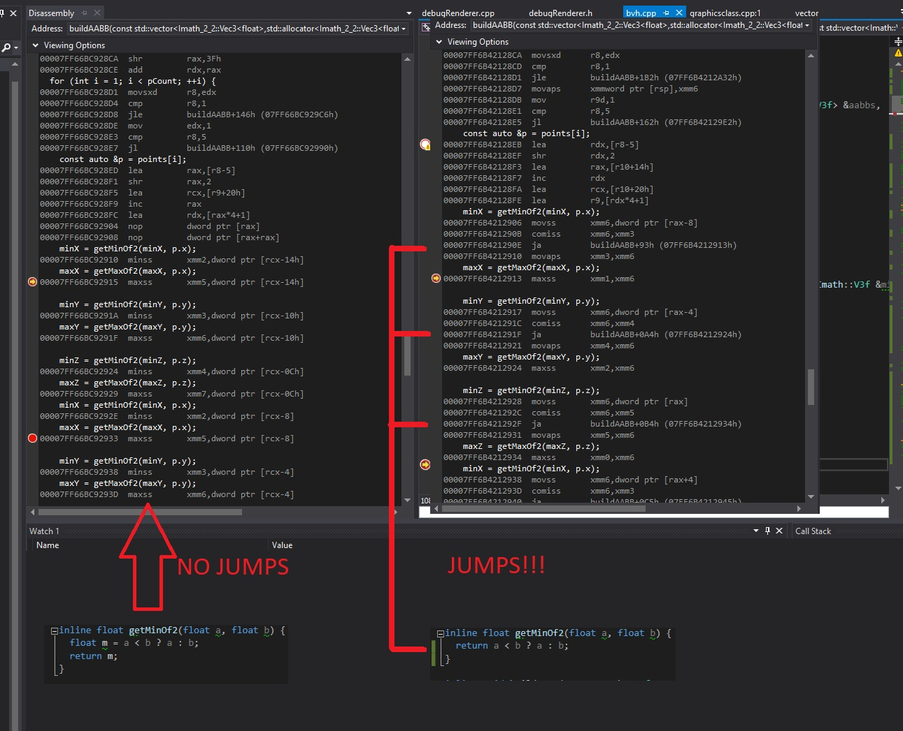

You followed a couple of introduction articles about DXR? You watched the 
Siggraph 2018 DXR course
? Now is time to leave the guiding 
hand and do your first step alone. How to do it? Read below to ready my journey and the issue 
and knowledge gaps I had to overcome.

To give a bit of background, I am farily new to DX12 in general, before DXR hit the shelves I barely had a basic cube
running in DX12. I understood the various concepts like PSO, command lists, descriptors etc, but getting "fluent" with it
is a whole different story.
Then DXR comes along and just grabs the complexity and cranks it up to 11 with super complex PSO and shader tables, 
for me was no small task to overcome, but with patience and helps from an extremely talented friend, 
,
I did manage to get something up and running.

This article won't be covering the actual basic, as the title imply, this "***the second step***", that moment when you
watched the available material and you actually need to make it your own and write your code. If you did not do so already 
go and watch the 
,
and have a look at the 
,

