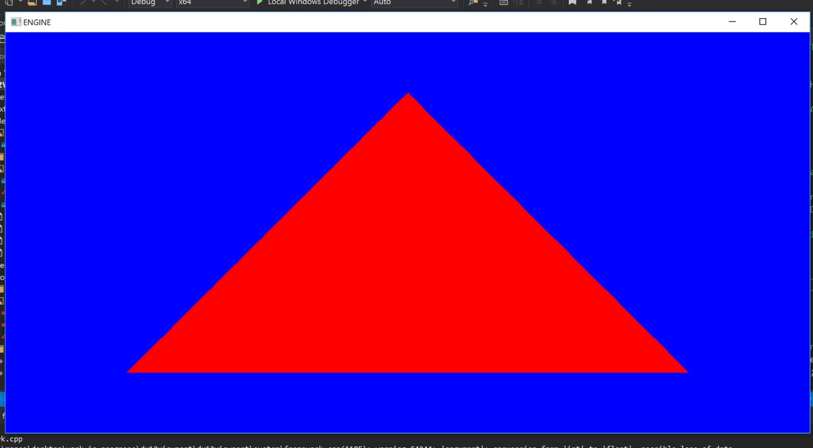

You followed a couple of introduction articles about DXR? You watched the 
? Now is time to leave the guiding 
hand and do your first steps alone. How to do it? Read below to ready my journey and the issue 
and knowledge gaps I had to overcome.

# Introduction
To give a bit of context, I am farily new to DX12 in general, before DXR hit the shelves I barely had a basic cube
running in DX12, basically up to chapter 6 of the Dx12 book. I understood the various concepts like PSO, command lists, descriptors etc, but getting "fluent" with it
is a whole different story.
Then DXR comes along and  and cranks the complexity up to 11 with super complex PSO and shader tables, 
for me was no small task to overcome, but with patience and helps from an extremely talented friend, 
,
I did manage to get something up and running.

This article won't be covering the actual basic, as the title imply, this "***the second step***", that moment when you
watched the available material and you actually need to make it your own and write your code. If you did not do so already 
go and watch the 

and have a look at the 
.

# Starting point
My starting point was this, a simple screenspace triangle, red means hit, blue means miss. This is was done
written from scratch integrated in my basic viewport with the cube.

# Dynamic camera
The next step for me was to get a camera moving in the scene, this means being able to update the matrix
every frame. Following the triangle example, the camera matrix is directly "baked" into the PSO as a 
root argument. There is no indirection through a descriptor and there is no constant buffer bound at runtime
like dx11.

The sample comes with a useful class called ShaderRecord, this class is part of the samples, is not part
of 

and is not part of the 
 either.
The class is extremely useful and I am still using it now, the only problem with the class is that does not offer a 
method for updating a shader record (a shader table is composed of a lot of shader record, more on this later).
Going back to my need of updating the camera every frame, I was forced to hack the class, steal the pointer of the
mapped resource (your "constant buffer"), and trying to copy my matrix there every frame.

***That wont work***

