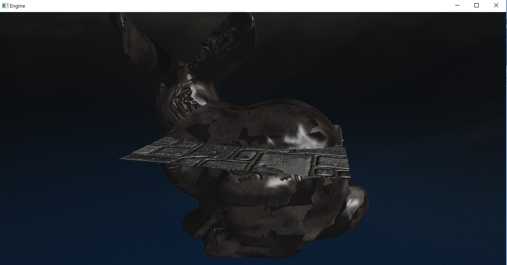
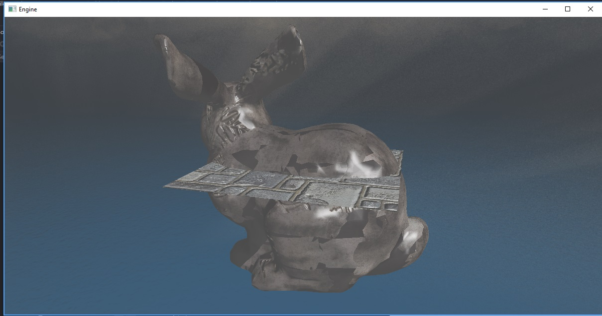

You just applied gamma correction to your real-time application
and everything looks too bright? De-gamma!

  

    
  

  

    
  

# Introduction

I have been working on my dx11 toy engine for a while now, 
and I got to the point of where I wanted to try to implement
PBR. By following the 
, 
tutorial they mentioned
that I was going to need to handle HDR, so I went and upgraded
my deferred rendered to support it, and added a post processing
pass to do tone mapping and since I never did it, ***gamma*** correction.

This is probably the point where you realize that I don't know 
anything about colors. With that said, I quickly realized my
image looked so washed out, way to "white".

I started debugging and the code looked solid, I mean doing
a gamma correction is a pow operation. There are only so many
ways you can fuck it up.

Running out of options I reached out to the amazing 
, 
he has been helping me in my game-dev epic fails since years now, 
since that time I was trying to load file in parallel from a 
mechanical drive (super smart idea, I know right).

He looked at the two pictures before and after and asked me
are you correcting your textures when you read them? Meaning, 
are you transforming from gamma to linear space?

Short answer was no, in this case we are talking about albedo
textures only, makes no sense to correct normal maps  (unless you know
they have been gamma corrected.)

This made me realize I was basically gamma correcting twice,
once in the input texture and second in my post processing 
pass, that explain the super white and washed out result.

Here you can see the original frame after I compensated the color
textures for the gamma correction, and the final gamma corrected
frame. As you can see the not gamma corrected frame is super dark.

  

    
  

  

    
  

