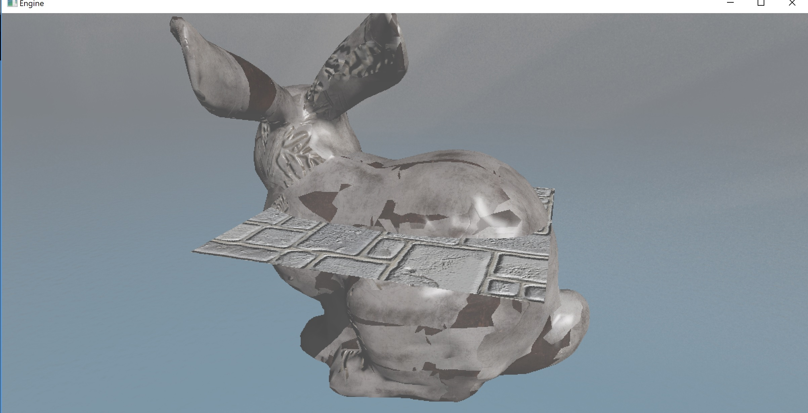

<p style="background:gray;padding: 1em;">
You just applied gamma correction to your real-time application
and everything looks too bright? De-gamma yout textures!
</p>


To wet your appetite, here it is a wrongly doubly gamma corrected picture.




# Introduction

I have been working on my dx11 toy engine for a while now, 
and I got to the point where I wanted to try to implement
PBR. By following the 
 
tutorial, they mentioned that I was going to need to handle HDR, I went and upgraded
my deferred renderer to support it, and added a post processing
pass to do tone mapping, and since I never did it, ***gamma*** correction.

Although being horrible about judging colors, I quickly realized my
image looked very washed out and way to bright.

I started debugging and the code looked solid, I mean ... doing
a gamma correction is a pow operation, there are only so many
ways you can mess it up.

Running out of options I reached out to the amazing 
, 
who has been helping me in my game-dev epic fails for years now, 
since the time I was trying to load file in parallel from a 
mechanical drive (super smart idea, I know right?).

He looked at the two pictures before and after and asked me
are you correcting your textures when you read them? Meaning, 
are you transforming from gamma to linear space?

Short answer: no, in this case we are talking about albedo
textures only, it makes no sense to correct normal maps  (unless you know
they have been gamma corrected.)

This made me realize I was basically gamma correcting twice,
once when reading the input texture, being already gamma corrected
and second in my post processing pass, 
that explains the super white and washed out result.

Here you can see the original frame after I compensated the color
textures for the gamma correction, and the final gamma corrected
frame. As you can see the difference is quite staggering.

<div class='vue'>
  <vue-compare-image 
		left-image="/images/08_gamma/wrongGamma.jpg" 
		right-image="/images/08_gamma/correctGamma.jpg" />
</div>

***apologies for the different size of the bunnies in the comparison***

To make sure that I am not actually doing things wrong I decided to compare the actual 
correct frame with the original skybox texture and bunny texture 
(ps: the texture I was using for the bunny made no sense, it was a random one, but that is not the point)

Here below we have the correct gamma compared with the albedo textures


<div class='vue'>
  <vue-compare-image 
		left-image="/images/08_gamma/correctGamma.jpg" 
		right-image="/images/08_gamma/skybox.jpg" />
</div>

<br><br>


It is a bit harder to see on the rabbit due to illumination:

<div class='vue'>
  <vue-compare-image 
		left-image="/images/08_gamma/correctGamma.jpg" 
		right-image="/images/08_gamma/armorColor.jpg" />
</div>

<br><br>

But if we go ahead and compare the same albedo with the wrong gamma we could clearly
that the result was awfully bright:


<div class='vue'>
  <vue-compare-image 
		left-image="/images/08_gamma/wrongGamma.jpg" 
		right-image="/images/08_gamma/skybox.jpg" />
</div>

<br><br>
It is a bit harder to see on the rabbit due to illumination:

<div class='vue'>
  <vue-compare-image 
		left-image="/images/08_gamma/wrongGamma.jpg" 
		right-image="/images/08_gamma/armorColor.jpg" />
</div>

<br><br>

Now, keep in mind you would have the same issue with every color that you might pick from the screen,
from a color picker widget for example(color wheel to change light color). 
When you do so, you are picking a color which is gamma corrected, so you
might want to linearize before passing it to the shader.

If you are curious in how you can make sure your texture gets gamma corrected is fairly simple,
the first way is to correct your texture and save them in linear, linearize them at runtime and or 
use a gamma texture format and let the hardware convert to linear when you sample the texture.

In my engine I spend already way to much time reading resources in an non-optimal way, so 
I decided to not add an extra linearizion pass on top of it, and went with the easy way to set 
a gamma corrected format, I just had to change my texture description format from:

```c++
DXGI_FORMAT_R8G8B8A8_UNORM;
```

to

```c++
DXGI_FORMAT_R8G8B8A8_UNORM_SRGB;

```

This is it! To finish here below the correct frames, on the left the not gamma corrected one with linear 
input albedo, and the gamma corrected frame on the right:

<div class='vue'>
  <vue-compare-image 
		left-image="/images/08_gamma/noGamma.jpg" 
		right-image="/images/08_gamma/correctGamma.jpg" />
</div>


Edit:
I recently found this amazing article about gamma correction, highly recommend:
, 

