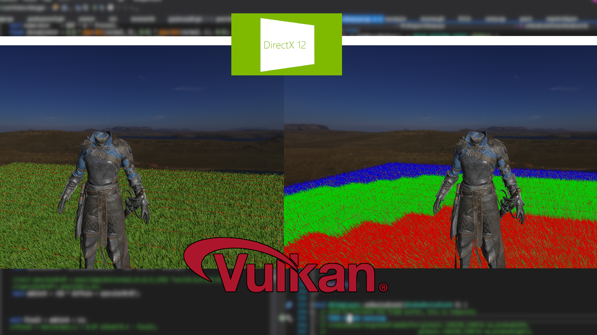
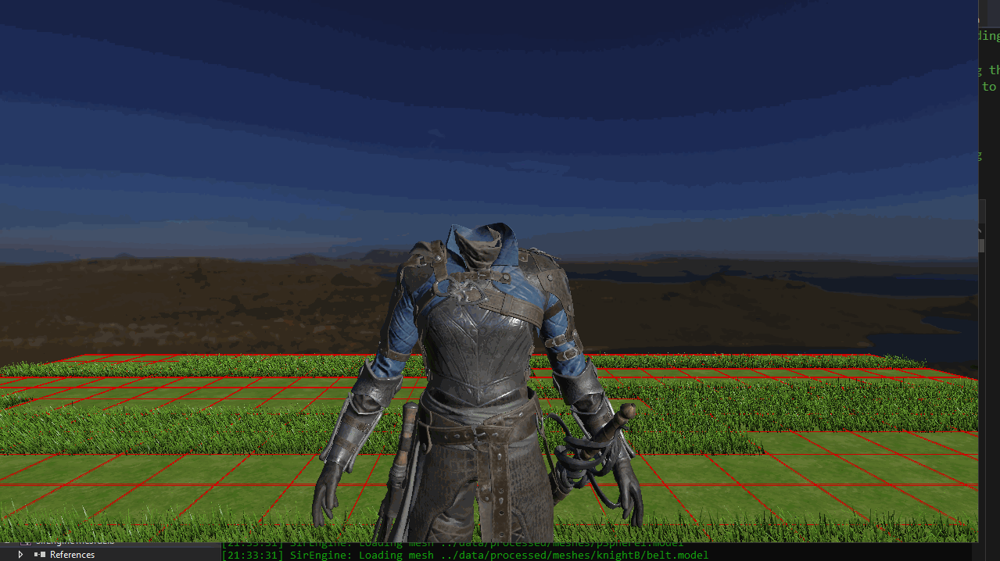
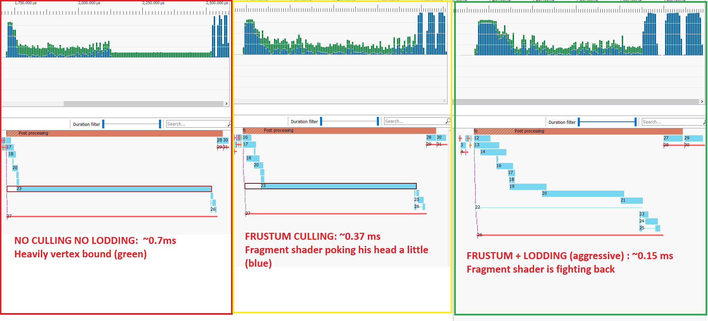

<p style="background:gray;padding: 1em;">
My take on realtime grass
</p>



<br><br>


# Intro 

 The latest effort in my engine has been a grass system. After porting quite a bit of the DX12 functionality to Vulkan I got to the point where I wanted to work on something new rather than just porting features to Vulkan.

At a glance what I did in my grass shader was:

- Using blue noise distribution for grass blades positions.
- Vertex + fragment shader, no geometry/tessellation shader involved. No billboards real geo per blade.
- Tile-based.
- GPU driven, both culling and LODding calculation happening on GPU, indirect rendering.

I will now go on into discussing each of these different parts in more details.

# A LODding idea
It all started when, a while back, I started thinking about how to add a grass shader to my engine. I wanted to do something interesting potentially leveraging mesh shaders as well (at some point). 
I had a fairly clear idea about how to use grass tiles to leverage GPU culling easily, but how would I go about doing LODding (Level of details variation)? Usually, the grass is very overdraw bound, and you want to render only what is visible to avoid wasted work (don't we all?), hence culling + LODding.

What I wanted to achieve was a simple way, at runtime, to grab a subset of points per tile and still have a nice distribution, no clumping or gaps. I was sitting on it for a bit then it hit me: if I want to solve a distribution problem I needed HIM!


The noise/distribution master is known as 
, he has been helping me for years, among many others, in my game engine/graphics dev-adventure! After explaining my idea, he pointed out that points from a blue noise distribution respect exactly the kind of distribution I was after; not only that, but he linked me to one of his blog post with c++ code I could directly use. 


I created a command-line application able to generate tiles of such points. I generated 100 tiles of 10k points each, each point was an in-tile normalized coordinate in the range [0-1]. The process took roughly 3 hours on a 6 core laptop (running on 12 threads), the code scales quadratically but being efficient was not the goal here. The points are generated once and baked down to a binary file. The data is ready, time to do some rendering.

# The first implementation                                                                                                         
 
After getting a clearer idea of how best approach things, it was time to get my hands dirty. I worked in the past in expanding geometry in vertex shaders, in particular for 
; that plus the fact that (usually) geometry shaders are frowned upon for being slow and I do not have experience with them, I decided to implement the technique in vertex shader by expansion. For the grass look, as a base, I used the great 
, here the result:                                                                                   
 

 
Here you can see the huge difference it made to use a proper albedo texture instead of basic interpolated colour
 

 
The initial result was not bad at all, and performance was decent. If I recall correctly I was rendering around 14 million vertices in around 1.5ms (take it with a bucket of salt, we are going to talk more about performance later). After the first implementation, a quick NSight profile highlighted that the Viewport culling (VPC) stage was my main bottleneck.
 
When I showed the initial gif on the internet, 

over at LinkedIn, suggested to offset sampling of the wind texture based on the UV coordinates of the blade; the higher the vertex in the blade from the ground the more offset it would get, this simple trick improved 
the effect by giving a nice whiplash effect, have a look for yourself.
<br><br>
 

 
Immediately the grass feels more of a blade than a static piece of geo rotating, I also improved a bit the wind rotations to give it a more natural look.
 
In case you are interested, in this video I cover a bit more the tiling working. Right now the tiling is a simple proof of concept, I am just using a simple grid:
<br><br>

<br><br>
 
# GPU driven rendering
The next step was to get the GPU culling going, I started by implementing the concept of a main camera and an active camera in the engine; in this way I was able to jump between them easily and see if the culling was actually working. The setup is fairly basic, but for now it will do. The culling shader will always use the main camera matrices to perform the culling, meanwhile, for the render I will use the active camera, this is allowing me to spin around with the debug camera and check that the grass is removed from the render. 
 
The culling happens in a compute shader; the first step is to compute a vote, informing me whether or not the tile survives the culling. Next, the surviving instances get compacted into a single array. I talk at length about the process in this 

I made a while back plus 

has some 


on culling, going in lots of details. Last time I have implemented something like this was on dx11, where wave instructions are not available if not through vendor-specific extensions. Having wave instructions as a first citizen made the code simpler and more efficient. Here the culling working:
<br><br>

<br><br>

Actually, the above is when culling goes wrong, in particular, it is an issue on Intel iGPUs, which is currently being looked at, being it potentially a compiler bug. Here the real culling working, in the below gif you can see me jumping from the main camera to active camera, the main camera frustum being rendered and matching the culled region of grass:

<br><br>

<br><br>

PRO-TIP: be mindful of your barriers for the draw indirect buffer! Indirect buffer transition exists for a reason! I was doing a simple write-read transition on the buffer, but that is not enough and was giving me glitches.

# Actual LODding implementation

After the culling, the VPC and rasterizer were still my bottlenecks, so the next logical step was implementing LODding. The LOD computation happens at the same time of the culling, not only I compute a culling vote value but also a LOD index; the LOD computation is a simple distance bucketing from the camera of the centre of the tile, nothing fancy.
After coloring based on LOD, the result was the following:

<br><br>

<br><br>

Of course, distances are completely configurable and there I was simply testing, thus the short distances. Once the LOD is computed I perform four different scan operations, to compact tiles based on LOD values from 0 to 3. The result is stored in a single array separated by an offset. Finally, a small compute shader gets kicked off, grabbing the result of the scans (accumulation atomics), use it to populate four indirect buffers and finally clearing the atomics for the next frame.

In the vertex shader, I use the LOD result to perform the indexing calculation to figure out which tile and blade I need to process, as explained before.
I have added configuration on the number of blades per LOD to be used, and we can use it to vary it at runtime. The parameter set by the artist is simply the number of blades that needs to be used for that LOD; given the blue noise distribution, even the subset of points are well distributed. Here below an example of varying the number of blades (to note: blades are stable when increasing in the count (which might not be the case if procedurally generated on the fly):


I am using the same shader for all LOD levels but I can easily create different shader per LOD reducing the geometry created. Another good tip from Freek was to only render the tips of the blade for lower LOD level which was something I did not think of!

# What about art direction
I am quite happy with the result, but how do you art direct it? Tiles are cool but make for a very uniform grass. Such distribution might work well in some situation, in others, you might want to reduce the density based on a texture or have it fade out when reaching a forest or a dirt road. I have few ideas about how to go about it.

## Binary search
I could use different tile distribution, not a grid that would allow me to kill easily entire tiles, but that is not granular enough. I would really need a variable number of points per tile.
The challenge would be figuring out to which tile/blade the ```gl_GlobalInvocationID.x``` maps to. I could use the result scan array from the culling to search for the corresponding slot, which would tell me the index of the tile to sample and how many points I have in that tile. Being a sorted array, a binary search would work well, but searching an array is highly divergent and I am not sure how performant it would be. 

## Compute blade expansion
Another option would be to expand the blades itself in the compute shader, store in a buffer and render that buffer as a single draw call. The drawback being the higher memory footprint and bandwidth consumption. Of course, if the grass is used in more than one pass
might very well be worth it expand it once and reuse it. If you have done any experiment on the matter I would love to hear your experience!

## Mesh shader enters the chat
The whole grass system has been planned from the ground up to be Mesh shader friendly. Culling specifically has been a big use case for it. I did not implement the mesh shader variant yet, mostly waiting for RDNA2 to do so. Mesh shading should allow for a very nice single-pass grass shader; I would be able to directly cull whole tiles, and on a per blade basis, pick a corresponding LOD and generate on-demand the geometry however I see it fit: varying geometry, varying tips only etc. There is no need for compute passes, draw indirect etc. I am actually looking forward to trying it.

# Performance
After all this work, did any of this culling and LODding help at all?

Here below a comparison before the culling, after the culling and both culling and LODding (I hope is readable enough, if not press RMB and click on view image):



As we can see from the top left image, we had half of the shader working on vertex work (in green) producing invisible fragment due to, most likely, being out of view or being rejected by early depth. After we perform some culling we pretty much drop completely the useless vertex only work (middle image); there is some more fragment action, but still overdraw is killing it (vertex to fragment ratio is too high).

After we add the LODding we can see that we have quite fewer vertices but more fragments working (in blue). At each stage, the overall shader got faster!

So that is it? No more VPC and raster bound? Not really... 

***Before***


***After***


VPC is as mad as me as ever, but the shader is 3x faster; I am not complaining. A lot more can be done on the matter, but for now this is fast enough and I can move to other things


# The elephant in the room
Yeah Yeah, I know... MSAA... I will get to it at some point, but let us be honest, who does not like a sea of shimmering aliasing? :P


# Conclusion
This is it! This is my take on grass shader. Of course, this grass system is still a proof of concept and will require much more work for it to be a complete tool, but for now, it will do! If you have any experience on the matter, suggestion, critiques or just want to discuss the topic contact me, I am always happy to nerd about graphics. My   on Twitter are open!
