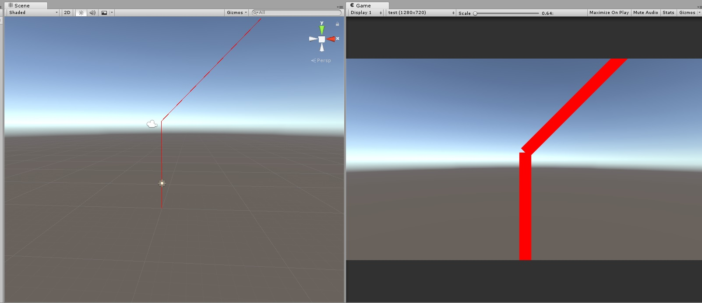
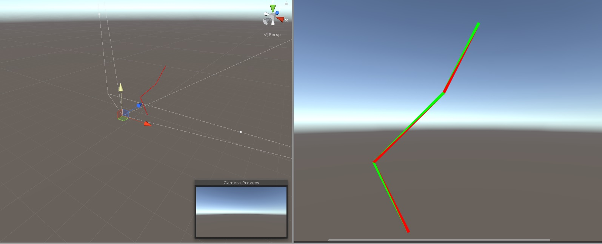
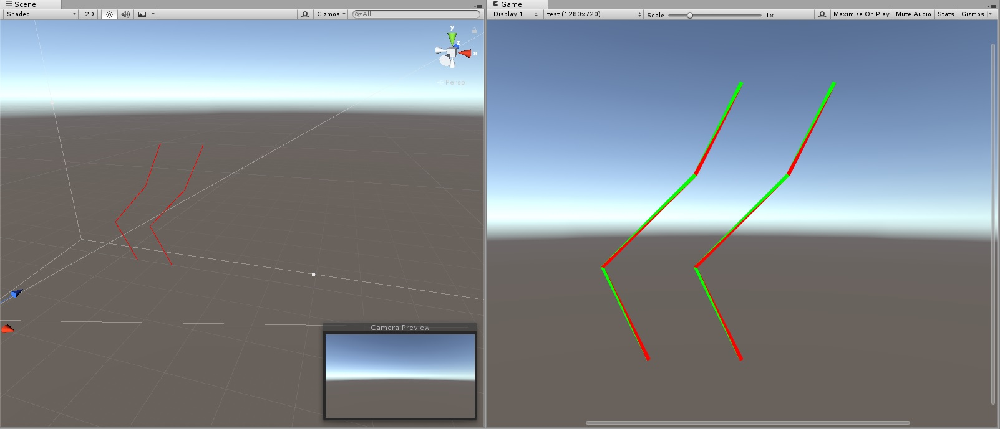

<p style="background:gray;padding: 1em;">
How would you go and expand your hair segment into polygons you can shade?
Geometry Shader? Vertex Shader?
</p>


# Introduction

The other day I was talking with a friend who was trying to make grass shader, he was going about it by using a geometry shader. Although a geometry shader is a really appealing solution, it might not be the fastest one.

# Why not geometry shader?

Warning, what I am about to say is mostly what I gathered from the industry, my experience
with geometry shader is near to not existent, the only geometry shader I ever implemented was
the
.

Although I do plan to go an verify those claims for myself, I did not get around to do so yet,
maybe this will be the time? Who knows. The TL;DR about geometry shaders is that they map quite bad to 
the modern pipeline, the not known amount of geometry generated and how the pipeline
is implemented is not really a good fit, in this

from  Joshua Barczak you can find
a detail discussion on Geometry shaders.

Don't get me wrong, I am not saying don't use geometry shader at all, I am saying there might be alternatives worth to try.

# Alternatives?

The next question, naturally, would be "What are those alternatives?". It would be bad of me if I suggest not to go with geometry shaders and don't offer any alternative.

As far as I know, we have few alternatives:

- Instancing
- Vertex Shader
- Turing mesh shader?

## Instancing

Instancing is a popular option when you have a lot of geometry to render, the idea being,
you kick the render for a lot of grass blades, and in the vertex shader you use a per instance matrix
to place your mesh in the world.
If your mesh needs to be deformed, you either need to be able to do the simulation for your vertex in the vertex shader, which might limit some options or bind a buffer
with the result of the simulation and fetch the data manually using the vertexID and InstanceID provided.

This is certainly a valid approach, but there is quite a bit of overhead for each geometry if you render a small geometry that overhead might dominate the cost of the render.

## Vertex shader

Ok, geometry shader and instancing are not ideal, what else we have? We have good old vertex shaders, if what we need to spawn is a simple shape we might be able to generate it procedurally in the VS.

The main idea is that you kick the render of as many vertices you need, then use the SV_vertexID variable in the shader to figure out what point you should output. Let say
you have 10 blades of grass, and the blade of grass is made of 3 quads, each quad is 2 triangles made of 3 vertices, you then want to kick the render for 10*3*6 vertices.
Once in the vertex shader, you want to expand a segment of the hair/grass (2 points), into a camera facing billboard, (2 triangles/6 points).

Let's have a look at how I was doing it in Unity for a hair shader.
Here it is my update method of the Monobehaviour:

```c#
	void Update () {

	    var data = cmp.getPointDataForRender();
        hairData.SetData(data);

        var cam = Camera.main;
        buffer.Clear();
        cam.RemoveCommandBuffer(CameraEvent.AfterForwardOpaque, buffer);

        buffer.SetGlobalBuffer("hairData", hairData);
        buffer.SetGlobalFloat("hairWidth", hairWidth);
        buffer.SetGlobalFloat("hairCount", hairCount);
        buffer.SetGlobalInt("hairSegments", segments);
        buffer.SetGlobalVector("cameraView", cam.transform.localToWorldMatrix.GetColumn(2));
        buffer.DrawProcedural(Matrix4x4.identity,hairMaterial,0,MeshTopology.Triangles, hairCount* segments * 6);
        cam.AddCommandBuffer(CameraEvent.AfterForwardOpaque, buffer);
	}
```

As can be seen from the code, what I am doing is fairly straight forward, I am binding a hairData buffer, which contains my simulated hair segments, plus some hair and camera configuration, the renderer is actually kicked by :

```c#
buffer.DrawProcedural(Matrix4x4.identity,hairMaterial,0,MeshTopology.Triangles, hairCount* segments * 6);
```

DrawProcedural() is a specific way of rendering in Unity which does not bind a vertex shader, it will be up to the shader to fetch the data needed to output the hair. The number of vertices I am rendering is:

```c#
hairCount* segments * 6
```

How does it look like in the vertex shader?

```c++
v2f vert(uint id : SV_VertexID)
{
    v2f o;
    uint vertexId = id % (6);
    uint hairIndex = id / (hairSegments * 6);
    uint vertexInHairIndex = id % (hairSegments * 6);
    uint segmentId = vertexInHairIndex / (6);

    //float globalVertexId = segmentId * 6 + vertexId;
    //get the tangent of the hair
    float3 tangent = getTangent(segmentId, vertexId, vertexInHairIndex, hairIndex);
    float3 crossV = normalize(cross(tangent.xyz, cameraView.xyz));

    int hairGlobalOffset = hairIndex * (hairSegments + 1);
    float4 pos = float4(hairData[hairGlobalOffset + segmentId + vertexOffset[vertexId]],1.0f);
    pos.xyz += -crossV* offsets[vertexId]* hairWidth;
    pos.w = 1.0f;

    //filling output
    o.vertex = UnityObjectToClipPos(pos);
    o.worldPos = pos;
    o.tangent = float4(tangent,0.0f);
    return o;
}
```

I am aware that all this indexing in the shader might not be the  easiest to read, but the main idea is, given the SV_VertexID, the first step is to figure out which hair that vertex belongs to, and which segments of that hair.
This can be achieved in the following way:

Which vertex in the segment you are manipulating
```c++
uint vertexId = id % (6);
```

Which hair the vertex belongs to
```c++
uint hairIndex = id / (hairSegments * 6);
```

The local id of the vertex to repsect of your hair:
```c++
uint vertexInHairIndex = id % (hairSegments * 6);
```

And finally your segment id
```c++
uint segmentId = vertexInHairIndex / (6);
```

Whit all this data the rest is just generating a billboard facing the camera using the
camera position.

For sake of "completeness" here the shader configuration:

```c++
uniform StructuredBuffer<float3> hairData : register(t0);
float4 cameraView;
float hairWidth;
uint hairSegments;
uint hairCount;
static int offsets[6] = { -1,1,-1,1,1,-1 };
static int vertexOffset[6] = { 0,0,1,0,1,1 };
static int u[6] = {0,0,1,1,0,1};
static int v[6] = {0,1,0,0,1,1};
```

The various offset arrays are just there to help me figure out without branches how to offset my vertices, I came up with them by writing on paper my two triangles and figuring out
the different offset I would need.

After my first experiment I got something like this:



On the left the edit view, with  the hair segment (started with a simple two segment hair), on the right the actual expanded hair.

The main issue is that we get a crack/break at each segment, ideally, we would like to have
the corners of the quads matching. With some extra maths we can actually achieve this, this is the job of the function getTangent which average the two segments, taking care of whether we
are going out of bounds:

```c++
inline float3 getTangent(int segmentId, int vertexId, int vertexInHairIndex, int hairIndex)
{

    int hairGlobalOffset = hairIndex * (hairSegments + 1);
    //computing the segment tan
    float3 currentTan = hairData[hairGlobalOffset + segmentId + 1] - hairData[hairGlobalOffset+ segmentId];

    //this value is either 0 or 1, telling us which end of the semgment
    //we need to grab
    int vOffset = vertexOffset[vertexId];


    //base id tells us wheter we need to grab the tangent before the semgnet or
    //the one after
    int baseId = vOffset == 1 ? segmentId +1: segmentId - 1;

    //we need to patch the value to take into account if we are at the start of the semgent
    //or at the end
    baseId = vertexInHairIndex < 2 ? segmentId : baseId;
    baseId = vertexInHairIndex == 3 ? segmentId : baseId;
    baseId = vertexInHairIndex >= ((hairSegments*6)-2)? segmentId : baseId;
    baseId = vertexInHairIndex == ((hairSegments*6)-4)? segmentId : baseId;

    float3 secondaryTan = hairData[hairGlobalOffset + baseId+1] - hairData[hairGlobalOffset+ baseId];
    return normalize(currentTan + secondaryTan);
}
```

This shader is by no mean optimized so probably can be made a lot better, just never got around to do so.

Anyway, this is the result, giving each triangle a different color, made my life much easier for debugging purposes:



Once this was working, I extended it to multiple segments:



And finally plugged in my hair simulation:


This technique is the same used by AMD for Tress FX, you can see the amazing result
by playing the rebooted Tomb Raider games. All this is done in vertex shader, with no
overhead of instancing and no geometry shader clunkiness.

With that said, is also true that might be increasingly harder to generate more complex geometries in vertex shader compared to the geometry shader, so this is not a silver bullet.
As a final note on vertex shader, the reader might have noticed that we are generating vertices multiple times, the vertices that are shared in the triangle, of course, this is wasteful,
unluckily I was forced to do this by unity, which does not allow me to use a triangle list for rendering. Having a triangle list, it would have solved the problem of the cracks in-between
segments too.

## Turing mesh shaders?

Finally, I wanted to mention the new
,
this shader offers unprecedented level of flexibility when it comes to geometry rendering and done in a gpu-friendly way, exploiting the GPGPU/Compute side of it. 
The main idea is that you generate work directly on the gpu, you can process chunks of triangles and dynamically 
decide to cull them, generates more etc. All this is done in parallel, and you are not limited by the input assembler anymore. Main downside being it is only available through extensions, which makes integration in off the shelf engines like Unity
a really high entry cost as an amount of work needed to integrate. I am really looking forward to trying it in my custom engine.

This is it for now guys! See you next time.
