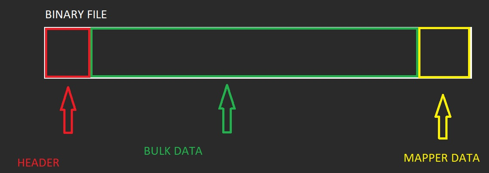

<p style="background:gray;padding: 1em;">
How a compiler plugin is implement, in particular how the model
compiler works.
</p>

<br><br>

# Processing geometry 

## The obj file
In the previous  

FIX LIIIIIIIIIIIIIIIIIIINK
FIX LIIIIIIIIIIIIIIIIIIINK
FIX LIIIIIIIIIIIIIIIIIIINK
 

I talked about how I was thinking to build a resource compiler for my engine. Today we will 
investigate a bit more how I am handling specifically the model/mesh compiler and how we write to
a binary file.

The first step in processing the model is to be able to load the geometry, as mentioned in the previous 
blog post I use 
,
the library lets me easily load the obj file. Next big problem is to be able to merge the
attribute buffers and indices (postitions,uvs etc) indo one. The way I ended up doing so was the same
way done by the 
, the algorithm ends up
being quite simple. 

The main idea is to be able to "hash" a full vertex, completed of all the needed attributes
you care about and use that hash to figure out whether or not you got a duplicate or you need to create a new
index. You then iterate all your triangles and duplicate when necessary. I suggest you to read the vulkan-tutorial.

The only difference in that turial is that I pass in a json file holding the tangents that a python script
exported from maya, my main loop looks something like this:

```c++
    // Loop over vertices in the face.
    for (size_t v = 0; v < fv; v++) {
      // access to vertex
      tinyobj::index_t idx = shape.mesh.indices[index_offset + v];
      VertexCompare c;
      c.p.x = attr.vertices[3 * idx.vertex_index + 0];
      c.p.y = attr.vertices[3 * idx.vertex_index + 1];
      c.p.z = attr.vertices[3 * idx.vertex_index + 2];
      c.n.x = attr.normals[3 * idx.normal_index + 0];
      c.n.y = attr.normals[3 * idx.normal_index + 1];
      c.n.z = attr.normals[3 * idx.normal_index + 2];
      c.uv.x = attr.texcoords[2 * idx.texcoord_index + 0];
      c.uv.y = attr.texcoords[2 * idx.texcoord_index + 1];
      c.t.x = tangents[3 * idx.vertex_index + 0];
      c.t.y = tangents[3 * idx.vertex_index + 1];
      c.t.z = tangents[3 * idx.vertex_index + 2];


      // if the vertex is not in the map, it means is unique
      // and needs to be added and is a valid ne vertex in the vertex buffer
      if (uniqueVertices.count(c) == 0) {
        uniqueVertices[c] = indexCount++;
        vertexData.push_back(c);
      }

      indices.push_back(uniqueVertices[c]);
    }
    index_offset += fv;
  }
```
Where ```VertexCompare``` is the struct I am able to hash.

Once I have loaded the obj, I am left with a Model structure that looks like this:
```c++
struct Model {
  std::vector<float> vertices;
  std::vector<int> indices;
  int strideInByte;
  int vertexCount;
  int triangleCount;
};
```
## Mesh optimizations

At this point I can do any sort of mesh optimization, the first thing I plan to do is to use the great 
 library. As of now I am doing
the least amount of work until I can get something on screen again.


# The binary file

## Binary file structure

All the data is in there ready to go into a binary file. The way I decided to organize my binary file is as follow:



It is composed of three chunks, header, bulk data and mapper data.

The header is a really small blob of data that holds mostly three pieces information, the type of file I am dealing
with, the version of the file was compiled from (aka the version of the plugin used) and finally an offset 
from the start of the binary file where the mapper data will be, here is the binary file header:

```c++
struct BinaryFileHeader {
  unsigned int fileType;
  unsigned int version;
  size_t mapperDataOffsetInByte;
};
```
The duty of the mapper data is tell the user how to read the bulk data, how it is composed etc. The reason 
why it is a the end is because makes life much easier for writing the file, you might not know how big the bulk
data is. You might be exporting either progressively or animation frames etc, you just keep going writing your 
data without worrying and rather than shifting memory around you just put the mapper data at the end.
Although does not make much of a difference for the model compiler, is an extra feature in there does not cost 
me anything to maintain. 

So we use the ```mapperDataOffsetInByte``` to get to the mapper data, the geometry mapper data looks like this:

```c++
struct ModelMapperData {
  unsigned int vertexDataSizeInByte;
  unsigned int indexDataSizeInByte;
  unsigned int strideInByte;
};
```
The stride is just the size of a single vertex, probably in the future I might want to store some extra information
like the composition of the vertex, but for know I am just keeping it simple. The two sizes in bytes tell me where
to find the data and how much of it there is. Bulk data starts after the header, I will find my vertex data in the
address range ```[fileStart+headerSize, fileStart+headerSize+vertexDataSizeInByte]```, index data just comes
after the vertex data, so I can compute start and end in a similar way.

At the end of the day is up to the user to implement whatever logic they need for the the asset type.


## Write the binary file

To write a file I generate a ```BinaryFileWriteRequest``` struct, that holds all the needed information:

```c++
struct BinaryFileWriteRequest {
  const char *outPath = nullptr;
  unsigned int fileType = 0;
  unsigned int version = 0;
  const void *bulkData = nullptr;
  size_t bulkDataSizeInBtye = 0;
  const void *mapperData = nullptr;
  size_t mapperDataSizeInByte = 0;
};
```
A generic function will write down that blob of data.


## Reading the binary file

Finally reading the file will be quite simple here some simple code I used for testing in my old dx11 engine:


```c++
void Mesh::loadFromFileBinary(const std::string &path) {
  std::vector<char> data;
  readAllBytes(path, data);
  const BinaryFileHeader *h = getHeader(data.data());

  auto mapper = getMapperData<ModelMapperData>(data.data());

  m_stride = mapper->strideInByte / 4;
  // creating the buffers
  int sz = mapper->vertexDataSizeInByte / mapper->strideInByte;
  render_index_size = mapper->indexDataSizeInByte / sizeof(int);

  // lets get the vertex data
  float *vertexData = (float *)(data.data() + sizeof(BinaryFileHeader));
  float *indexData = (float *)(data.data() + sizeof(BinaryFileHeader) +
                               mapper->vertexDataSizeInByte);

  m_vertexBuffer = getVertexBuffer(sz * m_stride * sizeof(float), vertexData);
   m_indexBuffer =
      getIndexBuffer(render_index_size * sizeof(int), indexData);
}
```

Specifically here you can see how I am the data in the mapper to index the data in binary buffer. 

```c++
  // lets get the vertex data
  float *vertexData = (float *)(data.data() + sizeof(BinaryFileHeader));
  float *indexData = (float *)(data.data() + sizeof(BinaryFileHeader) +
                               mapper->vertexDataSizeInByte);
```

That is it! The compiler is growing already, I currently have a shader compiler plugin aswell, able 
to compiler Shader model 6 shaders. I will write a small blog post about that next, since it gave me a bit
of trouble to get it to work.

Feedbacks are more than welcome! I would love to hear from experience game engine developers on how they 
approached similar issues!
See you next time!

