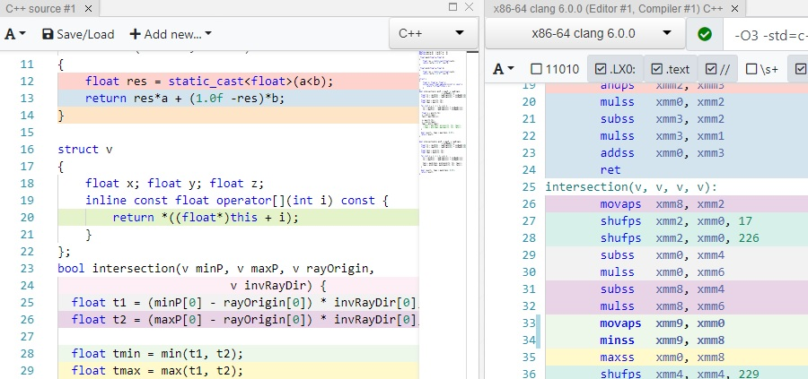
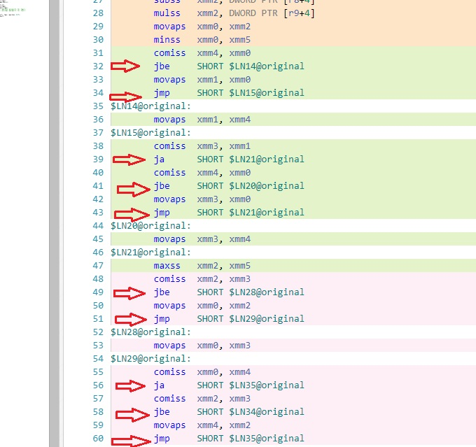
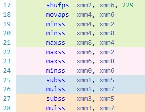

<p style="background:gray;padding: 1em;">
You thought those ternary operator were going to be converted to conditional move? Sorry...
</p>



# Introduction

It is a normal day, having some fun optimizing a custom CPU implementation of 
,
with the 
, (super cool by the way, check it out)
, when the profiler itself tells you the in the ray traversal function,
one piece of code is particularly expensive, I started to drill down to find some interesting surprises.

Before moving any further, I was developing on an up to date Windows 10 machine using latest Visual Studio 2017 as of the writing of this post.
For reference here below the full interactive code in compiler explorer. It is a bit tiny but should be serviceable, you can always open it full screen in a tab.

<iframe width="1000px" height="400px" src="https://godbolt.org/embed-ro#z:OYLghAFBqd5QCxAYwPYBMCmBRdBLAF1QCcAaPECAKxAEZSAbAQwDtRkBSAJgCFufSAZ1QBXYskwgA5NwDMWAGZ4WmANQBbJgA8ITUgCMAlKtVQmHWdiMWAYqqaqQq6wAYAgnMXK165boPGproWAMLWsnYOTq4e7oIExCLIBKoAbhzuHADsfO4mJgoMqEwpWhY8qoXFKQCe5ZVFJaoAXuUZbvmqygzeqmgs8Q3VqqgADpjEJSQcAKx8MwAiEMopeMb9g9m5HZ35xJgEYiyqAFRQVSUnhgQIeIKq/F2GbXn52Qvt7y%2BxP/qoqAwRsQ8MBlEwGBBUhplAAFUhpDTaOEIyY1ADywNBLFI7V2ePx%2BKhylSACUmDUFnhiMYtrihk0CLQHrIFqZfCwYbMeC5ZqyALSqVEYkHKLk8xbGE5dFik8mU4hi3nfAqNFIELjM1kQTRaTlzcX8wXk4VYxUS07S2UUqlmj6ybZ0i5q9ma6EsCCM%2BHq572x2q1QEHWunUe%2BgBrg%2Bh2vBQkUwrLqu2j1PDMkKqWT1fj8NYPHJ0kyM13a2FcvC81QCoWY0VzMvmqXEsnWhW1pW%2B14FjUWLU6vU8OuGqsilil3mSy1N%2BWjxbffMBl3dxE6QPKeHs4vuz3hwxenWGSNzwPaYN%2BI9aNfabWXrfe3fKffK3MfTKvP4AwWYQQiBgERfz48WNgS4euy8IuAAdC4CgHq8%2ByHMQxz7F%2BP6zlkz6/P8gIrBMgiYMkeCoO6ULssixFIvCUJDliOIdgSdG7ESMqTlSNJ5tG/qFouG59gaFZGui1YjvqY4Wo2co2sJM7tjsTrhkWva2nxVE1tyIkNkx4ktqpUlRjJHELiybqhl6EaPrJZ7BteYberO0axssLCrImyapumma8NmrHbJ0nGGdx06DsagkBeOYnNgFj6dvJSIBUpQXDiFokaeFrY6Z8HayVoJ6bvQNnSfkWWLuu55njBOzzsolnLqBWhlfmZSGSGnp5d5JiFY1fglXukUWUVnWkKVkWqAA9MNK7HEV16gUZ643hGu7aA%2B%2BX5KNvUdZuOoXjoTXWfNFUsEtrVfC%2BOxvoCSHfr%2Bhn/u1QFNdNEFQWVJhwUcH7IVdDpoelPxSDuDDSDMUikCw0guMDqDSCEWa8KowhiBIDxcLItDAwQYN/TuADWIAzBBAAc%2BOyFktBZMjsgACxZC4sgAJyMNIFPA6DUjg6QkNSMDgggC4A0YzucCwEgaDqKMeAMBM5CUCLYsS8QKDMGwABsLi80oP44ZQ%2BgYwYYLEDU0io6QIvqJgjloiwDAG6zwNYJobASzr%2BD7PhqSfjrmBaHhIgEJIUhG9hAM2wNwLqIbf2MKw7AwwIPT6NzkA7mMBAEQM0h8misgVvE6DdpwHm8LQRvw%2BIki0P9gPMzrHNaPjSt8krFN9IrwCqErkGQaYuCELGchhiEqCi%2BLExIyjxjQwXPBo/z2MgBTtPgUXStcPjXBZErSszFwtNK/QQdM6QYe0KrIPV9IXM83zNv7gzUhcFXwcc9P187m7xCCKnc9AA%3D%3D"></iframe>


# The code 
Drilling down in the profiler it seems like the 38% of the time was spent in this function:

```c++
bool original(v minP, v maxP, v rayOrigin,
                         v invRayDir) {
  float t1 = (minP[0] - rayOrigin[0]) * invRayDir[0];
  float t2 = (maxP[0] - rayOrigin[0]) * invRayDir[0];

  float tmin = min(t1, t2);
  float tmax = max(t1, t2);

  for (int i = 1; i < 3; ++i) {
    t1 = (minP[i] - rayOrigin[i]) * invRayDir[i];
    t2 = (maxP[i] - rayOrigin[i]) * invRayDir[i];

    tmin = max(tmin, min(min(t1, t2), tmax));
    tmax = min(tmax, max(max(t1, t2), tmin));
  }

  bool result=  tmax > max(tmin, 0.0f);
  return result;
}
```
The function has been renamed as original for ease of writing, it also uses a Vector3 class that has been replaced in compiler explorer really lazily with:
```c++
struct v
{
    float x; float y; float z;
    inline const float operator[](int i) const {
        return *((float*)this + i);
    }
};
```

By looking at the code I would not see anything particularly weird, few additions, multiplication, the code had a hardcoded count so should unroll. Nothing weird here, then my memory kicked in,
min and max are actually coming from the windows headers and are defined as:

```c++
#define max(a,b)  ((a>b)? a : b)
#define min(a,b)  ((a<b)? a : b)
```

It is not the first time that I have issues with ternary operator, so I grabbed everything and went to compiler explorer, I was afraid of what I would have found, here the result:



The highlighted jump instructions are not even all of them, the screenshot should have been too big. After seeing this I started to understand why the function might have been so slow.
To note both Clang and GCC behaves correctly and generate code with not a single jump.

My first experiment was to try to convert max/min by converting it to a linear interpolation, that removed the branches at the cost of a lot of extra sub/mul/add instruction. This ended up being actually a bit slower of the branches. That lead me first to understand that those branches might have not been as slow as expected, but still, I would love not to have those jumps.
Clang just converted to native min max instructions, without the need to have jumps/branches:



I was about to give up when a friend of mine found a solution, of which I was quite surprised of:

```c++
bool intersection(v minP, v maxP, v rayOrigin,
                         v invRayDir) {
  float t1 = (minP[0] - rayOrigin[0]) * invRayDir[0];
  float t2 = (maxP[0] - rayOrigin[0]) * invRayDir[0];

  float tmin = min(t1, t2);
  float tmax = max(t1, t2);

  for (int i = 1; i < 3; ++i) {
    t1 = (minP[i] - rayOrigin[i]) * invRayDir[i];
    t2 = (maxP[i] - rayOrigin[i]) * invRayDir[i];

    //tmin = max(tmin, min(min(t1, t2), tmax));
   float x = min(t1,t2);
   x = min(x,tmax);
   tmin = max(tmin,x);

   //tmax = min(tmax, max(max(t1, t2), tmin));
   x= max(t1,t2);
   x = min(x,tmax);
   tmax = min(x,tmax);
    
  }

  bool result=  tmax > max(tmin, 0.0f);
  return result;
}
```

The key seems to be that visual studio gets confused if you start nesting min/max declaration, here I am using a single badly named variable x to store the intermediate result. 
You can use a different variable for each step to make it more readable, still will generate no jumps.

# Conclusion

After this change, the same function became roughly 25% faster. Not a crazy jump as I might have expected but still a nice speed up. As Matt Godbolt told me on the c++ slack, this small branches
sometimes are not as bad as they seem, and I think this is what we are seeing, but still, taking into account that this function is called a lot, I will take a 25% speed up gladly.

With time I started being weary of some patterns from MSVC, I remember a few months ago having a similar problem of a ternary 
operator being converted to branches only, if the ternary was paried with a return value like:
```c++
return a > b? a +10 : b +5;
```
The above would generate branches, the one below would not:
```c++
int res = a > b? a +10 : b +5;
return res;
```
Unluckily by the time I got around to write a post about it, I was not able to replicate the bug anymore.

That is it for now! Cheers.


