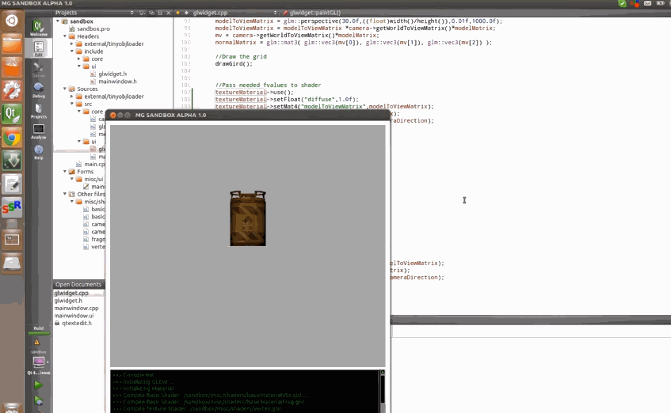
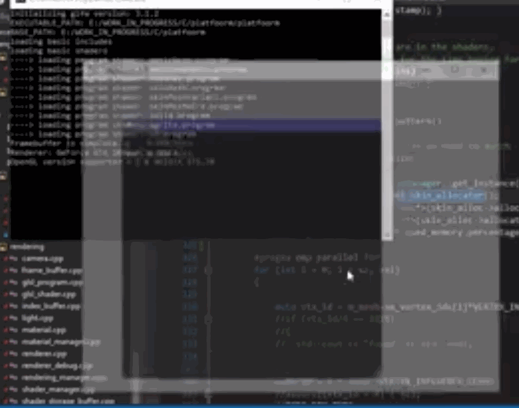
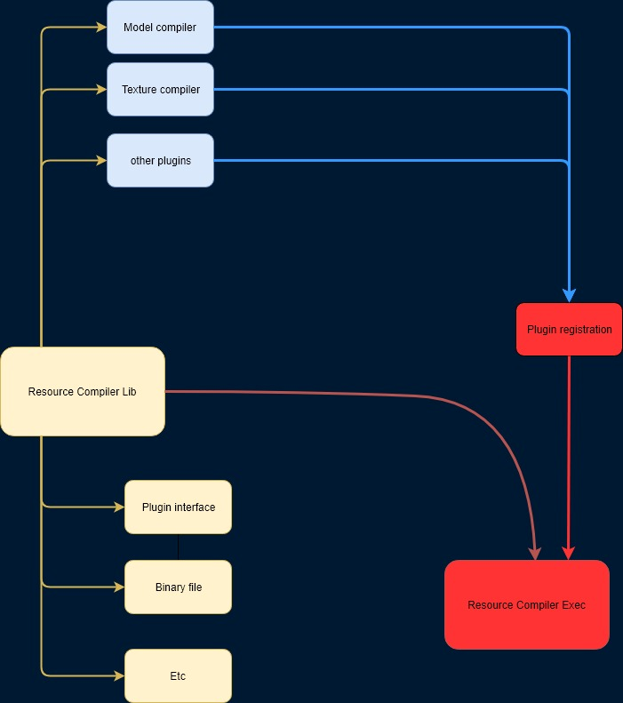
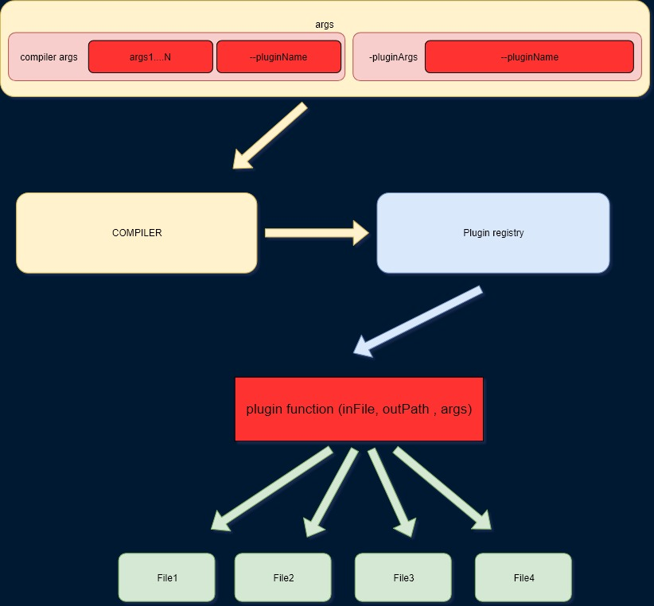

<p style="background:gray;padding: 1em;">
Planning the architecture for my first game engine resource compiler
</p>

<br><br>

# The ugly model loader

If you are not interested in how I ended up with a crappy model loader,
jump to the resource compiler section.

Since I started working with OpenGL, almost five years ago, I wrote a super simple and ugly model obj loader. The main issue was that  
would give me back multiple index buffers, one per geometry attribute. Inexperienced
and eager to get something on the screen like I was, led me to simply "smush"(technical term) the
mesh attribute into a single array, and the index buffer became a monotonic increasing
 array like : [1,2,3,4....N];

 Here below a quick gif of my Qt/OpenGL viewer at the time:



 As you can imagine, doing that makes the index buffer useless, there is
 not a single duplicated index, meaning no vertex cache hits.
 That piece of code was copy-pasted all over my graphics projects, almost untouched for five years. My latest DirectX demos, still run this ugly piece of code:

```c++
for (int i = 0; i < sz; ++i) {
      const auto vtx_id = attr.vertices_ids[i];
      const auto uv_id = attr.text_coords_ids[i];
      const auto n_id = attr.normals_ids[i];
      const auto curr = i * STRIDE;

      vtx[curr + 0] = sourceVtx[vtx_id * 3];
      vtx[curr + 1] = sourceVtx[vtx_id * 3 + 1];
      vtx[curr + 2] = sourceVtx[vtx_id * 3 + 2];
      vtx[curr + 3] = 1.0f;

      vtx[curr + 4] = sourceNorm[n_id * 3];
      vtx[curr + 5] = sourceNorm[n_id * 3 + 1];
      vtx[curr + 6] = sourceNorm[n_id * 3 + 2];
      vtx[curr + 7] = 0.0f;

      vtx[curr + 8] = sourceUv[uv_id * 2];
      vtx[curr + 9] = sourceUv[uv_id * 2 + 1];
      vtx[curr + 10] = 0.0f;
      vtx[curr + 11] = 0.0f;

      idx[i] = i;
    }
```

In particular, in case you did not notice:

```c++
//this is the index buffer
idx[i] = i;
```
Other than being ugly and slow to render, it was also very slow in reading/loading the resources.
Even for a single skinned character, it would take tens of seconds to load. To the extent that
in my dx11 engine, I added an async resource loader.



You can see from the gif the pieces of geometry popping on screen, don't get me wrong
it was a good exercise but did not solve the underlying problem, that my model
loading was crap.


Backtracking a little bit, although in 2018 I focused on graphics a bit, my
2019 resolution was to have graphics as main focus, stopping any other side projects.
This left me with two graphics projects my DX11 and DX12 engines.

My DX11 engine is mostly a bunch of code used to get stuff on screen as fast as possible
for the programmer. My DX12 engine, still in early stage, wants to be
a proper engine. I'm trying to get a decent architecture.
The implementation of a graphics technique is going to happen in my DX11 engine, until
my DX12 engine will be able to stand on its legs.

# The resource compiler

The need for a decent DX12 engine architecture, made me
fix my model loader, and have a proper resource compiler to process
the resources down to binary, ready to go straight on the GPU at no extra processing needed.

I decided to sit on it for a while and try to architect how it would look like.
Here it is what I came up with:



Let me try to explain it in a bit more detail now that you have seen a visual
representation of it.

There is a core library for the resource compiler; the library will define several
factors like the interface of the plug-ins (more on that later), how to deal with binary
files, and so on.

This library will then be used in the resource compiler application, which will be in
charge of discovering and registering plug-ins, read-in arguments from command line and
dispatch everything to the correct plug-in.

Now you may be wondering, what are those plug-ins I am talking about? Rather than go with a "monolithic"
approach, I decided to break it down a little and make it more modular. Each
plug-in will be in charge of processing one type of file, for example, models,
images, skin data.

In reality, I will create small files descriptions of a whole asset, containing
shader, animations, etc, the compiler will unpack such description and dispatch each
resource to the correct plug-in.

The only thing the plug-in needs to do is to export a function called

```c++
extern "C"
{
    bool RC_PLUGIN pluginRegisterFunction(PluginRegistry *registry);
}
```
The compiler executable will try to look for all the dlls
inside a plug-in folder and load as well as execute such function.

```c++
void PluginRegistry::loadPlugin(const std::string &dllPath) {
  auto ws = std::wstring(dllPath.begin(), dllPath.end());
  HMODULE loadedDLL = LoadLibrary(ws.c_str());
  if (loadedDLL) {
    auto loadFun = (RegisterPluginFunction)GetProcAddress(
        loadedDLL, "pluginRegisterFunction");

    if (loadFun) {
      bool res = loadFun(PluginRegistry::getInstance());
      if (res) {
        m_dlls.push_back(loadedDLL);
        SE_CORE_INFO("Successfully loaded plug-in {0}", getFileName(dllPath));
        return;
      } else {
        SE_CORE_ERROR("Problem in loading plug-in {0}", getFileName(dllPath));
      }
    }
    FreeLibrary(loadedDLL);
  }
}
```

The loaded function will be executed, its only job is to register the processing
function in the plug-in registry:

```c++
bool pluginRegisterFunction(PluginRegistry *registry) {
  registry->registerFunction(PLUGIN_NAME, &processModel);
  return true;
}
```

Where processModel() is of type:
```c++
typedef bool (*ResourceProcessFunction)(const std::string &assetPath,
                                        const std::string &outputPath
                                        const std::string &args);
```
I am not sure on how I want to handle the args for the plug-in, whether I prefer to pre-process
them outside or inside. For the main resource compiler I am using 
which works quite well.

This is how an actual compiler invocation is working:



The args are fed to the compiler, the compiler will use the plug-in name to access the
registry, and dispatch the plug-in args to the correct plug-in function which will
generates one or more files.

In the next blog post, I will go a bit more in details on the modelCompilerPlugin and
how I am dealing with the binary file.
Any comments and feedback are more than welcome! I am sure this can be improved
big time!

See you next time.
