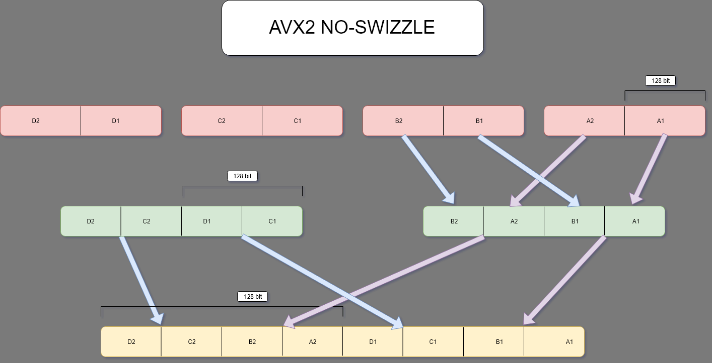

<p style="background:gray;padding: 1em;">
Converting an image and saving it to disk... with help of SIMD (SSE4,AVX2 ...), easy right?
</p>


<br><br>

# The problem
I started working on YET another personal project, at least I am staying true to myself that should be graphics related. I started hitching 
for some CPU work, AVX, disassemble and optimize. I decided to work on a software rasterizer using some tutorials out there as a base:

* 
* 

Right now I am to the point where I am able to render a mesh with soft normals (meaning using vertex attributes), the goal of the project is not to make
pretty picture, but to work on performance and optimizations, meaning going wide in both cores and register. 
After I got the basic mesh render I cleaned up the API and decided to see how I was doing timing wise, timings looks roughly like this:

* Load mesh: 3ms
* Render mesh: 14ms
* Write image :90 ms

Not that I am really worried about the image write speed but I went and have a look. The function does also a conversion from float to unsigned char,
I treat colors as float, for now implicitly between 0.0f to 1.0f. I decided to vectorize that loop just for the sake of it, I was quite rusty with 
SIMD programming and that was a task simple enough to familiarize with it again.
This is where my rabbit hole starts.


# The algorithm 

The original code looked something like this (simplified for brevity):

```c++
 for (unsigned int h = 0; h < data.h; ++h) {
    for (unsigned int w = 0; w < data.w; ++w) {
      int offset = (h * data.w + w) * channels;
      outData[offset + 0] =
          static_cast<unsigned char>(data.data[offset + 0] * 255.0f);
		  ...
    }

```

The body of the loop is duplicated all the way to ```offset + 3```, basically doing all 4 channels of the image. The code is super simple and quite dump
(I know can be improved, for example removing the internal loop). The vectorized algorithm would just process N channels at the same time, after
all I am doing the same operation on all of them, perfect for vectorization.

The algorithm would just load N float channels, scale them, converts to ```uchar``` and store. When I was googling on how to do the conversion I came across
a pretty much identical case on Stack Overflow, one of the answer suggest to pack multiple unsigned char in the register and write them all at once.
Sounds pretty straight forwad doesn't it? Well ... so I thought at least, but then problems started to happen. 


# AVX2 

I started working right away on the ```AVX2``` version of the algorithm, wider is better right? 
The code looked something like this:

```c++
void writePNG_AVX2(const TextureData &data, unsigned char *outData) {

  int channels = getImageChannelCountFromFormat(data.format);
  // we know by definition that the image is padded so avx is safe to use.
  int elementCount = data.w * data.h * channels;

  const __m256 scaleAVX2 = _mm256_set1_ps(255.0f);
  for (int i = 0; i < elementCount; i += 32) {

    __m256 dataReg1 = _mm256_loadu_ps((data.data + i + 0));
    __m256 dataReg2 = _mm256_loadu_ps((data.data + i + 8));
    __m256 dataReg3 = _mm256_load_ps((data.data + i + 16));
    __m256 dataReg4 = _mm256_load_ps((data.data + i + 24));
    // scale by 255
    __m256 resFloat1 = _mm256_mul_ps(dataReg1, scaleAVX2);
    __m256 resFloat2 = _mm256_mul_ps(dataReg2, scaleAVX2);
    __m256 resFloat3 = _mm256_mul_ps(dataReg3, scaleAVX2);
    __m256 resFloat4 = _mm256_mul_ps(dataReg4, scaleAVX2);


    __m256i resInt1 = _mm256_cvtps_epi32(resFloat1);
    __m256i resInt2 = _mm256_cvtps_epi32(resFloat2);
    __m256i resInt3 = _mm256_cvtps_epi32(resFloat3);
    __m256i resInt4 = _mm256_cvtps_epi32(resFloat4);

    // pack to 2x8 int32 to int 16
    __m256i resInt16_1 = _mm256_packs_epi32(resInt1, resInt2);
    __m256i resInt16_2 = _mm256_packs_epi32(resInt3, resInt4);

    // pack to int 8
    __m256i toWrite = _mm256_packus_epi16(resInt16_1, resInt16_2);
    _mm256_storeu_si256((__m256i *)(outData + i), toWrite);
  }
}
```

Might be a bit overwhelming but let us unpack this, before the loop I just compute how many elements I have in my array. then I set
a float8 to the scale value. Note I am going to refer to types as "type + count", so float8 is the same as __m256, just easier to read IMO.

Next I load four register worth of float8, here the first load:
```c++
    __m256 dataReg1 = _mm256_loadu_ps((data.data + i + 0));
```

I scale the channels:
```c++
    __m256 resFloat1 = _mm256_mul_ps(dataReg1, scaleAVX2);
```

This perform the conversion to int8_32 where 32 is the width of each int, in this case 8 ints of width 32bit.
I like to live dangerously, we will check if a value is greater than 255.0f another day :P.

```c++
    __m256i resInt1 = _mm256_cvtps_epi32(resFloat1);
```
Next we convert two int8_32 to two int8_16 and pack them in a single int8.

```c++
    __m256i resInt16_1 = _mm256_packs_epi32(resInt1, resInt2);
```
Next we perform the same operation but going from integer of size 16bit to size 8bit and write to disc.
```c++
    __m256i toWrite = _mm256_packus_epi16(resInt16_1, resInt16_2);
    _mm256_storeu_si256((__m256i *)(outData + i), toWrite);
```

OK, we now know the details of the algorithm, so will make the rest of discussion easier. Let us run our code and see what we get!


Perfect! It is working ... wait what? What happened to the image? It looks like it as some weird striding in the pixels.

It took me a while to track down the exact problem, the issue is in the packing instructions ```_mm256_packs_epi32``` and ```_mm256_packs_epi16```
By looking at the 
we see the following:


As you can see from the highlighted part, the lines gets swizzled 4 wide at the time. The result would be the first 4 lanes of register ```a```
then the first four lanes of register ```b``` and so on. This means our pixels are being swizzled around too, giving us the jagged look.
Next we will be focusing on how to fix this.


# Fixing the swizzle by ... SWIZZLING.

I have been thinking about this and the only way I found to get the right result was to pre-swizzle your data then perform the compaction, in 
this way you would end up with the right pixels. I am not sure this is the best course of action, if you have any other idea please let me 
know!

In order to figure out how it works I had to use pen and paper, first I started to see what is happening, how my register would be compacted
in a top to bottom way, then I started bottom up with the resulted I wanted to see what my starting register would have to look like to get 
the right result.
Here below the manual working I did, with mandatory stain of coffee of course (this one is for AVX512 which we will 
look later on, is just to give an idea).


Let us look at a better picture drawn properly:



In the above picture each 256bit register is split in two chunks of 128 bits, in this case we have registers A,B,C,D. As you can see the compaction
works 128bits of data at the times, each time we go down one level, the seize of the data halves, so twice as much data fits in our 256 bit register.

This is what is happening in the case of the jagged image, what will we need to do in order to get the right result? Let us check the below image.


I suggest to work out the image bottom up, by following the arrows. If you then check the top row, it is clear we need to mix the register in a way
that first register holds the bottom part(bottom 128 bit) of A and C, the second register the top part of A and C and so on. 
How do we achieve that in code?
We could use extract and insert instructions but there is a more power full instruction, let us meet: ```_mm256_permute2f128_ps``` 

The  
let us pick which block of 128bit we want to pick from two register based on a int, this int is a 8 bit value, where the first 4bit, tell us which 128 block 
will end up in the destination lower register and the second 4 bit in the integer will tell us which 128bit block will end up in the upper register.

Here is the code to achieve our result:

```
    __m256 shuffle1 = _mm256_permute2f128_ps(resFloat1, resFloat3, mask0);
    __m256 shuffle2 = _mm256_permute2f128_ps(resFloat1, resFloat3, mask1);
    __m256 shuffle3 = _mm256_permute2f128_ps(resFloat2, resFloat4, mask0);
    __m256 shuffle4 = _mm256_permute2f128_ps(resFloat2, resFloat4, mask1);

```
You can map resFloat1 to A and so on. The only thing to figure out is this mask value:

```
  constexpr int mask0 = (2 << 4);
  constexpr int mask1 = ((3 << 4) | (1));
```

In the first register shuffle1, we need to get the bottom part of A and C. Since we are passing in the A,C as argument the first 4 bit needs to be 0,
so we get the bottom part of A, the other 4 bits need to be 2, in this way it will pick the bottom part of C, so the mask is (2<<4) | 0, but since the 
or with zero is redundant we drop it.

The second mask follows the same reasoning but everything is shifted by one since we need the upper part of the registers.

The full code is :

```
 const __m256 scaleAVX2 = _mm256_set1_ps(255.0f);
  constexpr int mask0 = (2 << 4);
  constexpr int mask1 = ((3 << 4) | (1));
  for (int i = 0; i < elementCount; i += 32) {

    __m256 dataReg1 = _mm256_loadu_ps((data.data + i + 0));
    __m256 dataReg2 = _mm256_loadu_ps((data.data + i + 8));
    __m256 dataReg3 = _mm256_load_ps((data.data + i + 16));
    __m256 dataReg4 = _mm256_load_ps((data.data + i + 24));
    // scale by 255
    __m256 resFloat1 = _mm256_mul_ps(dataReg1, scaleAVX2);
    __m256 resFloat2 = _mm256_mul_ps(dataReg2, scaleAVX2);
    __m256 resFloat3 = _mm256_mul_ps(dataReg3, scaleAVX2);
    __m256 resFloat4 = _mm256_mul_ps(dataReg4, scaleAVX2);

    __m256 shuffle1 = _mm256_permute2f128_ps(resFloat1, resFloat3, mask0); //A1C1
    __m256 shuffle2 = _mm256_permute2f128_ps(resFloat1, resFloat3, mask1); //A2C2
    __m256 shuffle3 = _mm256_permute2f128_ps(resFloat2, resFloat4, mask0); //B1D1
    __m256 shuffle4 = _mm256_permute2f128_ps(resFloat2, resFloat4, mask1); //B2D2

    // pack to 2x8 int32 to int 16
    __m256i resInt16_1 = _mm256_packs_epi32(resInt1, resInt2);
    __m256i resInt16_2 = _mm256_packs_epi32(resInt3, resInt4);

    // pack to int 8
    __m256i toWrite = _mm256_packus_epi16(resInt16_1, resInt16_2);
    _mm256_storeu_si256((__m256i *)(outData + i), toWrite);
  }

```

Let us run it and see what we get as output image:


Finally! We reached our result!
In the next part of the blog we are going to discuss what will happen if we use SSE4 and or AVX512 and also discussing some timings.

See you next time!


