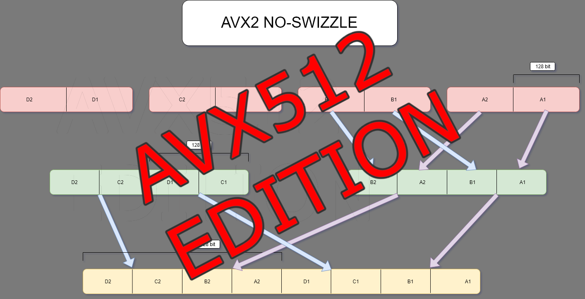
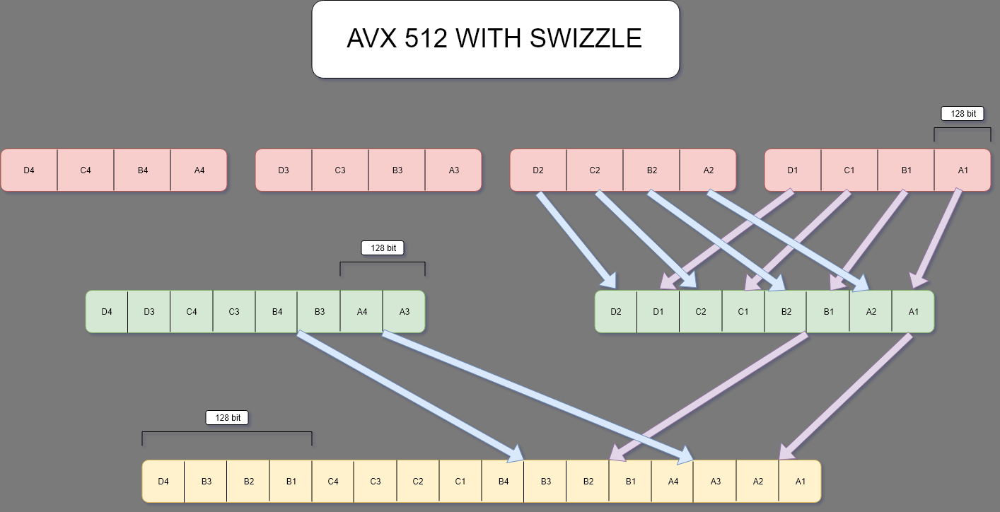
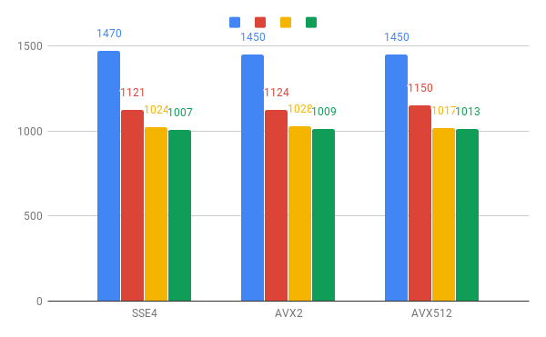
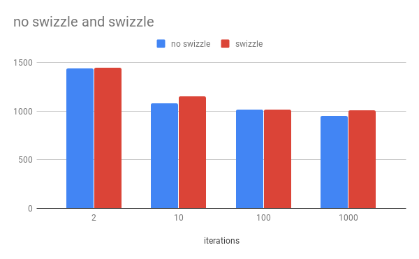

---
date: 2019-06-26
linktitle: simd compaction 
title: "SIMD Register compaction PT2"
tags : ["simd","cpu"]
tocname: "Table of contents:"
toc : true
draft : true 
---

<p style="background:gray;padding: 1em;">
Converting an image and saving it to disk... with help of SIMD (SSE4,AVX2 ...), easy right?
</p>


<br><br>


# Wider 

Welcome back to the second part of this blog post, in the first part we looked in more detail on the algorithm, the problem with the naive
algorithm and how to solve in AVX2. In this second part instead we will be checking what to do with AVX512, SSE4 and some timings.

As of now I have access to a machine rocking a i9 9920X, a 12 cores AVX512 enabled. That is a pretty cool machine that will allow me to push my
software rasterizer quite a bit.
When we go to AVX512, we can chew twice as much floats in one go, we can process 16 channels or 4 pixels at the time. Unluckily if you were expecting
to be able to use the same instructions just bumped from `_mm256` to `_mm512` you are in for a bad news.

If we look at ```_mm512_permute4f128_ps ``` we can quickly see that you can only permute data inside a single 512 register, not across two 
512 registers. I could not find an instruction to do that, the closet I could find is 
.

That instruction lets you swizzle single values, not blocks of 128bits, it seems even more flexible, although I am curious to see if the latency of those 
instructions is actually much higher, unluckily seems like Intel did not release the timings for this instruction.

Before looking at how to use the instruction let us investigate the problem again, as you would expect the result from compaction is quite similar:


The result we wish to get is the following:



From the look of it our only goal is to get corresponding sections from all our registers into one, for example, the first 128bits from all 4 registers
packed into one register, then the seconds 128bits and so on.
Let us try to use ```_mm512_permutex2var_ps```, one issue is, I spent 30 minutes looking at the documentation, trying on paper, but could not figure
out how the mask worked, so I had to brute force it, trying value and see what the result was. If anyone can explain me how exactly should I read that
piece of documentation I would be very glad!

At the end of the day, the mask seems to boils down to a _m512i register, aka 16 integers each ranging from 0 to 31, where the first 0-15 integers are used
to index the lanes of the first register and 16 to 31 are used to index the lanes of the second register. 

For example to get A1B1A2B2 into a register (remember that A* and B* are blocks of 128bits or four floats), we can use the following mask:

```c++
  constexpr int maskFirst[16]{0, 1, 2, 3, 16, 17, 18, 19,
                              4, 5, 6, 7, 20, 21, 22, 23};
```

As you can see we are going to get lane 0-3 in from first register then lane ((0-3) +16) from the second register, as you can see to index the register 
you need to offset by 16. 

Here the full swizzle

```c++
  constexpr int maskFirst[16]{0, 1, 2, 3, 16, 17, 18, 19,
                              4, 5, 6, 7, 20, 21, 22, 23};
  constexpr int maskSecond[16]{8,  9,  10, 11, 24, 25, 26, 27,
                               12, 13, 14, 15, 28, 29, 30, 31};

  constexpr int maskThird[16]{0,  1,  2,  3,  4,  5,  6,  7,
                              16, 17, 18, 19, 20, 21, 22, 23};
  constexpr int maskFourth[16]{8,  9,  10, 11, 12, 13, 14, 15,
                               24, 25, 26, 27, 28, 29, 30, 31};

    // lovely register swizzling
    __m512 mix1 = _mm512_permutex2var_ps(dataReg1, maskt1, dataReg2); // contains A1B1A2B2
    __m512 mix2 = _mm512_permutex2var_ps(dataReg1, maskt2, dataReg2); // contains A3B3A4B4

    __m512 mix3 = _mm512_permutex2var_ps(dataReg3, maskt1, dataReg4); // contains C1D1C2D2
    __m512 mix4 = _mm512_permutex2var_ps(dataReg3, maskt2, dataReg4); // contains C3D3C4D4

    __m512 final1 = _mm512_permutex2var_ps(mix1, maskt3, mix3); // contains A1B1C1D1
    __m512 final2 = _mm512_permutex2var_ps(mix1, maskt4, mix3); // contains A2B2C2D2

    __m512 final3 = _mm512_permutex2var_ps(mix2, maskt3, mix4); // contains A3B3C3D3
    __m512 final4 = _mm512_permutex2var_ps(mix2, maskt4, mix4); // contains A4B4C4D4

```

Woah! that was quite a bit of swizzling!! I am giving here the full code aswell for completeness:

```c++

  constexpr int maskFirst[16]{0, 1, 2, 3, 16, 17, 18, 19,
                              4, 5, 6, 7, 20, 21, 22, 23};
  constexpr int maskSecond[16]{8,  9,  10, 11, 24, 25, 26, 27,
                               12, 13, 14, 15, 28, 29, 30, 31};

  constexpr int maskThird[16]{0,  1,  2,  3,  4,  5,  6,  7,
                              16, 17, 18, 19, 20, 21, 22, 23};
  constexpr int maskFourth[16]{8,  9,  10, 11, 12, 13, 14, 15,
                               24, 25, 26, 27, 28, 29, 30, 31};

  __m512i maskt1 = _mm512_loadu_si512(maskFirst);
  __m512i maskt2 = _mm512_loadu_si512(maskSecond);
  __m512i maskt3 = _mm512_loadu_si512(maskThird);
  __m512i maskt4 = _mm512_loadu_si512(maskFourth);

  const __m512 scale = _mm512_set1_ps(255.0f);

  for (int i = 0; i < elementCount; i += 64) {

    __m512 dataReg1 = _mm512_loadu_ps((data.data + i + 0));
    __m512 dataReg2 = _mm512_loadu_ps((data.data + i + 16));
    __m512 dataReg3 = _mm512_load_ps((data.data + i + 32));
    __m512 dataReg4 = _mm512_load_ps((data.data + i + 48));

    // lovely register swizzling
    __m512 mix1 = 
	_mm512_permutex2var_ps(dataReg1, maskt1, dataReg2); // contains A1B1A2B2
    __m512 mix2 = 
	_mm512_permutex2var_ps(dataReg1, maskt2, dataReg2); // contains A3B3A4B4

    __m512 mix3 = 
	_mm512_permutex2var_ps(dataReg3, maskt1, dataReg4); // contains C1D1C2D2
    __m512 mix4 = 
	_mm512_permutex2var_ps(dataReg3, maskt2, dataReg4); // contains C3D3C4D4

    __m512 final1 = 
	_mm512_permutex2var_ps(mix1, maskt3, mix3); // contains A1B1C1D1
    __m512 final2 = 
	_mm512_permutex2var_ps(mix1, maskt4, mix3); // contains A2B2C2D2

    __m512 final3 = 
	_mm512_permutex2var_ps(mix2, maskt3, mix4); // contains A3B3C3D3
    __m512 final4 = 
	_mm512_permutex2var_ps(mix2, maskt4, mix4); // contains A4B4C4D4

    // scale by 255
    __m512 resFloat1 = _mm512_mul_ps(final1, scale);
    __m512 resFloat2 = _mm512_mul_ps(final2, scale);
    __m512 resFloat3 = _mm512_mul_ps(final3, scale);
    __m512 resFloat4 = _mm512_mul_ps(final4, scale);

	//convert to int32
    __m512i resInt1 = _mm512_cvtps_epi32(resFloat1);
    __m512i resInt2 = _mm512_cvtps_epi32(resFloat2);
    __m512i resInt3 = _mm512_cvtps_epi32(resFloat3);
    __m512i resInt4 = _mm512_cvtps_epi32(resFloat4);

	//pack to int16
    __m512i resInt16_1 = _mm512_packs_epi32(resInt1, resInt2);
    __m512i resInt16_2 = _mm512_packs_epi32(resInt3, resInt4);

	//pack to int8
    __m512i toWrite = _mm512_packus_epi16(resInt16_1, resInt16_2);

    _mm512_storeu_si512((__m512i *)(outData + i), toWrite);
  }
}
```


# SSE4

Ok we saw that was a bit more work to go to AVX512, a lot of swizzling... but what about SSE4? The good news is, it works out of the box,
if you remember, we often worked with 128bit blocks of data, but sse4 register width is 128bit! 
So it ends up there is no packing shenanigans!

Here the code, by now you should be super familiar with it:

```c++
 const __m128 scale = _mm_set1_ps(255.0f);
  for (int i = 0; i < elementCount; i += 16) {

    __m128 dataReg1 = _mm_loadu_ps((data.data + i + 0));
    __m128 dataReg2 = _mm_loadu_ps((data.data + i + 4));
    __m128 dataReg3 = _mm_loadu_ps((data.data + i + 8));
    __m128 dataReg4 = _mm_loadu_ps((data.data + i + 12));

    __m128 resFloat1 = _mm_mul_ps(dataReg1, scale);
    __m128 resFloat2 = _mm_mul_ps(dataReg2, scale);
    __m128 resFloat3 = _mm_mul_ps(dataReg3, scale);
    __m128 resFloat4 = _mm_mul_ps(dataReg4, scale);

    __m128i resInt1 = _mm_cvtps_epi32(resFloat1);
    __m128i resInt2 = _mm_cvtps_epi32(resFloat2);
    __m128i resInt3 = _mm_cvtps_epi32(resFloat3);
    __m128i resInt4 = _mm_cvtps_epi32(resFloat4);

    __m128i resInt16_1 = _mm_packs_epi32(resInt1, resInt2);
    __m128i resInt16_2 = _mm_packs_epi32(resInt3, resInt4);

    __m128i toWrite = _mm_packus_epi16(resInt16_1, resInt16_2);
    _mm_storeu_si128((__m128i *)(outData + i), toWrite);
  }
```

# Performance
At this point my curiosity was, which one is faster? Is it going to be any difference? Does the swizzling actually gives us a big slowdown?

On paper AVX512 is the one chewing more data at the time but at the end of the day we are just doing a single mul instruction plus swizzling
overall we are just reading memory compressing it and writing it. Most likely we would be memory bound rather than ALU bound (I should probably run a 
VTune session :P ).

Let us see some timings.



Timings are in microseconds, and the bars going left to right are respectively 2,10,100,1000 iterations.


You might be wondering why I did provide timings for different count of iterations, that is because when I started getting some of the timings I 
noticed that the more iterations I did the lower the per iteration time got. My first thought was that somehow I was hitting the caches.
I am working with an image that is roughly 16mb worth of data which should only be able to fit in the 19mb L3 of cache of the 9920X (assuming it could
hog the whole L3 cache). While investigating Intel's 

I found a particularly interesting point:

<p style="background:gray;padding: 1em;">
Possible candidates for the cache blocking technique include large data sets that get operated on many times. 
By going through the entire data set and performing one operation, followed by another pass for the second operation, and so on.
</p>

Not sure if any of this is playing a factor, but was interesting to see and if anyone knows if I am actually hitting the cache I would love to know.

Finally I took some of the timings with and without swizzling:



My gut feeling was telling me all this swizzling might have killed completely the benefit of SIMD usage but probably the problem is so memory bound
that is taking little or no effect as we can see from the graph.

# Conclusion

Well this is it for this small detour in saving images using SIMD. As usual if I said anything incorrect please do let me know!
Until next time!


