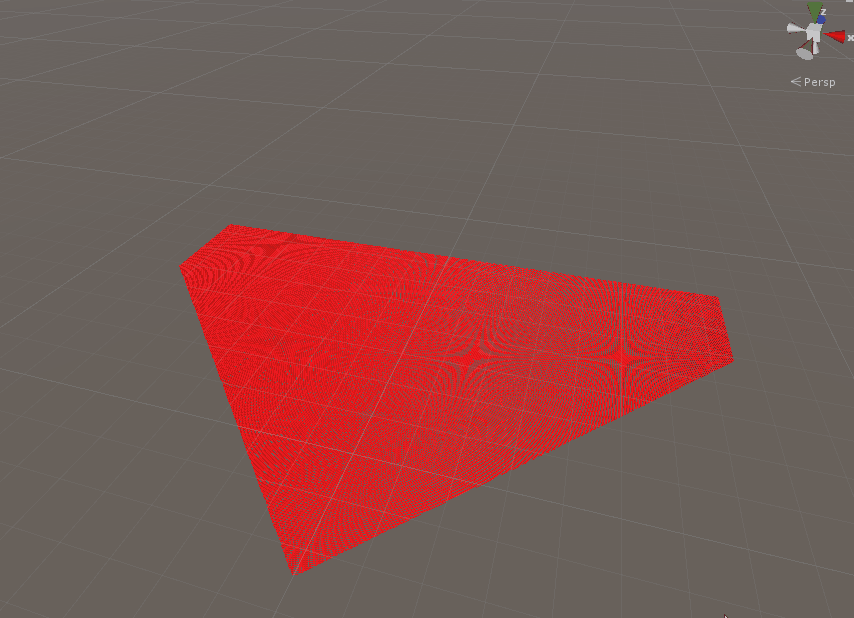

<p style="background:gray;padding: 1em;">
Dealing with high count of instances effectively in Unity
</p>

<br><br>

# The problem 

For the virtual production work we do at MPC, we constantly strive to achieve high frame rate for a smooth experience. 
One thing that kept comping up over and over in the profiling sessions was culling. We often deal with a lot of geometries 
in the scene and decided to see how we could improve upon that.

The low hanging fruit in this scenario is to deal with instances, in our daily work it is common to work with huge sets 
with a lot of geometry complexity and instances.
There have been several advances in GPU culling in the recent years, both for frustum and 

, we started our journey in dealing with the former.

# GPU Frustum culling



The above is one of the first prototype we created to test the performance of the culling, 
a test scene with one million cubes.

Lets have a look at how we can move the CPU algorithm to the GPU. The algorithm itself involves several stages:

* Find the instances in the scene
* Perform the culling and store the surviving instances in an array
* Render the instances

We are going to briefly cover all the steps one by one, but we will mostly focus on  one the unity integration side of things,
and in the next post we will have a look in how to optimize the computation.

## Find instances in the scene

The first prototype we did was  to spawn matrices for the objects in a grid, although a nice and easy way to get something going,
it does not represent a real use case scenarios. In the future we plan to use USD to manage our scene, 
so we can find and read those instances directly from  a USD stage. 
For the time being, we had to scan the scene at start up and get all the objects that had a custom instancing component.

Once the object were found we wrapped them into a Renderable class, 
which is in charge of drawing a single set of instances, something on the lines:

```c#
public class Renderable
{
	public Transform Parent { get; set; }
	public Mesh Mesh { get; private set; }
	public Vector4[] AABB { get; private set; }
	public CompressedTransform[] Instances { get; private set; }
	public CullingShaders Shaders { get; private set; }
	public Material Material { get; private set; }
	...

```
The Renderable class is in charge to collect and make the instances data easier to access and manage.
Dealing with nodes in the scene has a couple of down-sides, in the first place all those game objects 
make the editor harder to deal with, slow and with hangs. Scanning the scene at start up adds extra time
before the game starts. Dealing with a USD scene directly we would not have to create the unity nodes at all.

## Performing the culling

There is a lot of material on the Internet about CPU culling, so we will not spend much time on this, 
we will focus mostly in what to change in moving the algorithm to the GPU.
Whether or not a transform is in frustum is performed by checking if all the vertices of the AABB of the instance 
are inside the 6 planes of the frustum. If any of the  vertices are inside the frustum, the instance is considered visible.

What we want to achieve is a contiguous array of matrices of  instances that survived the culling. 
This is a fairly straightforward task on CPU, not so much on the GPU.
The solution is an algorithm called scan and compact. There are a lot of resources on the Internet about is, for example:

https://www.youtube.com/watch?v=We9j876CjtA

The main idea is that you first perform a vote and generate an array of 0s and 1s, 0 means the instance 
did not survive the culling, 1 means that it needs to be rendered.
The scan algorithm will allow you to figure out in parallel, where each surviving matrix will need to be copied, aka
the index of the output array where to write you matrix.
The algorithm works in three steps:

* Vote - generate a boolean vote for each istance, defining whether or not it surived the culling. 
* Scan - compute the final address of all the matrices that survived.
* Compact - use the compute address to copy the matrix at its final destination.

All this can be achieved with compute shaders (more on this later), 
you just need to load all the needed data (frustum, matrices) in Unity's  Compute buffers, bind them and kick the shader.

## Perform the render

We now have an array of matrices representing the position of the meshes we want to render. 
A naive approach to render them would be to download such matrices on the CPU and call a DrawMeshInstanced method.

That will work for sure, but would be extremely inefficient, every time you perform a CPU-GPU synchronization, 
you lose a lot of performance, it is extremely slow to read back from the GPU and you will be stalling the queued GPU
frames, the GPU will go idle with no work to be done.
Usually the cost can be amortize at the cost of latency, where you will use your result few frame later and try to 
compensate for the camera movement, this is how CPU occlusion query worked for example.

Luckily this is such a common problem that there is a built in solution in the graphics API. 
It is called indirect rendering, where during the GPU computation, you know exactly how many elements survived and need to be
rendered, so you will just write the arguments for the render call in a small GPU buffer and just tell the driver to render
the geometry and fetch the configuration from such buffer.
IN this way there is no need to sync the CPU and GPU, the GPU is able to generate autonomsuly extra work for itself.
Lets have a look at how we can do that in unity.
```c#
foreach (var r in Renderables)
{
	//this is critical in order to make the shader work
	int deferredPassIndex = r.Material.FindPass("DEFERRED");
	r.Material.SetBuffer("inMatrices", r.GetBuffer(Renderable.EBufferType.kVisibleInstances));
   
	for (int i = 0; i < r.Mesh.subMeshCount; ++i)
	{
		Deferred.EnableShaderKeyword("LIGHTPROBE_SH");
		Deferred.EnableShaderKeyword("UNITY_HDR_ON ");
	   Deferred.DrawMeshInstancedIndirect(r.Mesh, i, r.Material, deferredPassIndex, r.GetBuffer(Renderable.EBufferType.kIndirectBuffer));
	}
}
```

In the above code, we already performed the culling computation, and the result is in the buffer named "inMatrices".
You can bind the matrix buffer in the following way:

```c#
	r.Material.SetBuffer("inMatrices", r.GetBuffer(Renderable.EBufferType.kVisibleInstances));
```

We then perform the render with :
```c#
Deferred.DrawMeshInstancedIndirect(r.Mesh, i, r.Material, deferredPassIndex, r.GetBuffer(Renderable.EBufferType.kIndirectBuffer));
```

Where the last argument is the indirectBuffer holding the render configuration.

To note, when rendering with DrawMeshInstanced/Indirect, you need to enable manually some shader flags to get the correct render:

```c#
Deferred.EnableShaderKeyword("LIGHTPROBE_SH");
Deferred.EnableShaderKeyword("UNITY_HDR_ON ");
```
The shader side of things is particularly simple, the only thing we want to do, is to fetch the correct matrix and pass it to 
the Vertex Shader, this can be done easily by:

```c#
StructuredBuffer<CompressedTransform> inMatrices;
VertexOutputDeferred customVertDeferred(VertexInput v,  uint inst : SV_InstanceID)
{
	//here we use the instanceID to extract the compressed matrix and expand it
	const float4x4 m =  getMatrixFromCompressed(inMatrices[inst]);
   
	//once we have the matrix, we override the unity_ObjectToWorld and WorldToObject
	unity_ObjectToWorld = m;
   
   
	//calling regular deferred shader
	return vertDeferred(v);
}

```

The only thing to do in the shader is to patch the unity_ObjectToWorld matrix with the one coming from our StructuredBuffer,
then we just forward the vertex to the normal deferred unity function.
To note: You will also need to compute the unity_WorldToObject, which is the inverse of the unity_ObjectToWorld. If you put 
in place some restrictions like no scaling etc you can compute it more cheaply. Might be worth to compute it at compact time.

# The good, the bad and the ugly

At this point we have a basic prototype of GPU culling, but does it work? How does it perform?
We tested the culling on a real scene, an outdoor set where we had around four hundred thousands threes, 
grouped in four different instancing group of hundred thousands instances each. 

The regular unity framerate was around 10-12 FPS, the GPU culling version was around 2500FPS. 
That is not a bad speed up! Don't get too focused on performance right now, we will discuss this at length 
in the next post. 
The major speed up did not only come from the rendering side, but from unity not having to handle that many
components and the GPU culling.

This is really promising, unluckily is only one side of the story. There is a major issue with this system, 
and weirdly enough is the problem is shadowing.
When unity performs the culling, it does also compute which geometry ends up in which shadow cascade, 
and will only submit the necessary geometries to the render of each shadow cascade. 

When using DrawMeshInstanced/Indirect, unity has no idea of what is being rendered or where is located, so the full
geometries will be rendered for each shadow cascade, with the default 4x cascade, we are submitting more than a million threes,
we are rendering four times the amount of geometry we normally would.

As far as we are aware in the normal rendering pipeline there is no way to fix it. The solution might be a 

or modifying the Unity's built in HD rendering pipeline.
The SRP is the new Unity way of rendering, it completely exposes to the user the render loop, upon inspection, we were able
to find where unity renders the cascade shadows map and we should be able to hook up in there, perform culling on a per cascade
base and only render the surviving instances.

On a scene with a high count of high resolution stones, our custom culling ended up being as fast as the regular Unity rendering
although we were rendering 4 times as much geometry. There is quite a bit of potential there!

This is it, in the next post we will investigate a bit more at lower level how to optimize the shader to make the culling
much faster.

