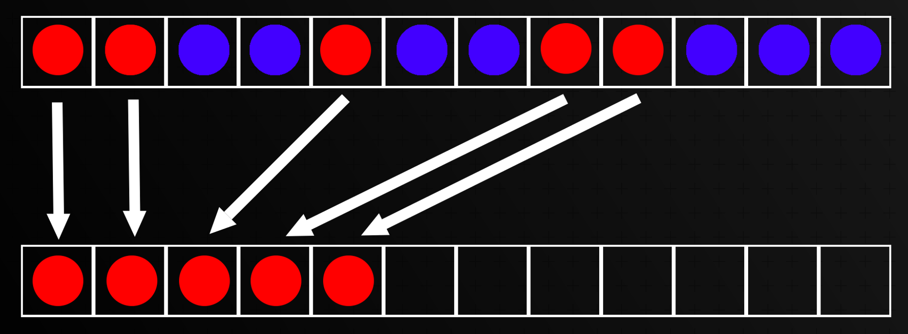
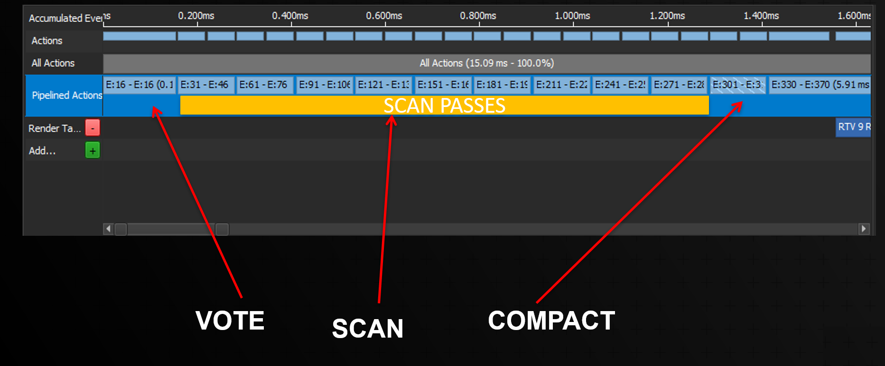
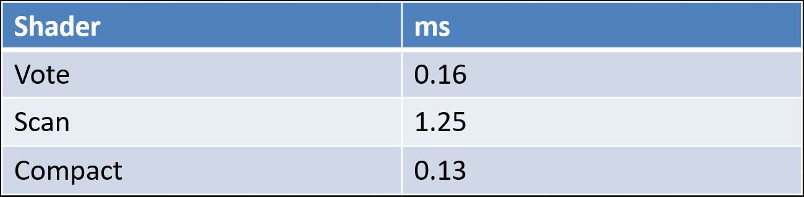
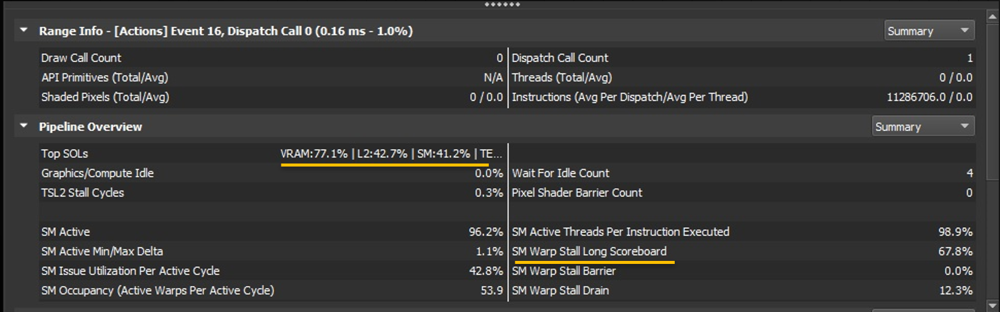
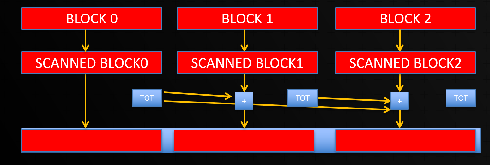
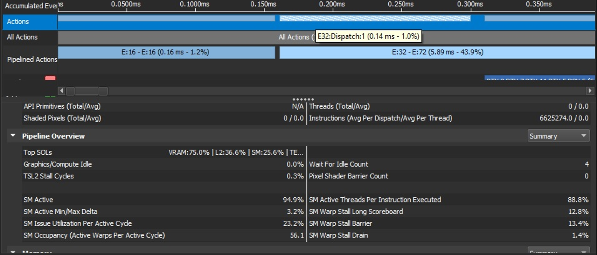
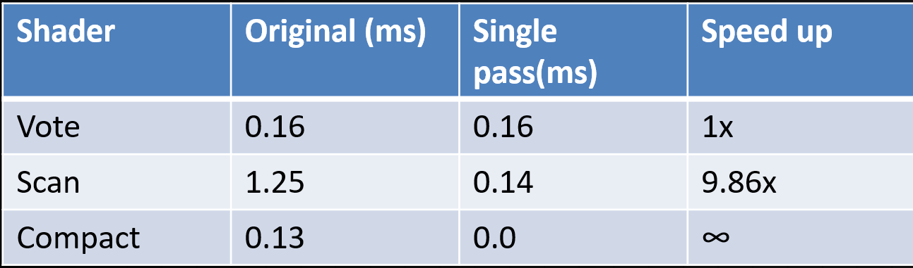
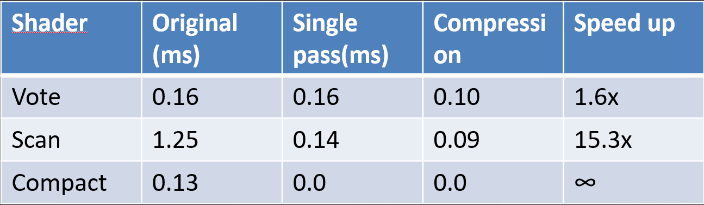
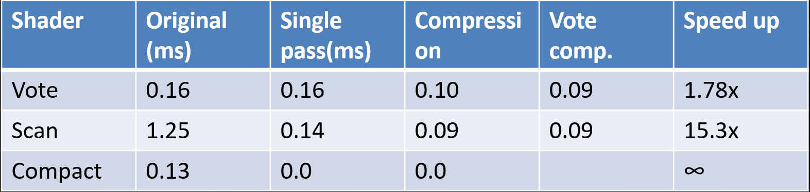
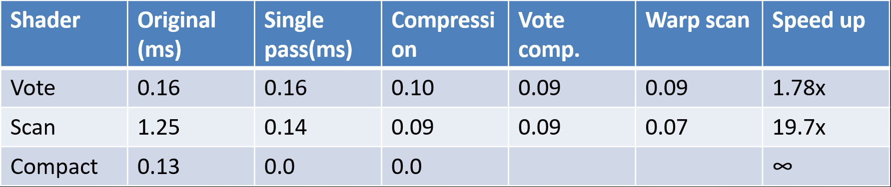

We can deal with a lot of instances, let's make it faster now.

  

# Re-cap 
This is Part 2 of the article series about GPU culling in Unity. You can find the 
.

This post is a mirror of the original post from 

To quickly recap, when we do frustum culling, we want to figure out which geometries are visible in the frustum
and if not visible, we don't render them. In particular, we are focusing on doing the culling on the GPU and using instances.

The goal is to be able to filter the instances that survive the culling in parallel. We can depict this here:

Our goal is to compact the surviving instances (the red spheres), into an array, by effectively filtering the blue orbs out.

# A naive implementation 

The computation is performed inside compute shaders, in three steps:

- Vote
- Scan
- Compact

As mentioned in the previous articles, the vote shader will write to an array either a 1 or a 0 to 
specify whether or not the instance survived the frustum culling.
The scan shader will generate, in parallel, the output index for each of the instances.
The compact will copy the instance to the final array using the index generated by the scan.

Let's take a first look at the profile result of the rendering loop: 

The software used for the profiling is 

from Nvidia.

Here there are some timings:

As we can see, the algorithm spends most of its time in the scan passes. For the moment, we have a naive
implementation (Hillis-Steele based), which works in several iterations on the data, where every 
iteration is a kernel invocation.

Let's dig a bit more into the statistics the profiler gives us:

We can see that we are memory bound (77% SOL), we also have a quite high percentage of stalls waiting for memory 
(67%)(check highlighted parts).
The problem with Hillis-Steele implementation is that we are processing the data many times, and every time
with a bigger and bigger stride, which is quite bad for memory accesses, causing a lot of cache misses. 

How can we do better? 

# A first improvement

All those accesses to global memory are quite slow, but the GPU has several different memories we can use.
One of those is called    
.

Shared memory is a much smaller but significantly faster memory that is on-chip, close to the cores. The main peculiarity
is that you need to manually fill shared memory before you can use it, forcing you to reason on a block of data/threads at the time, not on a single thread anymore.

How can we re-imagine a scan operation using shared memory? If you recall a 

.
algorithm (also called prefix-sum),
performs the sum of all the elements of the array up to the index, for example, at index 10, we will have the sum of all the values
from 0-9/10, if the 10th index itself is included or not in the sum, depends whether or not the scan is inclusive or exclusive.

Let's try to visualize how a scan will work using shared memory: 

Each block will be scanned independently, in shared memory,  and we will still perform multiple iterations, but memory accesses
will be much faster and without the need to kick multiple shader invocations.

Once the block is scanned, we need to offset it by the sum of the previous
blocks. Since we are doing an inclusive scan, the last value in the block is going to be the sum of all the elements
in the block. If we want to know the result of the of the block N-1, we need to check the last number of such block.
How can we exactly achieve that?

There are two ways to do it. The first is data order independent, the second is not.
For this particular task, we don't mind if the instances get shuffled in the process. If instead the order
for your use case is a concern you might have to use some more sophisticated methods, check this

for inspiration.

Since we don't care if our data gets shuffled, as soon as one block is done we are going to accumulate
the total sum of the block with an atomic operation on a counter. The old value before the addition is going to be the value
we need to offset our local block scan. So every block will first read the value and then increment by the local scan
value. This operation can be done atomically.

One added benefit is that as soon as we read our offset from the atomic variable, we know exactly 
where will we need to write our data in global memory so that we can merge the scan and compact pass in a single 
shader invocation.

How did that optimization help us?

As we can see from the telemetry, VRAM is still the major bottleneck, but memory stalls went down dramatically
from 67% to 12%, what about the actual timings?

What we are seeing is quite an impressive speed up, how can we do better?

# Let us reduce memory usage.

VRAM is still very much our problem. We tried an algorithmic improvement, can we try to read less data?

Our algorithms are using a full 4x4, 32 bits matrix for representing each instance, let us reduce that to a position
and a quaternion, this will result in 8x32 bits per instance. After we read the data, we will convert it to a matrix, and the algorithm will work just the same. We are threading memory size for computation. Let' profile this new optimization.

VRAM utilization finally went down, and finally, we can see the "SM" (Streaming processor), metric showing up!
The fact that SM metric starts to ranks up in utilization, means our cores are finally doing some real work and less bound on memory. Let us profile again:

We got a nice speedup from both the scan and vote algorithm!

# Even less memory.

Can we reduce our memory usage even more? In our vote, we're using an integer, to store the result of the value.
That is 32 bits of data to store a 0 or a 1. Some of the readers might think: "why not just use a bool?". A
bool datatype exists in HLSL but it is still a 32-bit value. We could use a "half", 16 bits,
but what about just using one bit per vote? Can we do it?
Thanfullky, both AMD and Nvidia offer custom instructions that work on "lanes", one of which is called a
ballot. Each thread in a warp is going to perform a vote, and store the result in a bit of a 32-bit integer.
On Nvidia, a warp is a collection of 32 threads, which fits our goal perfectly! On AMD a warp is called a wavefront
and is composed of 64 threads and the ballot operation returns 2x32bits integer.

The issue with those custom instructions is that they cannot be used in regular Unity shaders, but you need to
use a native plug-in and compile the shader differently. Let us know in a comment if you are interested in how to do
that and we will write a blog post about it!

By using those custom instructions, we are effectively able to reduce our vote array by a factor of 32. Did it help us?

Not a huge speed up, roughly a 10%. Still an improvement. Now the entry bar for this 10% improvement was quite high as
it took approximately 800 lines of C++ code to be able to use those instructions (due to going to a native plugin).
It this was the only benefit we got, I would probably advocate dropping the optimization for the sake of simplicity.
But now that we have custom instructions at our disposal, but can we do better?

# Shuffle!

Another instruction offered by both IHVs is called shuffle. Shuffle is an instruction that allows threads
in the same warp to exchange values without using memory, but directly, register to register. That will enable
us to do the scan of 32 numbers at the time, straight in the registers' memory space, which is the fastest memory on the GPU.
If you want more details on this technique, check this great 

by Nvidia.

We got roughly another 20% speed up, our slowest part of the algorithm became our fastest one! The whole 
algorithm ended up with a 10x~ speed up.

# The takeaway

Often when working with GPU compute and/or shaders, memory is going to be your primary concern.
GPUs have a tremendous amount of horsepower, but if you cannot keep all those core fed with memory, you are going
to cripple the performances by an order of magnitude. You will have to think hard about how you are accessing and structuring
your data.

# Can we do better?

Is this it? Can we do anything more? Of course! Optimization is a never-ending task. There are a few things that
we did not get around to try but might be quite interesting.

- Aggressive data compression, it is possible to compress quaternions down to a single 32-bit value, this would allow
us to store the quaternion in the w component of the position, and reduce our original 4x4 matrix to a 4x1 dataset.
- Use more of the shuffle instructions, it is quite useful for sharing data between registers. 
Maybe we can exploit that to speed up the frustum computation as well. 

Hope you enjoyed the post, see you next time.
