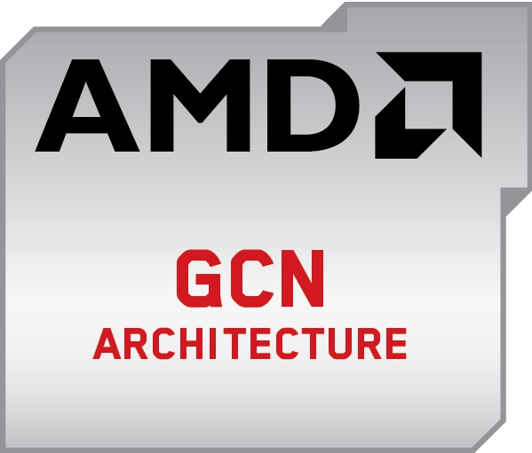
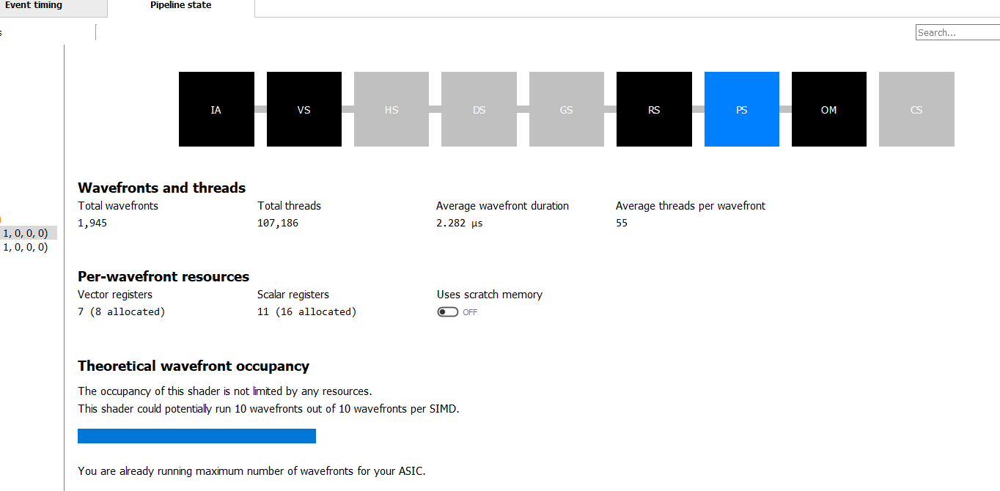
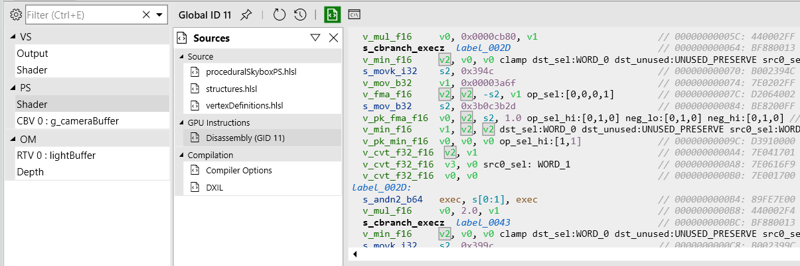
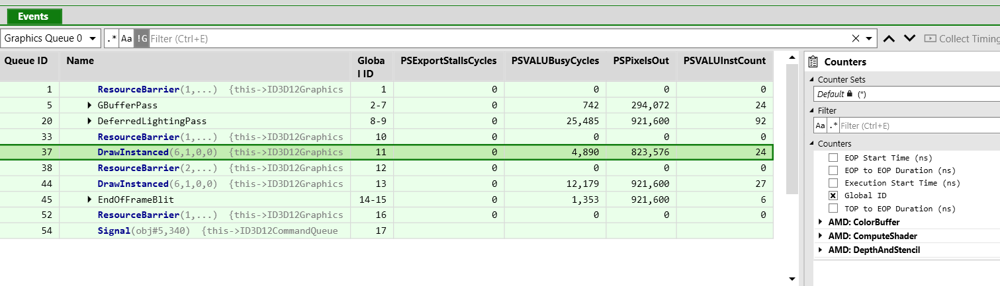
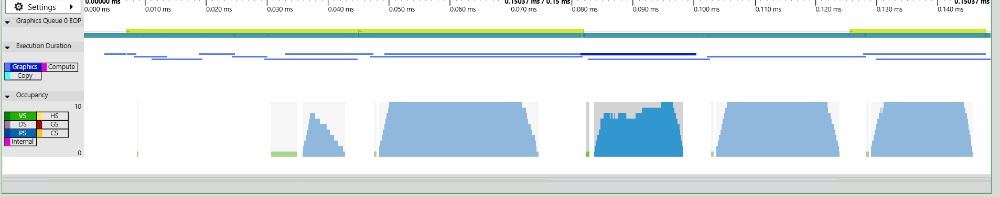
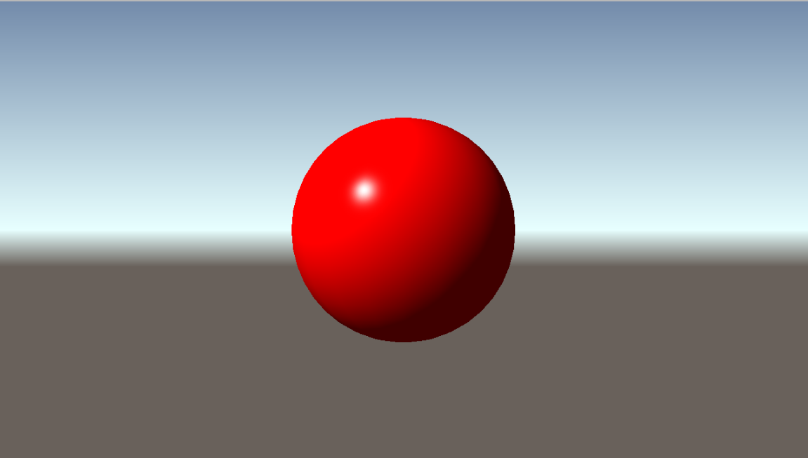

---
date: 2019-03-10
linktitle: vega ISA 
title: "AMD GCN ISA: a first dive"
tags : ["realtime","engine"]
tocname: "Table of contents:"
toc : true
draft : true
---

<p style="background:gray;padding: 1em;">
You want to learn more about GCN but where to start?
</p>


<br><br>

# Where to start 

I always liked getting my hands dirty when coding, optimizing, disassembling etc. When trying to do that on GPU
well result is mixed and often hard to do because the information is not available, you can't really see the machine code
etc. That is more or less true depending on the API you are using, you can for example see cuda disassambling but you don't
have the ISA to know instructions and or arguments/registers, in DirectX you can often only see the IR from the D3DCompiler.

In my case I am interested in optimizing my DirectX shaders, seeing the landscape the only solution I had was to buy an AMD
card and work on it. AMD has always been super open on the architecture and tooling. There is a public ISA and a lot 
of tools for developers on PC, you can disassamble and get a lot of information about your shaders. 
I went ahead I picked up a Vega 64. Ok I have the hardware now what?

# What to study? 
Next we have to get our hands on some material we can actually learn from and study. The first two stops are this two
amazing presentations, packed with knowledge:



and



<br><br>
This should give you a enough to get your way around a bit more, next you need to inspect the 
.

I personally found is good to keep all of the ISA pdfs at hand, some explain a bit more than others, if there is something you 
don't understand from one ISA pdf you can probably figure out from a previous guide. 
We got the hardware, some knowledge now what? Well, we now need to start look at some code!

# The tooling
Our main goal now is how to generate the disassembly or gather any useful information about it? One of the thing I did not 
like from AMD was that their software stack was all over the place, so many tools, many discontinued/deprecated, It might
 a bit hard to navigate this, so here below a list of all the tools I ended up using and for what reason.

## Radeon GPU Analizer 

The first tool in our bag is the . 
The tool deals with both OpenCL and graphics, but the UI only deals with OpenCL, if you want to do graphics stuff you 
need to use the CLI. The tool is amazing for OpenCL, it shows relationship between source code lines and assembly lines,
I really hope the UI functionality and source-code/assembly lines linking will be ported to graphics soon. (hint hint AMD!).

To use from CLI we need to do something along this lines
```bash
rga temp.hlsl -f PS -s hlsl --isa out.txt --il ir.txt -I E:/WORK_IN_PROGRESS/C/SirEngineThe3rd/data/shaders/rasterization -p ps_5_0 -c gfx900 --intrinsics -a analisys.txt
```
The above snippet of code will generate an ISA dump (assembly), IR dump, and an extra analysis for our pixel shader.
The analysis file will contain mostly number of registers used and registers spills.

## Radeon GPU Profiler
The 
is quite good for profiling the whole application, but only it offers few informations about your specific shader but nothing
too useful for optimizing it. It is amazing to see the overall program execution and barriers debugging.
Here a screen shot of a pixel shader:



If you want to know more I highly recommend the official   .

## CodeXL
The next workhorse in our toolset is .
The software is quite similar to RGA, it has a lot of overlap, not sure what AMD plans for it but I would foresee CodeXL
to merge into RGA. It is a bit silly to have several similar tools around.
CodeXL works with the UI as such is easier to use than RGA, the disassembly offers some nice visualization where you 
also get the cost of instructions in cycles and what type of instructions is.

## Pix
Next in the pipeline is .
Pix is an amazing graphics debugger, and I use it on a daily basis. This is by now my go to for DirectX 12 code. 
Among the usual goodies for debugging it can show us the disassembly of our shader (thanks a cooperating AMD driver):



But can also show us a **LOT** of counters, as far as I know this is the only tool that does that (possibly along RenderDoc).
Those counters can be essential to understand the bottlenecks in your shader, if you are memory bound ALU bound etc.
The downside is that is fairly hard to deal with those counter, they are shown in columns where you end up scrolling a lot.
Personally I think that for now NSight Graphics nailed it quite well with the SOLs (speed of light) way of optimizing, I hope 
AMD will go down a similar path, they already have the data they just need to present it better IMHO.



Finally you can also see the same kind of occupancy graph you see in RGP, AMD is the only IVH I managed to get that graph in
pix out of (just ignore the horrible stalls :D):



# Disassambly
After the tooling detour we are finally ready to start looking at some disassembly, I will be using mostly CodeXL.
For a first example I decided to have a look at my super simple procedural background. The reason why I decided to look at it 
is because it is extremely simple and would not be too overwhelming and easier to understand what the disassembly was doing.

Here a picture of the actual background, heavily inspired by the default Unity background, 
mostly because I am used to look at it:



Let us have a look at the actual shader

```c++
#include "../common/vertexDefinitions.hlsl"
#include "../common/structures.hlsl"

ConstantBuffer<CameraBuffer> g_cameraBuffer : register(b0);

float4 PS(FullScreenVertexOut pin) : SV_Target
{
    float4 worldDir = normalize(mul(float4(pin.clipPos, 0.0f, 1.0f), g_cameraBuffer.VPinverse));

	//degamma color
    float3 ground = float3(0.142f, 0.119, 0.103);
    float3 skyTop = float3(0.103f, 0.173f, 0.325f);
    float3 skybottom = float3(0.804f, 1.0f, 1.0f);

    float bottomGradientDiffusion = 15.0f;
    float topGradientDiffiusion= 2.0f;
    float verticalGradient = worldDir.y;
    float topLerpFactor = saturate(verticalGradient*topGradientDiffiusion);
    float bottomLerpFactor = saturate(-verticalGradient*bottomGradientDiffusion);

    //sky
    if(worldDir.y > 0)
    {
        float4 color = float4(lerp(skybottom, skyTop, topLerpFactor), 1.0f);
        return color;
    }
    //ground
    else
    {
        float4 color = float4(lerp(skybottom, ground, bottomLerpFactor), 1.0f);
        return color;
    }
}
```

This was the  simplest version of the shader, the first one I used to get it to work. As you might have noticed I am using
shader model 6.0, unluckily AMD toolings do not support that shader model, and for disassambling I will need to remove 
those features like ConstantBuffers<>.

Before making any assumptions about how good or bad this code is (I know you have been looking at that branch!), let
see what CodeXL has to say about it.

