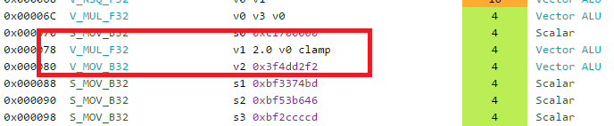

<p style="background:gray;padding: 1em;">
You want to learn more about GCN but where to start?
</p>


<br><br>

# Where to start 

I always liked  optimizing and disassembling code. 
When trying to do that on GPU, the result is mixed. It is often hard to do because the information 
is simply not available (on PC) and you can't really see the machine code easily. 
That is more or less true depending on the API you are using, you can for example 
see CUDA disassembly but you don't have the ISA to understand the instructions and/or arguments/registers. 
In DirectX you can often only see the IR from the D3DCompiler, which might be quite far from the final
machine code.

In my case I was interested in optimizing my DirectX shaders and by looking at the landscape, the only 
solution I had was to buy an AMD card and work on it. AMD has always been super open with respect to the architecture and tooling. 
There is a public ISA and a lot of tools for developers on PC which you can use to disassemble and get a lot of information out of your shaders. 
I went ahead I picked up a Vega 64, but now that you have the hardware, where do you start? 

# What to study? 
We have to get our hands on some material we can actually learn from and study. The first two stops are these
amazing presentations, packed with knowledge:

* 
* 
* 


<br><br>
This should give you a enough to get your way around a bit more, next you need to inspect the 
.

I personally found that it is good to keep all of the ISA pdfs at hand not only the Vega one as some explain a bit more than others. If there is something you 
don't understand from one ISA pdf you can probably figure out from a previous guide. 
We are all set to start looking at some code.

# The tooling
Our main goal now is how to generate the disassembly and gather any useful information. One of the things I did not 
like from AMD was that their software stack was all over the place, so many tools, many discontinued/deprecated, It might
 a bit hard to navigate all this, so here below a list of all the tools I ended up using and for what reason.

## Radeon GPU Analizer 

The first tool in our tool-bag is the . 
The tool deals with both OpenCL and graphics, but the UI only deals with OpenCL, if you want to do graphics stuff you 
need to use the CLI. The tool is amazing for OpenCL as it shows relationship between source code lines and assembly lines,
I really hope the UI functionality and source-code/assembly lines linking will be ported to graphics soon. (hint hint AMD!).

To use from CLI we need to do something along these lines
```bash
rga temp.hlsl -f PS -s hlsl --isa out.txt --il ir.txt -I E:/WORK_IN_PROGRESS/C/SirEngineThe3rd/data/shaders/rasterization -p ps_5_0 -c gfx900 --intrinsics -a analisys.txt
```
The above snippet of code will generate an ISA dump (assembly), IR dump, and an extra analysis for our pixel shader.
The analysis file will contain mostly number of registers used and registers spills.

## Radeon GPU Profiler
The 
is quite good for profiling the whole application, but only it offers few informations about your specific shader but nothing
too useful for optimizing it. It is amazing to see the overall program execution and barriers debugging.
Here a screen shot of a pixel shader:


If you want to know more I highly recommend the official   .

## CodeXL
The next workhorse in our tool-set is .
The software is quite similar to RGA, it has a lot of overlap, not sure what AMD plans for it but I would foresee CodeXL
to merge into RGA. It is a bit silly to have several similar tools around.
CodeXL works with the UI and as such is easier to use and iterate than RGA. The disassembly offers some nice visualization where you 
also get the latency of instructions in cycles and what type of instructions it is.

## Pix
Next in the pipeline is .
Pix is an amazing graphics debugger, and I use it on a daily basis. This is  my go to for DirectX 12 code. 
Among the usual goodies for debugging it can show us the disassembly of our shader (thanks to a cooperating AMD driver):


It also shows  a **LOT** of counters, as far as I know this is the only tool that does that (possibly along RenderDoc).
Those counters can be essential to understand the bottlenecks in your shader, if you are memory bound, ALU bound etc.

The downside is that it is fairly hard to deal with those counters as they are shown in columns where you end up scrolling a lot.
Personally I think that for now NSight Graphics nailed it quite well with the SOLs (speed of light) way of optimizing, I hope 
AMD will go down a similar path, they already have the data they just need to present it better in my opinion.


Finally you can also see the same kind of occupancy graph you see in RGP and AMD is the only IVH I managed to get such graph in
Pix (just ignore the horrible stalls :D):


Edit: Latest version just added high resolution counter for all three major IHVs making even better!

## Shader playground
Last but not least  !
This is the Godbolt compiler explorer equivalent for shader, it is amazing! It is as simple as it gets, 
you put your shader and assembly is generated based
on the compiler your picked. Just too good.


# The code 
After this tooling detour we are finally ready to start looking at some disassembly, I will be using CodeXL mostly.
As a first example I decided to have a look at my super simple procedural background/sky. The reason why I decided to use it 
is because it is an extremely simple and it will not be too overwhelming therefore easier to understand what the disassembly is doing.

Here's a picture of the actual background, it is heavily inspired by the default Unity background, 
mostly because I am used to looking at it:


Let us have a look at the actual shader

```c++
#include "../common/vertexDefinitions.hlsl"
#include "../common/structures.hlsl"

ConstantBuffer<CameraBuffer> g_cameraBuffer : register(b0);

float4 PS(FullScreenVertexOut pin) : SV_Target
{
    float4 worldDir = normalize(mul(float4(pin.clipPos, 0.0f, 1.0f), g_cameraBuffer.VPinverse));

	//degamma color
    float3 ground = float3(0.142f, 0.119, 0.103);
    float3 skyTop = float3(0.103f, 0.173f, 0.325f);
    float3 skybottom = float3(0.804f, 1.0f, 1.0f);

    float bottomGradientDiffusion = 15.0f;
    float topGradientDiffiusion= 2.0f;
    float verticalGradient = worldDir.y;
    float topLerpFactor = saturate(verticalGradient*topGradientDiffiusion);
    float bottomLerpFactor = saturate(-verticalGradient*bottomGradientDiffusion);

    //sky
    if(worldDir.y > 0)
    {
        float4 color = float4(lerp(skybottom, skyTop, topLerpFactor), 1.0f);
        return color;
    }
    //ground
    else
    {
        float4 color = float4(lerp(skybottom, ground, bottomLerpFactor), 1.0f);
        return color;
    }
}
```

This was the  simplest version of the shader, the first one I used to get it to work. As you might have noticed I am using
shader model 6.0, unluckily AMD tooling do not support that shader model, and for disassembling I will need to remove 
features like ConstantBuffers<>.

Before making any assumptions about how good or bad this code is (I know you have been looking at that branch!), let us
see what CodeXL has to say about it.


# Disassembly

## A first implementation
Here's the first result from CodeXL:


The above is not the full code, there are few instructions at the bottom that are missing, you can check the 
full original listing   .

Before looking at the disassembly let us have a quick look at the statistics:


As expected, register pressure wise we are in good shape, but the shader is
extremely simple, and we are using a lot of registers not the less, that should remind us that register
pressure is a big deal, although it is something I never worried too much before, mostly because I have no 
way to know how many register I was using.

Lets try to concentrate on the assembly now. Right at the beginning we can see some interesting 
instructions I was not expecting: ***V_INTERP_P[1,2]_F32***.


From the ISA pdf, we know that those instructions are used to interpolate data that came from the
vertex shader, in this case we are interpolating the clip space coordinate before using them.
The source data lives in the LDS for faster read. 

Although I never spent too much time  thinking how the interpolation was done, I was naive enough 
to believe that happened at the rasterizer stage, and in the pixel shader you would get the data pre-interpolated. 
It is clearly not the case, reading the rasterizer part from
 
was also eye opening.

Moving down we find the matrix multiplication with a lot of ADD, MULL and an interesting MAC.
From looking at the ISA guide, the MAC instruction implements the following operation:


Which is slightly different from the MAD one:


The difference seems to be only in the fact the destination register is reused for the add part compared
with the mad instruction which requires 3 source operand plus the destination. I'm not sure why this is the 
case. It possibly helps with reducing register usage, if anyone knows more I would love to know!

As we keep moving down the code, we see a lovely 16 cycle reciprocal square root, that is used for
the normalization of the vector. More about it later.


Next, something really interesting is coming up:



It looks like a MUL instruction but with an extra clamp? What is it and where does it come from?
This particular piece of information was covered in the Digital Dragons presentation, and it refers to
input and output modifiers. 

If I'm not mistaken the short story is by not having to deal with IEEE floating point correctness, 
the GPU is able to sneak int some extra operation for free either on input or output of 
your instructions.  The ISA guide says this when referring to the output of instructions: 

```
When the VOP3 form is used, instructions with a floating-point result can apply an output modifier (OMOD field) 
that multiplies the result by: 0.5, 1.0, 2.0 or 4.0. Optionally, the result can be clamped (CLAMP field) to the range [0.0, +1.0].
```
That is quite interesting! But where does it come from? In the code we are clamping
our interpolation value with a saturate():

```c++
    float topLerpFactor = saturate(verticalGradient*topGradientDiffiusion);
    float bottomLerpFactor = saturate(-verticalGradient*bottomGradientDiffusion);
```

Thanks to the output modifiers, we are getting the saturate for free in a single instruction!
That's not all because if you look closely you will also notice that one of the argument of the instructions
does not come from a standard register but looks like a literal constant, interestingly enough the second
saturate/clamp instruction does not use the same form, we don't see the 15.0 value directly in the 
instruction:


The reason for this comes from the fact that GCN has some special registers that are hard-coded to some common values
like 0.0f, 1.0f, 2.0f , 0.5 , 4, 8 etc. If the compiler sees that the value can actually use those special
register directly, in the disassembly they show up as literal constant. This not only allows us to save
a scalar register, it also allows us to save a mov instruction to put such value in the register.

Finally at the end of the program we have few extra instructions worth nothing (they were not visible
in the first screenshot):


Those are packing instructions, that convert F32 values to F16 and send it to be exported 
for being written to the RenderTarget, I assume EXP sends the value to ROPs.

Phewww! That was quite a bit of stuff from a simple assembly dump! Fortunately, it is not over yet, there 
are still few things I wish to try just for fun.

## A first optimization pass

I did not really need to optimize this shader, my simple application is heavily CPU bound. Since the 
graphics load is so short, the card does not even bother to raise the cores frequency. The reason why I 
am doing it is just to see the result in the assambly, I won't even bother profiling it. 

The first thing that I thought of doing was to simplify the matrix multiplication to convert from
clip space to world space. After all I am using only the Y component from the whole vector and this feels 
a bit wasteful! Unluckily the vector normalization needs the full result from the matrix multiplication.
Can I get away without normalizing? In order to see that I decided to remove the normalization and render 
the error as color on screen:


The above error is scaled by a factor of 5.0f and is the worst case scenario when looking straight up and or down.
Since the error shows up mostly when looking up and down, where the gradient would be the full sky color or ground
we most likely  won't see any difference. Let us try drop the normalization and only use the y component:

```c++
    float worldDir = mul(float4(pin.clipPos, 0.0f, 1.0f), g_cameraBuffer.VPinverse).y;
```

How did the code change?


There is quite decrease in instructions with no visual difference. We also reduced quite a bit the number
of registers used (not that was really necessary).


## Rapid Packed Math

The last thing I wanted to try, was to use Rapid Packed Math(RPM). RPM was a big feature for Vega, it boils down to FP16 operation
which offers twice the throughput compared to the big brother FP32. This seems to be a great option to have if you are ALU bound
and want to speed up your code, of course not everything can be computed at FP16.

I decided to give it a go, I changed all my float in the code to half and ... nothing happened. 
The output code was still exactly the same.
By looking at the MSDN doc, it seems like half only exists for compatibility reasons. At compile time half is used as a float.
At that point I was not sure how to use and/or enable RPM, I did not find anything in the AMD intrinsics extensions either.


I asked  for help, he is super nice, you should totally give him a 
follow! He pointed me in the right direction, where the right data type to use is "min16float".
More info can be found , 
the TLDR is, min16float will allow the compiler to use the reduced precision where it can. 
Having said that, there is no hard guarantee that you are going to get FP16 instructions.

That is good enough! Let us substitute all the floats to min16float and see what happens 
(you do have all the vector types available like min16float4 etc.). 
As a note, you cannot have min16float in variables coming in from constant buffers or vertex output, etc, 
only in the body of your shader. Here the output result:


The output is quite interesting. Right away we can see that we start to get FP16 operations:


There seems to be also some special flags for preserving part of the register that might not be used,
to note that those are not RPM instructions, they are only FP16. This might be due to the fact some 
of the source arguments are from scalar registers? I am not exactly sure, if anyone knows more I would 
like to know!

Moving forward a little bit we start to see the first RPM instructions:


Finally something else caught my eyes. At export times there seems to be quite a bit going on, let us have 
a look:


From the looks of it, our final result gets up-casted to a F32 and then compacted and down-casted again 
for export. Interestingly enough my render target is a R16G16B16A16_FLOAT render buffer.

Thanks to the help from Rohan (thanks again), we found the issue was from my return type
still being a float4, once I changed that to a min16float4 and the export went away.


At the end of the day I don't know yet if this would actually give a performance benefit or not,
on the surface we can see packed instructions, one less register used and less instructions 
for exports. This was just some fooling around, I plan to test RPM with a meatier shader.

That is it for now folks!

