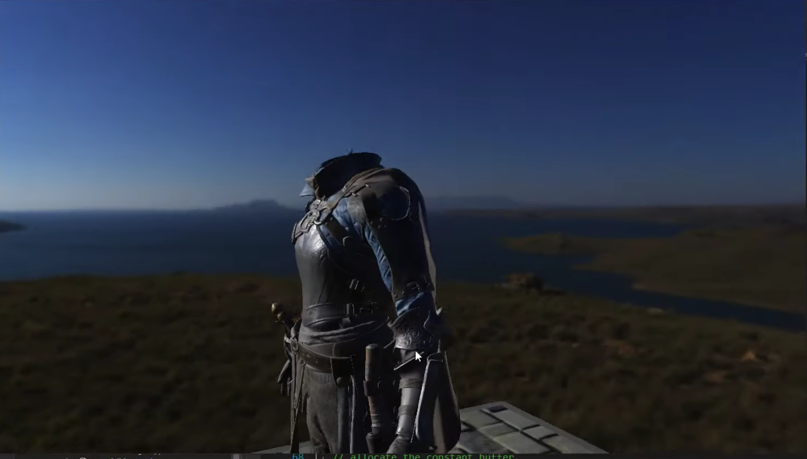

---
date: 2019-07-08
linktitle: HLSL Viewport Clamping 
title: "HLSL Viewport Clamping trick"
tags : ["shader","gpu"]
tocname: "Table of contents:"
toc : true
draft : false
---

Time to render that sweet skybox but how to avoid overdraw?

  

# The skybox problem

I always found a skybox an incredible tool to increase the quality of your scene, as soon
as you add a skybox everything looks better, even lighting altough probably that is 
just my brain playing tricks. 

When I got to the point of rendering a skybox in my DX12 game engine I went the quick and 
hacky way, just render a big enough spehere and be done with it. That comes with several problems
first of all if you don't move the sphere with your camera you can easily get out of the sphere
or the sphere will start clipping far away objects when your camera moves.

So how can we render the skybox?

# Skybox first
An old school way to render the skybox was to render the skybox as first thing, with depth
disabled. In doing so you will blit the skybox in the background without affecting the depth
such that everything no matter how far it is will end up in front of the skybox (unless clipped
by far plane). This surely works and is a quick and easy to do, main problem is you are 
shading a lot of pixels that will be later coverd by the object in your scene.
The more clutter you have in the scene the more wasted skybox pixel you will have

# Using stencil 

Another option is to use a stencil in pair with your depth, whenever a fragments survives depth, 
you write to the stencil aswell then when you do you skybox pass you check the stencil, if there 
is a value different than your default clear value means a fragment has been written there and
there is no need for skybox.
This method works well and is not too bad to setup, but you are paying an extra price to write
to the stencil.

# Forcing depth to far plane

The next option is to force the depth to max value (or min value in case of inverted depth) in 
the vertex shader, altough this surley works and does not invove the cost of the stencil
it does give some visual artefacts where you can start to see distortion in interpolation
due to forcing the depth.(Note did not see this personally since I did not implement this method).

# Viewport trick
I was ready to go and implement the stencil method, between me and me I was thinking that I was going 
to need stencil anyway due to screen space sub surface scattering. I decided to reach to 

on twitter just to do a final check to see if I was missing something, and as usual MJP tought me 
somethign I did not know!

He suggested to use 

to force the output depth to max value for both the minimum and maximum, such that the only 
value it can output is either 1.0f or 0.0f, depending if you use inverted depth or not.

I went to my computer, modified the viewport and voila' working like a charm, no distortion
no extra performance cost!

<iframe src="https://giphy.com/embed/S6prbT1uZRre8" width="480" height="270" frameBorder="0" class="giphy-embed" allowFullScreen></iframe>
<a href="https://giphy.com/gifs/S6prbT1uZRre8">via GIPHY</a>

I know, it is a simple thing, but something I did not know about, that is why I felt worth blogging
about!

Wait a second .... no distortion? How does it work?

# How does it work?
As soon as I stopped and think about what I was doing I started to have questions of the like:
"Where is the viewport enforced? When does this clipping happens?"
Naively enough I thought the whole viewport was applied/enforced in one single point of the 
execution, this was also the source of my confusion.
Matt actually kindly enough pointed me to the specific point in the 
.

Specifically: 

"An additional effect of the Viewport is that in the Output Merger, 
just before the final rounding of z to depth-buffer format before depth compare, 
the z value is always clamped: z = min(Viewport.MaxDepth,max(Viewport.MinDepth,z)), 
in compliance with D3D11 Floating Point Rules(3.1) for min and max. 
This clamping occurs regardless of where z came from: out of interpolation, 
or from z output by the Pixel Shader (replacing the interpolated value). 
Z input to the Pixel Shader is not clamped (since the clamp described here occurs after 
the Pixel Shader)."

As we can see the clamping happens at the end of fragment shader and right before depth compare.
This explains why we don't get interpolation artefacts, since interpolation happens normally
but right before depth compare we can just clamp it with the viewport.

This is great, and also end of the story right? But what about early depth testing?

Again, back to the specs, more specifically at  the 
,
here we can read that as soon as we enable conservative depth, early depth testing is disabled.
Among other thing, using "SV_DepthGreaterEqual" or "SV_DepthLessEqual" disables early depth testing,
which is my case. 

  

