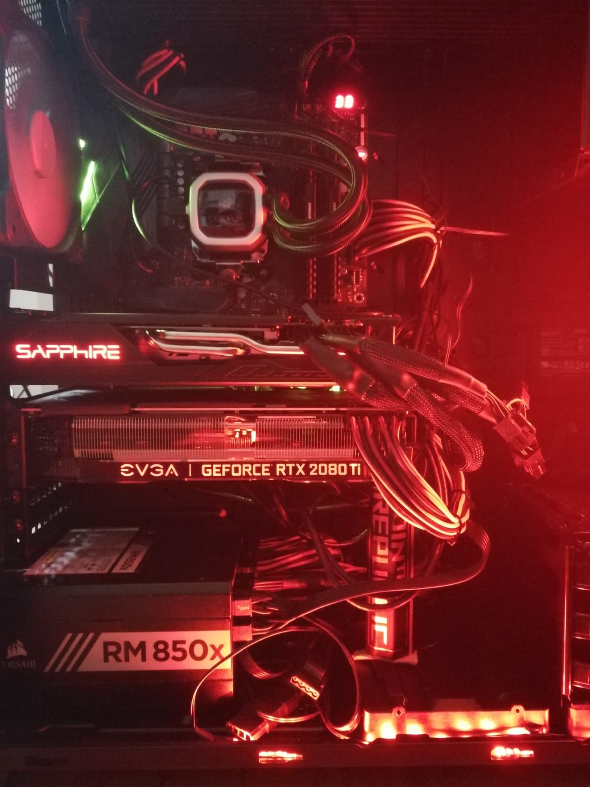
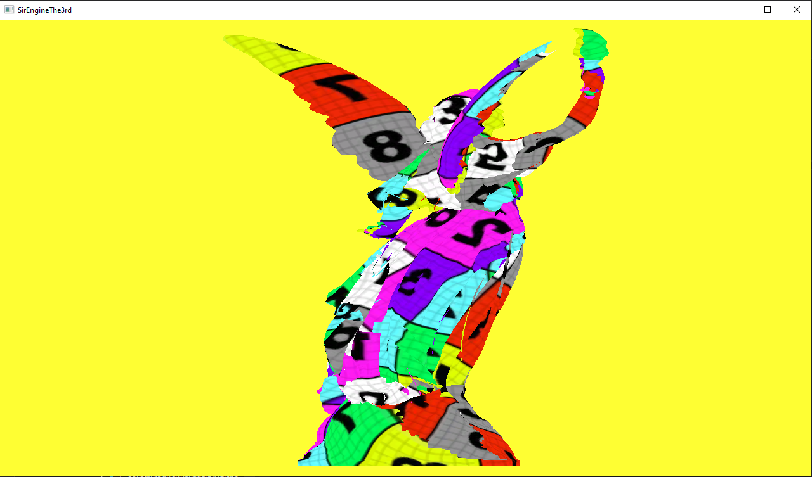
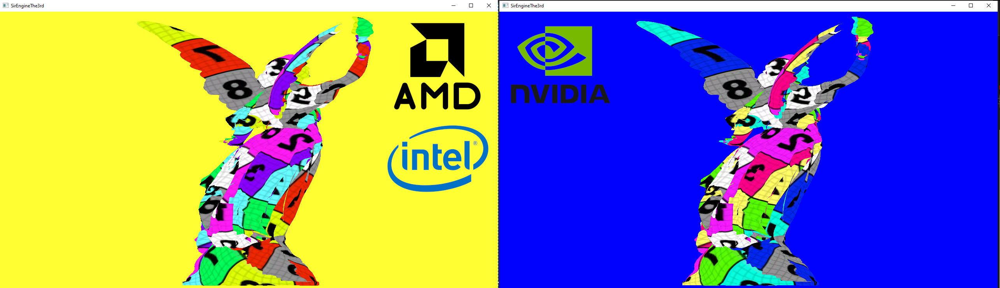
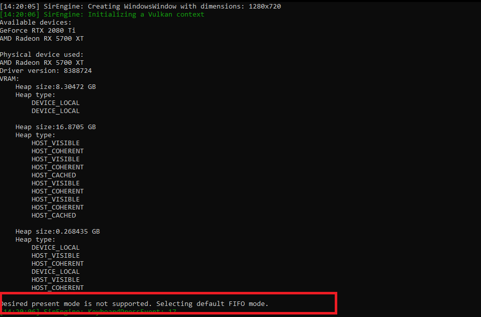

<p style="background:gray;padding: 1em;">
It finally starts! I am porting my DX12 engine to Vulkan!
</p>

<br><br>

<br><br>

# Let us get started! 

If you have been following my   /
 and so on, you probalby know about my DX12 toy engine, 
which is called Sir Engine the 3rd:
<br><br>
<iframe width="640" height="360" src="https://www.youtube.com/embed/hCN16cuo2LE?list=PLqTYlr4mV7LeYmUOJuMg3nI7u6-6-gMLC" frameborder="0" allow="accelerometer; autoplay; encrypted-media; gyroscope; picture-in-picture" allowfullscreen></iframe>

The above is the current status at the time of writing, quality/graphics wise. I decided I wanted to focus a lot more on Vulkan and AMD hardware.
The reason being I got exposed to Vulkan thanks to 
  and I liked the API quite a bit, on top of that I like to get closer to the hardware,
to do so the easieast way is to work on AMD platform, mostly due to the wealth of information on their architectures freely available.
<br><br>

# The hardware 

To put my evil plan in motion I wanted to get my hands on a Navi card, due to the fact the RX 5500 was nowhere to be seen, I decided to pull the trigger and get a Sapphire 5700XT. 
The main problem I was facing is that having a 2080ti it is hard to put a second card in the system.
The 2080ti is a 2.75 slots card, it would force me to put the second card too close and would choke the 2080ti, so I decided to get a new bigger case, and swap the cards around
here the result:

<br><br>

<br><br>

I would love to see a bit more space between the 5700XT and the 2080ti but the case being that big, dwarfs the space a little bit. I can fit my fingers inbetween the
two cards, and from thermal testing everything seems to behave just fine. Cable managment might need some love.

So the hardware is settled and working, minus some audio crackling that I am trying to sort out. What is next? Ah yes! I need some vulkan code!

# Vulkan hello world

I am not starting my Vulkan journey from scratch, as mentioned above I followed several of the Niagara streams, I have a basic mesh rendering in NDC space (no camera projection) with texture,
and cycling color for the background.(Saturating one channel after the other, going from black ->red ->yellow ->white).

<br><br>

<br><br>

Not as pretty as the DX12 backend yet, but is a good starting point. The engine, using a config file, can force the selection of a specific GPU, by vender and also GPU memory amount.
This allows me to swap which GPU I want to use easily. (Although I do not support doing that at runtime, and doubt I ever will). 
Then next thing I did was to test the hello world code, on both GPUs, to make sure everything worked fine. Of course ,it did not, and that is what this post is about.

# Issues on different GPUs: wrong colors
A picture is worth a thousands words,so let us show the problem right away:

<br><br>

<br><br>

I am getting completely different colors depending on the GPU, I added a test for my Intel Iris GPU from my surface pro aswell.
It was a bit puzzling at the beginning, but I was quite sure the problem was due to a possible surface format for my Swapchain. After some digging it did end up being that, but how did the problem came to be?

I was doing some work to be able to procedurally generate GraphicsPipeline by reading a configuration from JSON file, as I do for my DX12 backend. In order to make my life easier, I wanted to untangle the graphics pipeline code
from the Swapchain, to do so, I made my graphics pipeline write to an offscreen buffer, and **copy** the result onto the swap chain.

I did highlight the word to make it obvious what the source of the problem was, doing a copy does not care about the format, as long as the format size is compatible (same number of channels and channel width the same). 
Upon further investigation, I realized my 2080ti did not support a ```R8G8B8A8``` swap chain surface, but only a ```B8G8R8A8``` one, this explains why we get swapped channels.

Normally this should not be an issue since I do the copy to the swapchain using a fragment shader, which does the tone mapping and conversion from FP10/16 to int8. The copy was a temporary step to get the procedural
GraphicsPipeline generation working, not the less an interesting bug.

# Issues on different GPUs: wildly different framerate 

As previously mentioned, the background color is cycling in a loop. One thing I noticed immediately was the different speed at which the color was cycling on different GPUs, here a quick recap:

* 5700XT: slow
* 2080ti third PCIe slot (not driving monitor): fast
* 2080ti first PCIe slot(driving monitor): super fast

At first, I was puzzled and took me a bit to figure out what was going on here, the first hint came actually from a warning of my engine:



Digging into the code I realized I was asking for  VK_PRESENT_MODE_MAILBOX_KHR, and the AMD card was not supporting it and I was going back to FIFO presentation mode. Very interesting, that lead me to study a bit more the different presentation and 
the TLDR version is:

* VK_PRESENT_MODE_MAILBOX_KHR: you are limited by refresh rate of the monitor, BUT if you render faster, you are allowed to discard older images in favor of new one
* VK_PRESENT_MODE_IMMEDIATE_KHR: no throttling/sync with the monitor, go as fast as you can and enjoy the screen tearing that might follow
* VK_PRESENT_MODE_FIFO_KHR: used to prevent tearing, frames pushed in a queue and then consumed, I think the driver stops you on ```Present``` if the queue is full. (if wrong please let me know!) 
* VK_PRESENT_MODE_FIFO_RELAXED: if for any reason we miss a refresh, then image is shown immediately instead of wait for next refresh, a hybrid between IMMEDIATE and FIFO
[1]

My Nvidia card is able to use MAILBOX presentation mode, allowing the card to go as fast as it can, but still avoid tearing. It does also explain why the framerate was slower when te card was moved from first to the third slot,not driving
the monitor anymore there is a copy that needs to happen through PCIe to the card driving the monitor. 

Finally, the 5700XT was the slowest card of all due to being throttled by the monitor, although a 144HZ monitor, such simple render probably goes in
the thousands of frames per second. (I don't have a way to display FPS yet in vulkan). 

I decided to check all presentation mode currently availbale an all three vendors, here the result:

* AMD:
    * fifo
    * fifo-relaxed
    * immediate
* Intel:
    * fifo
    * immediate
* NVidia:
    * fifo
    * fifo-relaxed
    * immediate
    * mailbox

As we can see Intel is the one offering the least amount of presentaiton modes, hopefully we will see in the future all other vendors support the full list of presentation modes.

This is it! I hope this was somewhat useful! If you liked the article make sure to follow me on Twitter and subscribe to my Youtube channel!

**REFERENCES**

[1] Vulkan Programming guide, Graham Seller, page 146.
<br><br>
