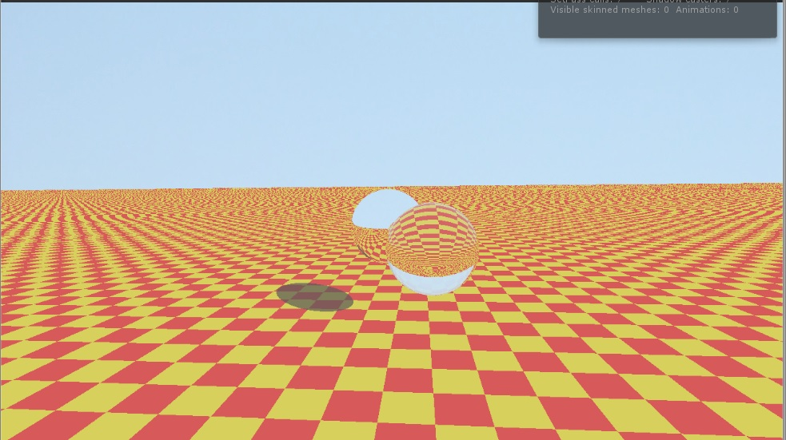
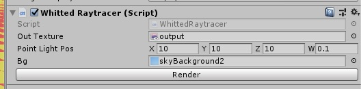

<p style="background:gray;padding: 1em;">
A simple, possibly correct, Whitted raytracer in unity, using the new Job system to get
realtime feedback on CPU.
</p>





# Introduction
Hi everyone and welcome to another post, today I would like to talk about a quick experiment I did
in Unity 2018, lately I am focusing a lot more on raytracing and decided to start from the basics.
The first seminal paper is the paper from Turne Whitted called: 
.

I decided to do it in Unity, for two reasons, first of all it would give me a good starting point, I would not 
need to have my own sandbox for rendering etc. Although I have one, it would have required me some more
work to get it up and running. The second reason was I wanted to keep it on CPU to make it simple, also
unity has a great new multithreading system to help me speed up the tracing. It was a win win situation.

# Unity plumbing 

Before we can actually start do any kind of rendering, we need to have some plumbing going in Unity,
I started by creating a component whit some public fields on it:



The component has a output render texture, a point light position , background texture and a button to kick a render.
The main idea behind the button was that when I tried to do some raymarching a couple of months ago, with the same method, it ended up being quite slow, it was hard to stop the render
so this time I wanted to have a way to kick a render and be done with it, if took minutes when it was done it would stop.

To achieve this I created a custom inspector you can see here below:

```c#
[CustomEditor(typeof(WhittedRaytracer))]
public class WhittedRaytracerEditor : Editor
{
    public override void OnInspectorGUI()
    {
        DrawDefaultInspector();

        WhittedRaytracer raytracer = (WhittedRaytracer)target;
        if(GUILayout.Button("Render"))
        {
            raytracer.kickRenderToTexture();
        }
    }
}
```

The inspector would do nothing more than just call a function in the component:

```c#
    public void kickRenderToTexture()
    {
        initialize();
        renderIt();
        Graphics.Blit(m_BackbufferTex, outTexture);
        clearData();
    }
```
As you might have expected there are some simple step, initialize allocates all the memory, 
copies the background texture into an array etc. Render kicks the job system, more on this later,
then we copy the content of the render texture on the output render texture and we clean all the 
allocated memory. The job system lets us use native containters but their lifetime is up to us,
we need to release the memory manually when we are done.

The only downside is that to properly have it display and trigger when not in play mode, I need 
to set the component to execute in edit mode:

```c#
[ExecuteInEditMode]
class WhittedRaytracer: MonoBehaviour
{
    private int width;
    private int height;
	...
```

Unluckily this still gives some issues sometimes when not fired properly Unity throws some errors
that some memory has not been dellocated, I did not investigate if those are false positives, the 
start method should not be called normally, unless you recompile the component. Not ideal, but for
prototyping was more than fine.

I also wanted to have it render at runtime, to see how fast it was going. To achieve this I  just
needed to add the Whitted component on the camera, and blit the texture on the "OnRenderImage"
callback:

```c#
    void OnRenderImage(RenderTexture source, RenderTexture dest) {
            
        Graphics.Blit(outTexture, dest);
    }
```

Of course you still also need the update:
```c#

    public void Update()
    {
        renderIt();
        Graphics.Blit(m_BackbufferTex, outTexture);
    }
```

# The job system


# Performance 


